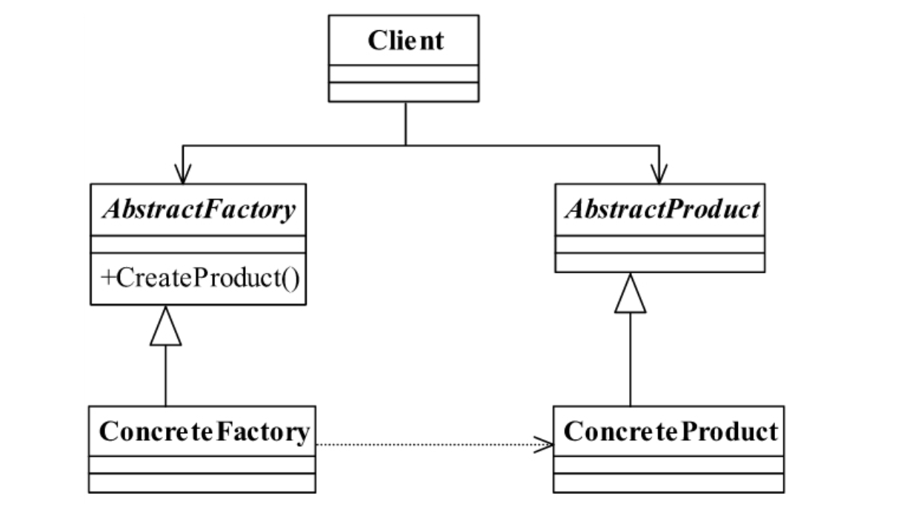
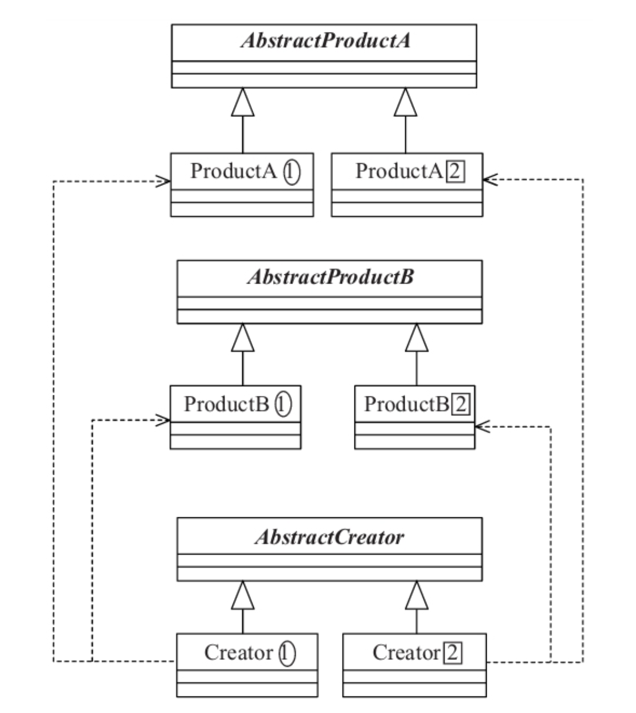
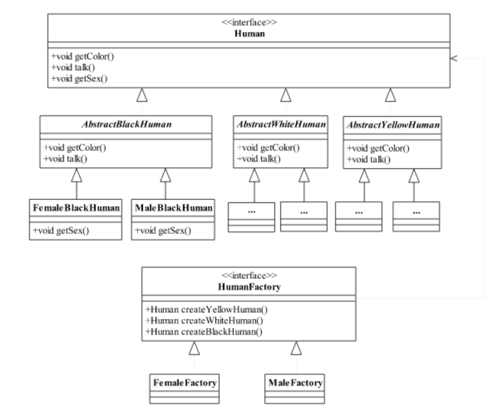

<!--
 * @description: 
 * @Author: tianzhi
 * @Date: 2020-04-28 19:40:15
 * @LastEditors: Tian Zhi
 * @LastEditTime: 2020-05-07 18:03:12
 -->

## 定义

> Provide an interface for creating families of related or dependent objects without specifying their concrete classes.

> 为创建一组相关或相互依赖的对象提供一个接口，而且无须指定它们的具体类。

## 使用场景

一个对象族（或是一组没有任何关系的对象）都有相同的约束，则可以使用抽象工厂模式。

例如一个文本编辑器和一个图片处理器，都是软件实体，但是nginx下的文本编辑器和Windows下的文本编辑器虽然功能和界面都相同，但是代码实现是不同的，图片处理器也有类似情况。

这里的共同的约束条件是操作系统类型。一个对象族包括文本编辑器和图片处理器（nginx操作系统或windows操作系统下的）。

## 名词解释

这里我摒弃了作者书中的描述，使用**一个产品族**和**一类产品**来分别表示抽象工厂模式产品分类的二象限。

1. **一个产品（对象）族：** 一组相关或相互依赖的对象，例如使用场景中的 **Windows系统下的文本编辑器和图片处理器**。
    > 一个产品族中产品的数量等于抽象工厂中产品创建方法的数量。

2. **一类产品：** 作者书中用的名词为*产品等级*，我觉得不太好理解，这里换成*一类产品*，例如使用场景中的 **Windows系统下的文本编辑器和Nginx系统下的文本编辑器**。
    > 一类产品中产品的数量等于具体工厂的数量。

## 类图

### 抽象工厂模式的通用类图



### 抽象工厂模式的通用源码类图



## Java代码

### 抽象产品类

```java
public abstract class AbstractProductA {
    // 每个产品共有的方法
    public void shareMethod() {}
    // 每个产品相同方法，不同实现
    public abstract void doSomething();
}
```

### 产品A1和A2的实现类（产品B1和B2实现类省略，与A类似）

```java
public class ProductA1 extends AbstractProductA {
    public void doSomething() {
        System.out.println("产品A1的实现方法");
    }
}
```

```java
public class ProductA2 extends AbstractProductA {
    public void doSomething() {
        System.out.println("产品A2的实现方法");
    }
}
```

### 抽象工厂类

```java
public abstract class AbstractCreator {
    // 创建A产品家族
    public abstract AbstractProductA createProductA();
    // 创建B产品家族
    public abstract AbstractProductB createProductB();
}
```

### 产品族1的具体工厂类（2的实现类省略，与1类似）

```java
public class Creator1 extends AbstractCreator {
    // 只生产产品等级为1的A产品
    public AbstractProductA createProductA() {
        return new ProductA1();
    }
    // 只生产产品等级为1的B产品
    public AbstractProductB createProductB() {
        return new ProductB1();
    }
}
```

### 场景类

```java
public class Client {
    public static void main(String[] args) {
        // 定义出两个工厂
        AbstractCreator creator1 = new Creator1();
        AbstractCreator creator2 = new Creator2();
        // 产生A1对象
        AbstractProductA a1 =  creator1.createProductA();
        // 产生A2对象
        AbstractProductA a2 = creator2.createProductA();
        // 产生B1对象
        AbstractProductB b1 = creator1.createProductB();
        // 产生B2对象
        AbstractProductB b2 = creator2.createProductB();
        /*
        * 然后在这里就可以为所欲为了...
        */
    }
}
```

## 案例-女娲造人（增加性别约束）

### 类图



### 代码部分

#### 人种接口

```java
public interface Human {
    // 每个人种都有相应的颜色
    public void getColor();
    // 人类会说话
    public void talk();
    // 每个人都有性别
    public void getSex();
}
```

#### 白色人种（省略黑色和黄色人种，和白色类似）

```java
public abstract class AbstractWhiteHuman implements Human {
    // 白色人种的皮肤颜色是白色的
    public void getColor() {
        System.out.println("白色人种的皮肤颜色是白色的！");
    }
    // 白色人种讲话
    public void talk() {
        System.out.println("白色人种会说话，一般说的都是单字节。");
    }
}
```

#### 白色女性人种（省略白色男性，其他色人种，和白色女性类似）

```java
public class FemaleWhiteHuman extends AbstractWhiteHuman {
    // 白人女性
    public void getSex() {
        System.out.println("白人女性");
    }
}
```

#### 抽象工厂接口

```java
public interface HumanFactory {
    // 制造一个黄色人种
    public Human createYellowHuman();
    // 制造一个白色人种
    public Human createWhiteHuman();
    // 制造一个黑色人种
    public Human createBlackHuman();
}
```

#### 生产女性的工厂（八卦炉）（省略生产男性的工厂，与其类似）

```java
public class FemaleFactory implements HumanFactory {
    // 生产出黑人女性
    public Human createBlackHuman() {
        return new FemaleBlackHuman();
    }
    // 生产出白人女性
    public Human createWhiteHuman() {
        return new FemaleWhiteHuman();
    }
    // 生产出黄人女性
    public Human createYellowHuman() {
        return new FemaleYellowHuman();
    }
}
```

#### 女娲重造人类

```java
public class NvWa {
    public static void main(String[] args) {
        // 第一条生产线，男性生产线
        HumanFactory maleHumanFactory = new MaleFactory();
        // 第二条生产线，女性生产线
        HumanFactory femaleHumanFactory = new FemaleFactory();
        // 生产线建立完毕，开始生产人了:
        Human maleYellowHuman = maleHumanFactory.createYellowHuman();
        Human femaleYellowHuman = femaleHumanFactory.createYellowHuman();
        System.out.println("---生产一个黄色女性---");
        femaleYellowHuman.getColor();
        femaleYellowHuman.talk();
        femaleYellowHuman.getSex();
        System.out.println("\n---生产一个黄色男性---");
        maleYellowHuman.getColor();
        maleYellowHuman.talk();
        maleYellowHuman.getSex();
        /*
         * ......
         * 后面继续创建
        */
    }
}
```

### Typescript实现

为了简单起见，我这里和Java代码保持一致，只实现白人女性类和女性人种工厂。其他人种和男性人种工厂实现方法类似。

```typescript
/** === 人类部分 === */
// 人类实例接口
interface Human {
    getColor(): void;
    talk(): void;
    getSex(): void;
}
// 人类构造函数接口
interface HumanConstructor {
    new(): Human;
}
// 抽象白色人种
abstract class AbstractWhiteHuman implements Human {
    getColor() {
        console.log('白色人种的皮肤颜色是白色的！');
    }
    talk() {
        console.log('白色人种会说话，一般都是但是单字节。');
    }
    abstract getSex(): void;
}
// 白色女性人种
class FemaleWhiteHuman extends AbstractWhiteHuman {
    getSex() {
        console.log('白人女性');
    }
}

/** === 工厂部分 === */
// 抽象工厂接口
interface HumanFactory {
    createWhiteHuman(): Human;
    // 省略以下实现
    // createYellowHuman(): Human;
    // createBlackHuman(): Human;
}
// 女性工厂
class FemaleFactory implements HumanFactory {
    createWhiteHuman() {
        return new FemaleWhiteHuman();
    }
}

// 女娲重新造人（这里只展示造白人女性）
function createHumanByNvWa() {
    // 声明锅炉
    const femaleFactory: HumanFactory = new FemaleFactory();
    // 造出来白人女性
    console.log('--造出的是白色女性人种--')
    const femaleWhiteHuman = femaleFactory.createWhiteHuman();
    // 白人女性开始表演
    femaleWhiteHuman.getColor();
    femaleWhiteHuman.talk();
    femaleWhiteHuman.getSex();
    // 打印结果：
    // --造出的是白色女性人种--
    // 白色人种的皮肤颜色是白色的！
    // 白色人种会说话，一般都是单字节。
    // 白人女性
}
// 开始造人
createHumanByNvWa();
```

## 最佳实践

一个模式在什么情况下才能够使用，是很多读者比较困惑的地方。抽象工厂模式是一个简单的模式，使用的场景非常多，大家在软件产品开发过程中，涉及不同操作系统的时候，都可以考虑使用抽象工厂模式，例如一个应用，需要在三个不同平台（Windows、Linux、Android（Google发布的智能终端操作系统））上运行，你会怎么设计？分别设计三套不同的应用？非也，通过抽象工厂模式屏蔽掉操作系统对应用的影响。三个不同操作系统上的软件功能、应用逻辑、UI都应该是非常类似的，唯一不同的是调用不同的工厂方法，由不同的产品类去处理与操作系统交互的信息。

## 抽象工厂模式 vs 工厂方法模式

1. 抽象工厂模式是工厂方法模式的升级版本。在女娲造人这个例子中，最开始人只有“肤色”这一个象限，我们使用了工厂方法模式；而在抽象工厂模式中，人种又出现“性别”这一象限，在有两个象限及以上的对象集合中，我们就可以选择使用两个区分度明显的象限，使用抽象工厂模式进行设计。

2. 抽象工厂创建的是一个产品族，这里面有一组相关的产品，每个产品对应抽象工厂里的一个工厂方法。而工厂方法模式则用来创建一个产品或者是只有一个象限约束的产品。

3. 使用抽象工厂确定两个象限时，应尽量遵循开闭原则，因此我们要做到：

* 如果象限X能够确定一定的产品数量，且产品数量固定，未来不会变化。则我们可以依据这个象限，实现抽象工厂里的工厂方法，方法数量和这个固定的产品数量一致。
* 使用另一个象限Y确定的产品数量，来决定实现多少个具体工厂。
* 这样可以保证接口不变，易于扩展。

## 与六大设计原则的结合

- [X] Single Responsibility Principle (SRP, 单一职责原则)

    抽象工厂模式和工厂方法模式一样，都可以做到一个工厂生产一种（或一类）产品，实现了单一职责原则。

- [x] Open Closed Principle (OCP, 开闭原则)

    抽象工厂模式只要遵循横向扩展，也就是增加产品族，是可以遵循开闭原则的；但是如果进行纵向扩展，改变抽象工厂接口，那么每一个实现工厂都需要更改，这违反了开闭原则。

- [x] Liskov Substitution Principle (LSP, 里氏替换原则)

    我们都是调用抽象工厂的工厂方法创建产品，实现时取决于传入的具体工厂。遵循里氏替换原则。

- [x] Law of Demeter (LoD, 迪米特法则)
    
    我们只需要关注抽象工厂和抽象产品类，其余的都不需要关注。遵循迪米特法则。

- [ ] Interface Segragation Principle (ISP, 接口隔离原则)

    和工厂方法模式一样，我认为抽象工厂模式没有提及接口隔离原则。

- [x] Dependency Inversion Principle (DIP, 依赖倒置原则)

    我们依赖的是抽象工厂和抽象产品类，实现了依赖倒置原则。