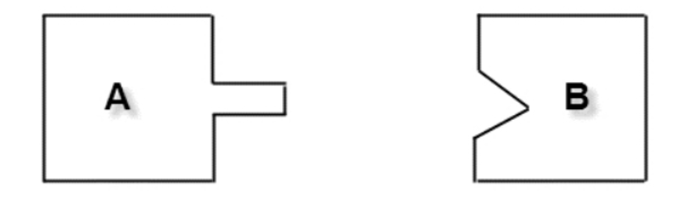

<!--
 * @description: 
 * @Author: Tian Zhi
 * @Date: 2020-05-29 10:13:34
 * @LastEditors: Tian Zhi
 * @LastEditTime: 2020-06-01 10:50:51
--> 
## 定义
适配器模式（Adapter Pattern）的定义如下：

> Convert the interface of a class into another interface clients expect.Adapter lets classeswork together that couldn't otherwise because of incompatible interfaces.

> 将一个类的接口变换成客户端所期待的另一种接口，从而使原本因接口不匹配而无法在一起工作的两个类能够在一起工作。

## 类图


* Target目标角色

    该角色定义把其他类转换为何种接口，也就是我们的期望接口，下面案例中的`IUserInfo`接口就是目标角色。

* Adaptee源角色

    它是已经存在的、运行良好的类或对象，经过适配器角色的包装，它会成为一个新的的角色。

* Adapter适配器角色

    适配器模式的核心角色，其他两个角色都是已经存在的角色，而适配器角色是需要新建立的，它的职责非常简单：把源角色转换为目标角色（通过继承或是类关联的方式）。

适配器模式在生活中很常见，比如笔记本上的电源适配器，可以在110～220V之间变化的电源下正常工作，这也是适配器一个良好模式的体现，简单地说，适配器模式就是把一个接口或类转换成其他的接口或类，从另一方面来说，适配器模式也就是一个包装模式，它把`Adaptee`包装成一个`Target`接口的类。

设计模式原是为建筑设计而服务的，软件设计模式只是借用了人家的原理而已，最原始的适配器设计如下：

两个已经成型的物体：


引入物体C：


## Java代码

### 目标角色

```java
public interface Target {
    // 目标角色有自己的方法
    public void request();
}
```

### 目标角色实现类

```java
public class ConcreteTarget implements Target {
    public void request() {
        System.out.println("if you need any help, pls call me!");   
    }
}
```

### 源角色

```java
public class Adaptee {
    // 原有的业务逻辑
    public void doSomething() {
        System.out.println("I'm kind of busy, leave me alone, pls!");
    }
}
```

### 适配器角色

```java
public class Adapter extends Adaptee implements Target {
    public void request() {
        super.doSomething();
    }
}
```

### 场景类

```java
public class Client {
    public static void main(String[] args) {
        // 原有的业务逻辑
        Target target = new ConcreteTarget();
        target.request();
        // 现在增加了适配器角色后的业务逻辑
        Target target2 = new Adapter();
        target2.request();
    }
}
```

## 案例-人员信息管理模块的业务扩展

下图是人力资源管理项目中的人员信息管理模块：


人员信息管理的对象是所有员工的所有信息，下面是接口以及实现类的代码：

**员工信息接口**

```java
public interface IUserInfo {
    // 获得用户姓名
    public String getUserName();
    // 获得家庭地址
    public String getHomeAddress();
    // 手机号码，这个太重要，手机泛滥呀
    public String getMobileNumber();
    // 办公电话，一般是座机
    public String getOfficeTelNumber();
    // 这个人的职位是什么
    public String getJobPosition();
    // 获得家庭电话，这有点不好，我不喜欢打家庭电话讨论工作
    public String getHomeTelNumber();
}
```

**实现类**

```java
public class UserInfo implements IUserInfo {
    /*
    * 获得家庭地址，下属送礼也可以找到地方
    */
    public String getHomeAddress() {
        System.out.println("这里是员工的家庭地址...");
        return null;
    }
    /*
    * 获得家庭电话号码
    */
    public String getHomeTelNumber() {
        System.out.println("员工的家庭电话是...");
        return null;
    }
    /*
    * 员工的职位，是部门经理还是普通职员
    */
    public String getJobPosition() {
        System.out.println("这个人的职位是BOSS...");
        return null;
    }
    /*
    * 手机号码
    */
    public String getMobileNumber() {
        System.out.println("这个人的手机号码是0000...");
        return null;
    }
    /*
    * 办公室电话，烦躁的时候最好"不小心"把电话线踢掉
    */
    public String getOfficeTelNumber() {
        System.out.println("办公室电话是...");
        return null;
    }
    /*
    * 姓名，这个很重要
    */
    public String getUserName() {
        System.out.println("姓名叫做...");
        return null;
    }
}
```

过了一段时间，公司开始招募了一批外包同学，需要从劳动服务公司同步外包同学的人员信息，但是他们人员信息的接口和当前的接口不一致：


接口以及实现类代码如下：

**劳动服务公司的人员信息接口**

```java
public interface IOuterUser {
    // 基本信息，比如名称、性别、手机号码等
    public Map getUserBaseInfo();
    // 工作区域信息
    public Map getUserOfficeInfo();
    // 用户的家庭信息
    public Map getUserHomeInfo();
}
```

**劳动服务公司的人员实现**

```java
public class OuterUser implements IOuterUser {
    /*
    * 用户的基本信息
    */
    public Map getUserBaseInfo() {
        HashMap baseInfoMap = new HashMap();
        baseInfoMap.put("userName", "这个员工叫混世魔王...");
        baseInfoMap.put("mobileNumber", "这个员工电话是...");
        return baseInfoMap;
    }
    /*
    * 员工的家庭信息
    */
    public Map getUserHomeInfo() {
        HashMap homeInfo = new HashMap();
        homeInfo.put("homeTelNumbner", "员工的家庭电话是...");
        homeInfo.put("homeAddress", "员工的家庭地址是...");
        return homeInfo;
    }
    /*
    * 员工的工作信息，比如，职位等
    */
    public Map getUserOfficeInfo() {
        HashMap officeInfo = new HashMap();
        officeInfo.put("jobPosition","这个人的职位是BOSS...");
        officeInfo.put("officeTelNumber", "员工的办公电话是...");
        return officeInfo;
    }
}
```

现在肯定不能因为他们的接口不同就对原先的接口进行改造。我们只能拿到他们的数据之后，中间加一层转换处理，转化为当前的数据对象：


`OuterUserInfo`可以看做是“两面派”，实现了`IUserInfo`接口，还继承了`OuterUser`，通过这样的设计，把`OuterUser`伪装成我们系统中一个`IUserInfo`对象，这便是适配器模式。

**我们之所以能够增加一个`OuterUserInfo`中转类，是因为我们在系统设计时严格遵守了依赖倒置原则和里氏替换原则，否则即使增加了中转类也无法解决问题。**

### Java代码实现

#### 中转角色

```java
public class OuterUserInfo extends OuterUser implements IUserInfo {
    private Map baseInfo = super.getUserBaseInfo();  // 员工的基本信息
    private Map homeInfo = super.getUserHomeInfo(); // 员工的家庭信息
    private Map officeInfo = super.getUserOfficeInfo(); //工作信息
    /*
    * 家庭地址
    */
    public String getHomeAddress() {
        String homeAddress = (String)this.homeInfo.get("homeAddress");
        System.out.println(homeAddress);
        return homeAddress;
    }
    /*
    * 家庭电话号码
    */
    public String getHomeTelNumber() {
        String homeTelNumber = (String)this.homeInfo.get("homeTelNumber");
        System.out.println(homeTelNumber);
        return homeTelNumber;
    }
    /*
    * 职位信息
    */
    public String getJobPosition() {
        String jobPosition = (String)this.officeInfo.get("jobPosition");
        System.out.println(jobPosition);
        return jobPosition;
    }
    /*
    * 手机号码
    */
    public String getMobileNumber() {
        String mobileNumber = (String)this.baseInfo.get("mobileNumber");
        System.out.println(mobileNumber);
        return mobileNumber;
    }
    /*
    * 办公电话
    */
    public String getOfficeTelNumber() {
        String officeTelNumber = (String)this.officeInfo.get("officeTelNumber");
        System.out.println(officeTelNumber);
        return officeTelNumber;
    }
    /*
    * 员工的名称
    */
    public String getUserName() {
        String userName = (String)this.baseInfo.get("userName");
        System.out.println(userName);
        return userName;
    }
}
```

#### 场景类-查看公司员工

```java
public class Client {
    public static void main(String[] args) {
        // 没有与外系统连接的时候，是这样写的
        IUserInfo youngGirl = new UserInfo();
        // 从数据库中查到101个
        for(int i = 0; i < 101; i++) {
            youngGirl.getMobileNumber();
        }
    }
}
```

#### 场景类-查看外包员工

```java
public class Client {
    public static void main(String[] args) {
        // 老板一想不对呀，兔子不吃窝边草，还是找借用人员好点
        // 我们只修改了这句话
        IUserInfo youngGirl = new OuterUserInfo();
        // 从数据库中查到101个
        for(int i = 0; i < 101; i++) {
            youngGirl.getMobileNumber();
        }
    }
}
```

使用了适配器模式只在高层模块修改了一句话，其他的业务逻辑都不用修改，而且在实际系统中只是增加了一个业务类的继承，就实现了可以查本公司的员工信息，也可以查劳动服务公司的员工信息，尽量少的修改，通过扩展的方式解决了该问题，这就是适配模式。

### TypeScript实现

```typescript
// 员工信息接口
interface IUserInfo {
    // 获得用户姓名
    getUserName(): string;
    // 获得家庭地址
    getHomeAddress(): string;
    // 手机号码，这个太重要，手机泛滥呀
    getMobileNumber(): string;
    // 办公电话，一般是座机
    getOfficeTelNumber(): string;
    // 这个人的职位是什么
    getJobPosition(): string;
    // 获得家庭电话，这有点不好，我不喜欢打家庭电话讨论工作
    getHomeTelNumber(): string;
}

// 员工信息实现类
class UserInfo implements IUserInfo {
    /*
    * 获得家庭地址，下属送礼也可以找到地方
    */
    getHomeAddress() {
        return "这里是员工的家庭地址...";
    }
    /*
    * 获得家庭电话号码
    */
    getHomeTelNumber() {
        return "员工的家庭电话是...";
    }
    /*
    * 员工的职位，是部门经理还是普通职员
    */
    getJobPosition() {
        return "这个人的职位是BOSS...";
    }
    /*
    * 手机号码
    */
    getMobileNumber() {
        return "这个人的手机号码是0000...";
    }
    /*
    * 办公室电话，烦躁的时候最好"不小心"把电话线踢掉
    */
    getOfficeTelNumber() {
        return "办公室电话是...";
    }
    /*
    * 姓名，这个很重要
    */
    getUserName() {
        return "姓名叫做...";
    }
}

// UserBaseInfoMap
type UserBaseInfoMap = Map<'userName' | 'mobileNumber', string>;

// UserOfficeInfoMap
type UserOfficeInfoMap = Map<'jobPosition' | 'officeTelNumber', string>;

// UserHomeInfoMap
type UserHomeInfoMap = Map<'homeTelNumber' | 'homeAddress', string>;

// 劳动服务公司的人员信息接口
interface IOuterUser {
    // 基本信息，比如名称、性别、手机号码等
    getUserBaseInfo(): UserBaseInfoMap;
    // 工作区域信息
    getUserOfficeInfo(): UserOfficeInfoMap;
    // 用户的家庭信息
    getUserHomeInfo(): UserHomeInfoMap;
}

// 劳动服务公司的人员实现
class OuterUser implements IOuterUser {
    /*
    * 用户的基本信息
    */
    getUserBaseInfo() {
        const baseInfo: UserBaseInfoMap = new Map();
        baseInfo.set("userName", "这个员工叫混世魔王...");
        baseInfo.set("mobileNumber", "这个员工电话是...");
        return baseInfo;
    }
    /*
    * 员工的家庭信息
    */
    getUserHomeInfo() {
        const homeInfo: UserHomeInfoMap = new Map();
        homeInfo.set("homeTelNumber", "员工的家庭电话是...");
        homeInfo.set("homeAddress", "员工的家庭地址是...");
        return homeInfo;
    }
    /*
    * 员工的工作信息，比如，职位等
    */
    getUserOfficeInfo() {
        const officeInfo: UserOfficeInfoMap = new Map();
        officeInfo.set("jobPosition","这个人的职位是BOSS...");
        officeInfo.set("officeTelNumber", "员工的办公电话是...");
        return officeInfo;
    }
}

// 中转角色
class OuterUserInfo extends OuterUser implements IUserInfo {
    private baseInfo = super.getUserBaseInfo();  // 员工的基本信息
    private homeInfo = super.getUserHomeInfo(); // 员工的家庭信息
    private officeInfo = super.getUserOfficeInfo(); //工作信息
    /*
    * 家庭地址
    */
    getHomeAddress() {
        const homeAddress = this.homeInfo.get("homeAddress");
        return homeAddress || '';
    }
    /*
    * 家庭电话号码
    */
    getHomeTelNumber() {
        const homeTelNumber = this.homeInfo.get("homeTelNumber");
        return homeTelNumber || '';
    }
    /*
    * 职位信息
    */
    getJobPosition() {
        const jobPosition = this.officeInfo.get("jobPosition");
        return jobPosition || '';
    }
    /*
    * 手机号码
    */
    getMobileNumber() {
        const mobileNumber = this.baseInfo.get("mobileNumber");
        return mobileNumber || '';
    }
    /*
    * 办公电话
    */
    getOfficeTelNumber() {
        const officeTelNumber = this.officeInfo.get("officeTelNumber");
        return officeTelNumber || '';
    }
    /*
    * 员工的名称
    */
    getUserName() {
        const userName = this.baseInfo.get("userName");
        return userName || '';
    }
}

// 查看员工场景
(function() {
    // 查看公司员工
    const youngGirl = new UserInfo();
    // 查看外包员工
    // const youngGirl = new OuterUserInfo();
    // 从数据库中查到5个
    for(let i = 0; i < 5; i++) {
        console.log(youngGirl.getMobileNumber())
    }
})()
```

## 适配器模式的扩展

刚刚讲的人力资源管理其实是一个比较幸运的例子。设想一下，如果劳动服务公司采用了单一职责对人员接口进行设计，提供的人员接口不止一个，也就是说，用户基本信息是一个接口，工作信息是一个接口，家庭信息是一个接口，总共有三个接口三个实现类，该如何处理呢？

肯定不能再使用我们上面的方法了，因为Java是不支持多继承的。不过可以使用类关联！声明一个`OuterUserInfo`实现类，实现`IUserInfo`接口，通过关联其他三个实现类就就可以解决这个问题了，我们来看看设计类图以及代码

### 类图


### Java实现

#### 用户基本信息接口（用户家庭信息接口和用户工作信息接口类似，此处省略）

```java
public interface IOuterUserBaseInfo {
    // 基本信息，比如名称、性别、手机号码等
    public Map getUserBaseInfo();
}
```

#### 用户基本信息（用户家庭信息和工作信息类似，此处省略）

```java
public class OuterUserBaseInfo implements IOuterUserBaseInfo {
    /*
    * 用户的基本信息
    */
    public Map getUserBaseInfo() {
        HashMap baseInfoMap = new HashMap();
        baseInfoMap.put("userName", "这个员工叫混世魔王...");
        baseInfoMap.put("mobileNumber", "这个员工电话是...");
        return baseInfoMap;
    }
}
```

#### 适配器

```java
public class OuterUserInfo implements IUserInfo {
    // 源目标对象
    private IOuterUserBaseInfo baseInfo = null;     // 员工的基本信息
    private IOuterUserHomeInfo homeInfo = null;     // 员工的家庭信息
    private IOuterUserOfficeInfo officeInfo = null; // 工作信息
    // 数据处理
    private Map baseMap = null;
    private Map homeMap = null;
    private Map officeMap = null;
    // 构造函数传递对象
    public OuterUserInfo(IOuterUserBaseInfo _baseInfo, IOuterUserHomeInfo _homeInfo, IOuterUserOfficeInfo _officeInfo) {
        this.baseInfo = _baseInfo;
        this.homeInfo = _homeInfo;
        this.officeInfo = _officeInfo;
        // 数据处理
        this.baseMap = this.baseInfo.getUserBaseInfo();
        this.homeMap = this.homeInfo.getUserHomeInfo();
        this.officeMap = this.officeInfo.getUserOfficeInfo();
    }
    // 家庭地址
    public String getHomeAddress() {
        String homeAddress = (String)this.homeMap.get("homeAddress");
        System.out.println(homeAddress);
        return homeAddress;
    }
    // 家庭电话号码
    public String getHomeTelNumber() {
        String homeTelNumber = (String)this.homeMap.get("homeTelNumber");
        System.out.println(homeTelNumber);
        return homeTelNumber;
    }
    // 职位信息
    public String getJobPosition() {
        String jobPosition = (String)this.officeMap.get("jobPosition");
        System.out.println(jobPosition);
        return jobPosition;
    }
    // 手机号码
    public String getMobileNumber() {
        String mobileNumber = (String)this.baseMap.get("mobileNumber");
        System.out.println(mobileNumber);
        return mobileNumber;
    }
    // 办公电话
    public String getOfficeTelNumber() {
        String officeTelNumber= (String)this.officeMap.get("officeTelNumber");
        System.out.println(officeTelNumber);
        return officeTelNumber;
    }
    // 员工的名称
    public String getUserName() {
        String userName = (String)this.baseMap.get("userName");
        System.out.println(userName);
        return userName;
    }
}
```

#### 场景类

```java
public class Client {
    public static void main(String[] args) {
        // 外系统的人员信息
        IOuterUserBaseInfo baseInfo = new OuterUserBaseInfo();
        IOuterUserOfficeInfo officeInfo = new OuterUserOfficeInfo();
        IOuterUserHomeInfo homeInfo = new OuterUserHomeInfo();
        IUserInfo youngGirl = new OuterUserInfo(baseInfo,homeInfo,officeInfo);
        // 传递三个对象
        for (int i = 0; i < 101; i++) {
            // 从数据库中查到101个
            youngGirl.getMobileNumber();
        }
    }
}
```

`OuterUserInfo`此时变成了委托服务，把`IUserInfo`接口需要的所有的操作都委托给其他三个接口下的实现类，它的委托是通过对象层次的关联关系进行委托的，而不是继承关系。这种适配器叫做**对象适配器**，我们之前讲的通过继承进行的适配，叫做**类适配器**。

对象适配器通用类图如下：


适配器的通用代码也比较简单，把原有的继承关系变更为关联关系就可以了，不再赘述。

对象适配器和类适配器的区别是：类适配器是类间继承，对象适配器是对象的合成关系，也可以说是类的关联关系，这是两者的根本区别。二者在实际项目中都会经常用到，由于对象适配器是通过类间的关联关系进行耦合的，因此在设计时就可以做到比较灵活，比如修补源角色的隐形缺陷，关联其他对象等，而类适配器就只能通过覆写源角色的方法进行扩展，**在实际项目中，对象适配器使用到场景相对较多**。

## 使用场景

适配器模式可以让两个没有任何关系的类在一起运行，只要适配器这个角色能够搞定他们就成。这样做具有如下优点：

* 增加了类的透明性

    我们访问的`Target`目标角色，但是具体的实现都委托给了源角色，而这些对高层次模块是透明的，也是它不需要关心的。

* 提高了类的复用度

    源角色在原有的系统中还是可以正常使用，而在目标角色中也可以充当新的演员。

* 灵活性非常好

    如果突然不想要适配器，删除掉这个适配器就可以，其他的代码都不用修改。基本上就类似一个热插件。

适配器应用的场景只要记住一点就足够了：有动机修改一个已经投产中的接口时，适配器模式可能是最适合的模式。比如系统扩展了，需要使用一个已有或新建立的类，但这个类又不符合系统的接口，使用适配器模式，这也是我们例子中提到的。

不过，使用适配器模式也有如下注意事项：

* 最好在详细设计阶段不用考虑

    适配器模式不是为了解决还处在开发阶段的问题，而是解决正在服役的项目问题，没有一个系统分析师会在做详细设计的时候考虑使用适配器模式，这个模式使用的主要场景是扩展应用中，就像我们上面的那个例子一样，系统扩展了，不符合原有设计的时候才考虑通过适配器模式减少代码修改带来的风险。

* 项目的开发严格遵守依赖倒置原则和里氏替换原则

    只有在项目最初设计中遵循了这两个原则，才能完美使用适配器模式，否则会造成较大改动。

## 最佳实践

适配器模式是一个补偿模式，或者说是一个“补救”模式，通常用来解决接口不相容的问题，在百分之百的完美设计中是不可能使用到的。但是，再完美的设计也会遇到“需求”变更这个无法逃避的问题，就以上面的人力资源管理系统为例，不管系统设计得多么完美，都无法逃避新业务的发生。

技术只是一个工具而已，是因为它推动了其他行业的进步和发展而具有了价值，通俗地说，技术是为业务服务的，因此业务在日新月异变化的同时，也对技术提出了同样的要求，在这种要求下，就需要我们有一种或一些这样的补救模式诞生，使用这些补救模式可以保证我们的系统在生命周期内能够稳定、可靠、健壮的运行，而适配器模式就是这样的一个“救世主”，它在需求巨变、业务飞速而导致你极度郁闷、烦躁、崩溃的时候横空出世，它通过把非本系统接口的对象包装成本系统可以接受的对象，从而简化了系统大规模变更风险的存在。

## 与六大设计原则的结合

- [ ] Single Responsibility Principle (SRP, 单一职责原则)

    没有提及。

- [x] Open Closed Principle (OCP, 开闭原则)

    适配器`Adapter`类的增加符合OCP。

- [x] Liskov Substitution Principle (LSP, 里氏替换原则)

    适配器模式符合LSP。参考[使用场景](#使用场景)。

- [x] Law of Demeter (LoD, 迪米特法则)

    高层业务模块无需知道源角色的存在，仍能够按已有的接口获取源角色的信息。符合LoD。

- [ ] Interface Segragation Principle (ISP, 接口隔离原则)

    没有提及。

- [x] Dependency Inversion Principle (DIP, 依赖倒置原则)

    适配器模式符合DIP。参考[使用场景](#使用场景)。
