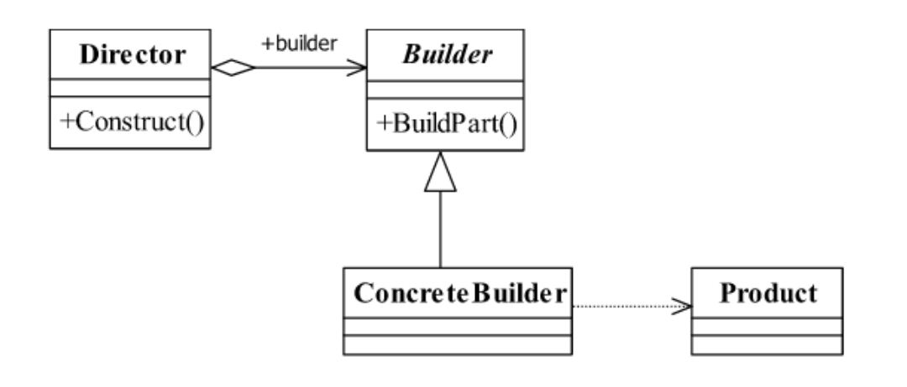
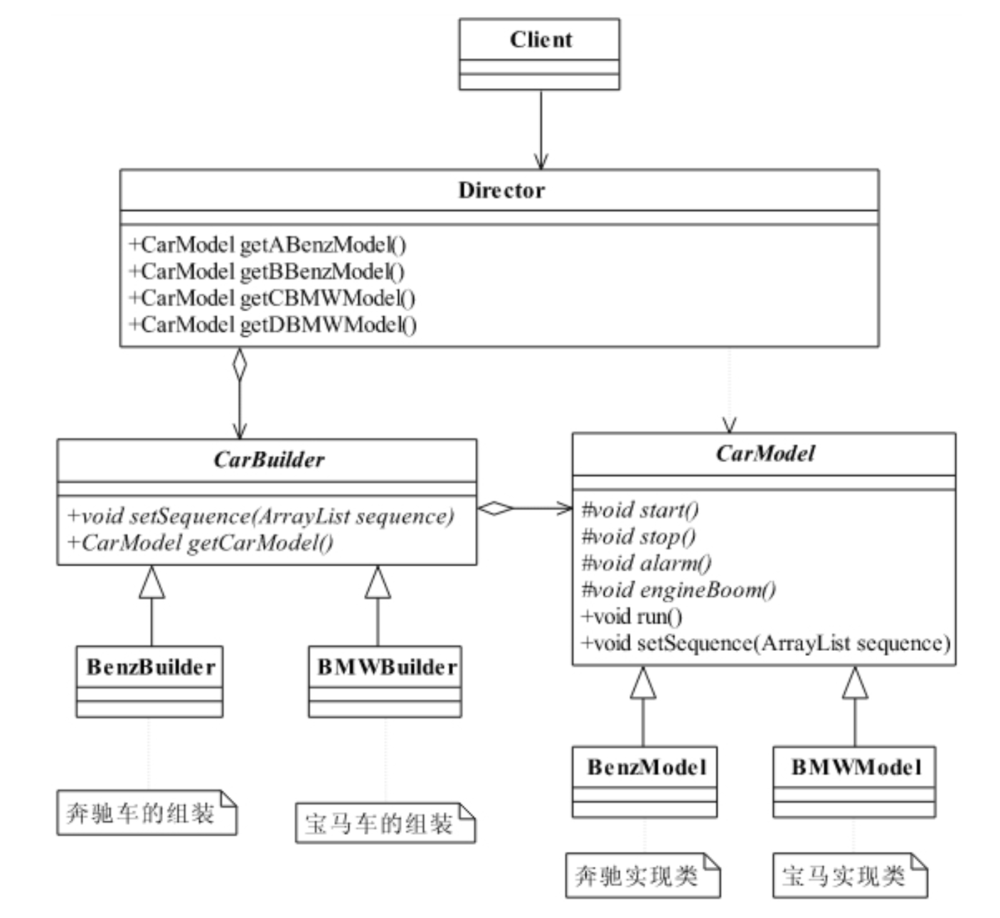

<!--
 * @description:
 * @Author: Tian Zhi
 * @Date: 2020-05-07 17:20:37
 * @LastEditors: Tian Zhi
 * @LastEditTime: 2020-05-08 20:48:16
 -->

## 定义

**建造者模式 _（Builder Pattern）_** 也叫做生成器模式，其定义如下：

> Separate the construction of a complex object from its representation so that the sameconstruction process can create different representations.

> 将一个复杂对象的构建与它的表示分离，使得同样的构建过程可以创建不同的表示。

## 使用场景

1. 相同的方法，不同的执行顺序，产生不同的事件结果时，可以采用建造者模式。

2. 多个部件或零件，都可以装配到一个对象中，但是产生的运行结果又不相同时，则可以使用该模式。

3. 产品类非常复杂，或者产品类中的调用顺序不同产生了不同的效能，这个时候使用建造者模式非常合适。

4. 在对象创建过程中会使用到系统中的一些其他对象，这些对象在产品对象的创建过程中不易得到时，也可以采用建造者模式封装该对象的创建过程。该种场景只能是一个补偿方法，因为一个对象不容易获得，而在设计阶段竟然没有发觉，而要通过创建者模式柔化创建过程，本身已经违反设计的最初目标。

## 类图



## Java 代码

### 产品类

产品类还可以配合模板方法模式使用

```java
public class Product {
    public void doSomething(){
        // 独立业务处理
    }
}
```

### 抽象建造者

```java
public abstract class Builder {
    // 设置产品的不同部分，以获得不同的产品
    public abstract void setPart();
    // 建造产品
    public abstract Product buildProduct();
}
```

### 具体建造者

```java
public class ConcreteProduct extends Builder {
    private Product product = new Product();
    // 设置产品零件
    public void setPart() {
        /*
        * 产品类内的逻辑处理
        */
    }
    //组建一个产品
    public Product buildProduct() {
        return product;
    }
}
```

### 导演类

```java
public class Director {
    private Builder builder = new ConcreteProduct();
    // 构建不同的产品
    public Product getAProduct() {
        builder.setPart();
        /*
        * 设置不同的零件，产生不同的产品
        */
        return builder.buildProduct();
    }
}
```

## 案例-汽车模型

### 类图



在建造者模式中，有如下 4 个角色：

- Product 产品类

  通常是实现了模板方法模式，也就是有模板方法和基本方法，这个参考第 10 章的模板方法模式。

- Builder 抽象建造者

  规范产品的组建，一般是由子类实现。

- ConcreteBuilder 具体建造者

  实现抽象类定义的所有方法，并且返回一个组建好的对象。

- Director 导演类

  负责安排已有模块的顺序，然后告诉 Builder 开始建造。

### Java 实现

#### 车模抽象类

```java
public abstract class CarModel {
    // 这个参数是各个基本方法执行的顺序
    private ArrayList<String> sequence = new ArrayList<String>();
    // 模型是启动开始跑了
    protected abstract void start();
    // 能发动，还要能停下来，那才是真本事
    protected abstract void stop();
    // 喇叭会出声音，是滴滴叫，还是哔哔叫
    protected abstract void alarm();
    // 引擎会轰隆隆地响，不响那是假的
    protected abstract void engineBoom();
    // 那模型应该会跑吧，别管是人推的，还是电力驱动，总之要会跑
    final public void run() {
        // 循环一边，谁在前，就先执行谁
        for (int i = 0; i < this.sequence.size(); i++) {
            String actionName = this.sequence.get(i);
            if (actionName.equalsIgnoreCase("start")) {
                this.start();  // 启动汽车
            } else if(actionName.equalsIgnoreCase("stop")) {
                this.stop(); // 停止汽车
            } else if(actionName.equalsIgnoreCase("alarm")) {
                this.alarm(); // 喇叭开始叫了
            } else if(actionName.equalsIgnoreCase("engine boom")) {
                this.engineBoom();  // 引擎开始轰鸣
            }
        }
    }
    // 把传递过来的值传递到类内
    final public void setSequence(ArrayList sequence) {
        this.sequence = sequence;
    }
}
```

#### 奔驰模型（宝马模型类似，忽略）

```java
public class BenzModel extends CarModel {
    protected void alarm() {
        System.out.println("奔驰车的喇叭声音是这个样子的...");
    }
     protected void engineBoom() {
        System.out.println("奔驰车的引擎是这个声音的...");
    }
    protected void start() {
        System.out.println("奔驰车跑起来是这个样子的...");
    }
    protected void stop() {
        System.out.println("奔驰车应该这样停车...");
    }
}
```

#### 抽象汽车组装类

```java
public abstract class CarBuilder {
    // 建造一个模型，你要给我一个顺序要求，就是组装顺序
    public abstract void setSequence(ArrayList<String> sequence);
    // 设置完毕顺序后，就可以直接拿到这个车辆模型
    public abstract CarModel getCarModel();
}
```

#### 奔驰车组装者（宝马类似，忽略）

```java
public class BenzBuilder extends CarBuilder {
    private BenzModel benz = new BenzModel();
    public CarModel getCarModel() {
        return this.benz;
    }
    public void setSequence(ArrayList<String> sequence) {
        this.benz.setSequence(sequence);
    }
}
```

#### 导演类

```java
public class Director {
    private ArrayList<String> sequence = new ArrayList();
    private BenzBuilder benzBuilder = new BenzBuilder();
    private BMWBuilder bmwBuilder = new BMWBuilder();
    /*
    * A类型的奔驰车模型，先start，然后stop，其他什么引擎、喇叭一概没有
    */
    public BenzModel getABenzModel() {
        // 清理场景，这里是一些初级程序员不注意的地方
        this.sequence.clear();
        // ABenzModel的执行顺序
        this.sequence.add("start");
        this.sequence.add("stop");
        // 按照顺序返回一个奔驰车
        this.benzBuilder.setSequence(this.sequence);
        return (BenzModel)this.benzBuilder.getCarModel();
    }
    /*
    * B型号的奔驰车模型，是先发动引擎，然后启动，然后停止，没有喇叭
    */
    public BenzModel getBBenzModel(){
        this.sequence.clear();
        this.sequence.add("engine boom");
        this.sequence.add("start");
        this.sequence.add("stop");
        this.benzBuilder.setSequence(this.sequence);
        return (BenzModel)this.benzBuilder.getCarModel();
    }
    /*
    * C型号的宝马车是先按下喇叭（炫耀嘛），然后启动，然后停止
    */
    public BMWModel getCBMWModel(){
        this.sequence.clear();
        this.sequence.add("alarm");
        this.sequence.add("start");
        this.sequence.add("stop");
        this.bmwBuilder.setSequence(this.sequence);
        return (BMWModel)this.bmwBuilder.getCarModel();
    }
    /*
    * D类型的宝马车只有一个功能，就是跑，启动起来就跑，永远不停止
    */
    public BMWModel getDBMWModel(){
        this.sequence.clear();
        this.sequence.add("start");
        this.bmwBuilder.setSequence(this.sequence);
        return (BMWModel)this.benzBuilder.getCarModel();
    }
    /*
    * 这里还可以有很多方法，你可以先停止，然后再启动，或者一直停着不动，静态的嘛
    * 导演类嘛，按照什么顺序是导演说了算
    */
}
```

#### 场景类

```java
public class Client {
    public static void main(String[] args) {
        Director director = new Director();
        // 1万辆A类型的奔驰车
        for(int i = 0; i < 10000; i++) {
            director.getABenzModel().run();
        }
        // 100万辆B类型的奔驰车
        for(int i = 0; i < 1000000; i++) {
            director.getBBenzModel().run();
        }
        // 1000万辆C类型的宝马车
        for(int i = 0; i < 10000000; i++) {
            director.getCBMWModel().run();
        }
    }
}
```

### TypeScript 实现

```typescript
// 车模功能字面量枚举
type CarSequence = "start" | "stop" | "alarm" | "engineBoom";

// 抽象车模
abstract class CarModel {
  // 这个参数是各个基本方法执行的顺序
  private sequence: CarSequence[] = [];
  // 模型是启动开始跑了
  protected abstract start(): void;
  // 能发动，还要能停下来，那才是真本事
  protected abstract stop(): void;
  // 喇叭会出声音，是滴滴叫，还是哔哔叫
  protected abstract alarm(): void;
  // 引擎会轰隆隆地响，不响那是假的
  protected abstract engineBoom(): void;

  // 那模型应该会跑吧，别管是人推的，还是电力驱动，总之要会跑
  run() {
    for (let i = 0; i < this.sequence.length; i++) {
      const seqName = this.sequence[i];
      if (typeof this[seqName] === "function") {
        this[seqName]();
      }
    }
  }

  // 把传递过来的值传递到类内
  setSequence(seq: CarSequence[]) {
    this.sequence = seq;
  }
}

// 奔驰车模
class BenzModel extends CarModel {
  protected alarm() {
    console.log("奔驰车的喇叭声音是这个样子的...");
  }
  protected engineBoom() {
    console.log("奔驰车的引擎是这个声音的...");
  }
  protected start() {
    console.log("奔驰车跑起来是这个样子的...");
  }
  protected stop() {
    console.log("奔驰车应该这样停车...");
  }
}

// 抽象汽车组装类
abstract class CarBuilder {
  abstract setSequence(seq: CarSequence[]): void;
  abstract getCarModel(): CarModel;
}

// 奔驰车组装类
class BenzBuilder extends CarBuilder {
  private benzModel: BenzModel = new BenzModel();
  getCarModel() {
    return this.benzModel;
  }
  setSequence(seq: CarSequence[]) {
    this.benzModel.setSequence(seq);
  }
}

// 导演类（如果只有一个导演，也可以使用单例模式）
class Director {
  private sequence: CarSequence[] = [];
  private benzBuilder: BenzBuilder = new BenzBuilder();
  /*
   * A类型的奔驰车模型，先start，然后stop，其他什么引擎、喇叭一概没有
   */
  getABenzModel() {
    // 清理场景，这里是一些初级程序员不注意的地方
    this.sequence = [];
    // ABenzModel的执行顺序
    this.sequence.push("start");
    this.sequence.push("stop");
    // 按照顺序返回一个奔驰车
    this.benzBuilder.setSequence(this.sequence);
    return this.benzBuilder.getCarModel();
  }
  /*
   * B型号的奔驰车模型，是先发动引擎，然后启动，然后停止，没有喇叭
   */
  getBBenzModel() {
    this.sequence = [];
    this.sequence.push("engineBoom");
    this.sequence.push("start");
    this.sequence.push("stop");
    this.benzBuilder.setSequence(this.sequence);
    return this.benzBuilder.getCarModel();
  }
  /*
   * 这里还可以有很多方法，你可以先停止，然后再启动，或者一直停着不动，静态的嘛
   * 导演类嘛，按照什么顺序是导演说了算
   */
}

// 造车场景方法
function makeSomeCar() {
  const director = new Director();
  // 2辆A类型的奔驰车
  for (let i = 0; i < 2; i++) {
    director.getABenzModel().run();
  }
  // 3辆B类型的奔驰车
  for (let i = 0; i < 3; i++) {
    director.getBBenzModel().run();
  }
}
makeSomeCar();
```

## 与工厂模式的比较

建造者模式关注的是零件类型和装配工艺（顺序），这是它与工厂方法模式最大不同的地方，虽然同为创建类模式，但是注重点不同。

建造者模式最主要的功能是基本方法的调用顺序安排，也就是这些基本方法已经实现了，通俗地说就是零件的装配，顺序不同产生的对象也不同；而工厂方法则重点是创建，创建对象是它的主要职责，零件的组装顺序则不是它关心的。

我在[stackoverflow](https://stackoverflow.com/a/8959150)上找到了一个不错的例子：

### Basic Factory Example

```java
// Factory
static class FruitFactory {
    static Fruit create(name, color, firmness) {
        // Additional logic
        return new Fruit(name, color, firmness);
    }
}

// Usage
Fruit fruit = FruitFactory.create("apple", "red", "crunchy");
```

### Basic Builder Example

```java
// Builder
class FruitBuilder {
    String name, color, firmness;
    FruitBuilder setName(name)         { this.name     = name;     return this; }
    FruitBuilder setColor(color)       { this.color    = color;    return this; }
    FruitBuilder setFirmness(firmness) { this.firmness = firmness; return this; }
    Fruit build() {
        return new Fruit(this); // Pass in the builder
    }
}

// Usage
Fruit fruit = new FruitBuilder()
        .setName("apple")
        .setColor("red")
        .setFirmness("crunchy")
        .build();
```

## 最佳实践

建造者模式中还有一个角色没有说明，就是零件，建造者怎么去建造一个对象？是零件的组装，组装顺序不同对象效能也不同，这才是建造者模式要表达的核心意义，而怎么才能更好地达到这种效果呢？引入模板方法模式是一个非常简单而有效的办法。

再次说明，在使用建造者模式的时候考虑一下模板方法模式，别孤立地思考一个模式，僵化地套用一个模式会让你受害无穷！

如果你已经看懂本书举的例子，并认可这种建造者模式，那你就放心使用，比单独使用建造者高效、简洁得多。

## 与六大设计原则的结合

- [x] Single Responsibility Principle (SRP, 单一职责原则)

  一个建造者只创建一类产品，符合 SRP。

- [x] Open Closed Principle (OCP, 开闭原则)

  建造者相对独立，容易扩展，符合 OCP。

- [x] Liskov Substitution Principle (LSP, 里氏替换原则)

  在导演类中都是使用抽象建造者，符合 LSP。

- [x] Law of Demeter (LoD, 迪米特法则)

  我认为建造者模式满足 LoD。回顾上述的简易水果构造者：

  ```java
  // Builder
  class FruitBuilder {
      String name, color, firmness;
      FruitBuilder setName(name)         { this.name     = name;     return this; }
      FruitBuilder setColor(color)       { this.color    = color;    return this; }
      FruitBuilder setFirmness(firmness) { this.firmness = firmness; return this; }
      Fruit build() {
          return new Fruit(this); // Pass in the builder
      }
  }

  // Usage
  Fruit fruit = new FruitBuilder()
          .setName("apple")
          .setColor("red")
          .setFirmness("crunchy")
          .build();
  ```

  可以发现，类似上述的链式调用，前面返回的都是 Builder 自身，最后返回的是 Builder 内部创建的 Fruit 对象。这是满足迪米特法则“朋友”的定义的。

- [ ] Interface Segragation Principle (ISP, 接口隔离原则)

  没有提及。

- [x] Dependency Inversion Principle (DIP, 依赖倒置原则)

  建造者模式可以使用抽象建造者来实现面向接口编程，符合 ISP。
