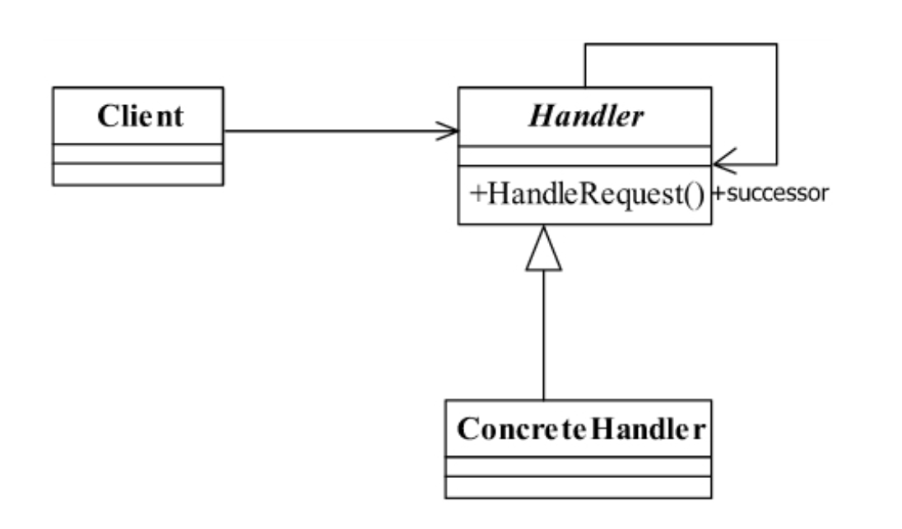
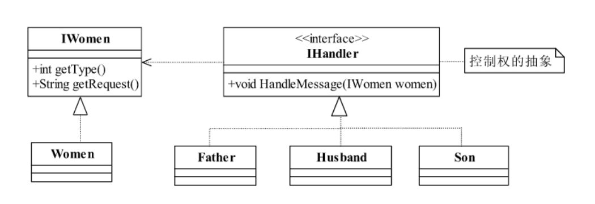
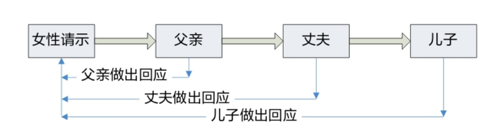
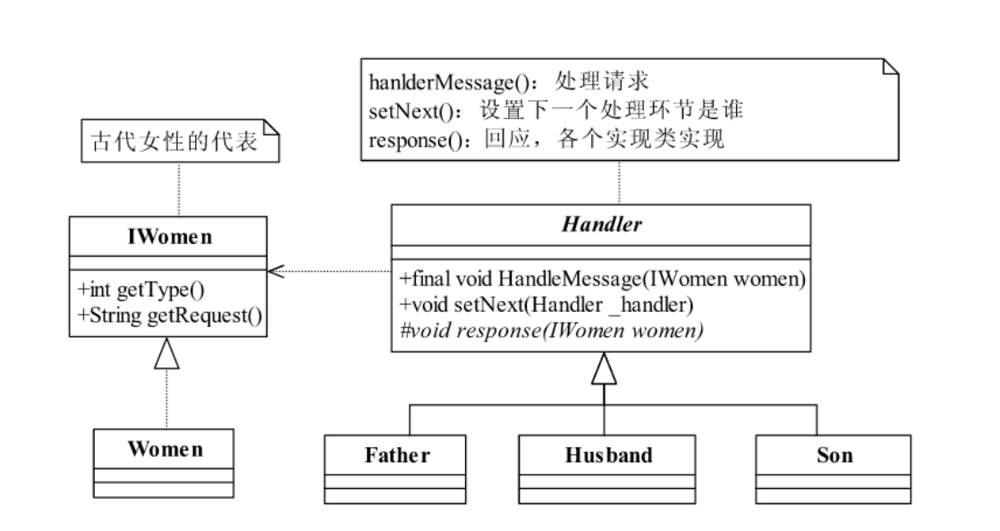
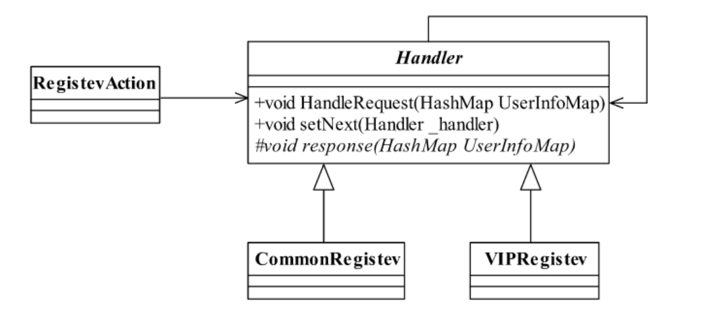

<!--
 * @description: 
 * @Author: Tian Zhi
 * @Date: 2020-05-21 19:53:04
 * @LastEditors: Tian Zhi
 * @LastEditTime: 2020-05-22 14:29:41
--> 
## 定义

> Avoid coupling the sender of a request to its receiver by giving more than one object achance to handle the request.Chain the receiving objects and pass the request along thechain until an object handles it.

> 使多个对象都有机会处理请求，从而避免了请求的发送者和接受者之间的耦合关系。将这些对象连成一条链，并沿着这条链传递该请求，直到有对象处理它为止。

## 类图



## Java代码

### 抽象处理者类

```java
public abstract class Handler {
    private Handler nextHandler;
    // 每个处理者都必须对请求做出处理
    public final Response handleMessage(Request request) {
        Response response = null;
        // 判断是否是自己的处理级别
        if (this.getHandlerLevel().equals(request.getRequestLevel())) {
            response = this.echo(request);
        } else {  // 不属于自己的处理级别
            // 判断是否有下一个处理者
            if (this.nextHandler != null) {
                response = this.nextHandler.handleMessage(request);
            } else {
                // 没有适当的处理者，业务自行处理
            }
        }
        return response;
    }
    // 设置下一个处理者是谁
    public void setNext(Handler _handler) {
        this.nextHandler = _handler;
    }
    // 每个处理者都有一个处理级别
    protected abstract Level getHandlerLevel();
    // 每个处理者都必须实现处理任务
    protected abstract Response echo(Request request);
}
```

### 具体处理者类

```java
public class ConcreteHandler1 extends Handler {
    // 定义自己的处理逻辑
    protected Response echo(Request request) {
        // 完成处理逻辑
        return null;
    }
    // 设置自己的处理级别
    protected Level getHandlerLevel() {
        // 设置自己的处理级别
        return null;
    }
}
```

在处理者中涉及三个类：Level类负责定义请求和处理级别，Request类负责封装请求，Response负责封装链中返回的结果，该三个类都需要根据业务产生：

### 业务框架类

```java
public class Level {
    // 定义一个请求和处理等级
}
public class Request {
    // 请求的等级
    public Level getRequestLevel() {
        return null;
    }
}
public class Response {
    // 处理者返回的数据
}
```

### 场景类

```java
public class Client {
    public static void main(String[] args) {
        // 声明所有的处理节点
        Handler handler1 = new ConcreteHandler1();
        Handler handler2 = new ConcreteHandler2();
        Handler handler3 = new ConcreteHandler3();
        // 设置链中的阶段顺序1-->2-->3
        handler1.setNext(handler2);
        handler2.setNext(handler3);
        // 提交请求，返回结果
        Response response = handler1.handlerMessage(new Request());
    }
}
```

在实际应用中，一般会有一个封装类对责任模式进行封装，也就是替代`Client`类，直接返回链中的第一个处理者，具体链的设置不需要高层次模块关系，这样，更简化了高层次模块的调用，减少模块间的耦合，提高系统的灵活性。

## 案例-古代女性”三从“模型

中国古代对妇女制定了“三从四德”的道德规范，“三从”是指“未嫁从父、既嫁从夫、夫死从子”。也就是说，一位女性在结婚之前要听从于父亲，结婚之后要听从于丈夫，如果丈夫死了还要听从于儿子。举例来说，如果一位女性要出去逛街，在她出嫁前必须征得父亲的同意，出嫁之后必须获得丈夫的许可，那丈夫死了怎么办？那就得问问儿子是否允许自己出去逛街。

作为父亲、丈夫或儿子，只有两种选择：要不承担起责任来，允许她或不允许她逛街；要不就让她请示下一个人。我们这个案例中通过程序描述一下古代妇女的“三从”制度：

### 类图-普通模式



类图比较简单，直接来看看代码实现：

### Java代码-普通模式

#### 女性接口

```java
public interface IWomen {
    // 获得个人状况
    public int getType();
    // 获得个人请示，你要干什么？出去逛街？约会？还是看电影？
    public String getRequest();
}
```

#### 古代妇女

```java
public class Women implements IWomen {
    /*
    * 通过一个int类型的参数来描述妇女的个人状况
    * 1--未出嫁
    * 2--出嫁
    * 3--夫死
    */
    private int type = 0;
    // 妇女的请示
    private String request = "";
    // 构造函数传递过来请求
    public Women(int _type,String _request) {
        this.type = _type;
        this.request = _request;
    }
    // 获得自己的状况
    public int getType() {
        return this.type;
    }
    // 获得妇女的请求
    public String getRequest() {
        return this.request;
    }
}
```

#### 有处理权的人员接口

```java
public interface IHandler {
    // 一个女性（女儿、妻子或者母亲）要求逛街，你要处理这个请求
    public void HandleMessage(IWomen women);
}
```

#### 父亲类（省略丈夫类和儿子类，这里类似）

```java
public class Father implements IHandler {
    // 未出嫁的女儿来请示父亲
    public void HandleMessage(IWomen women) {
        System.out.println("女儿的请示是：" + women.getRequest());
        System.out.println("父亲的答复是:同意");
    }
}
```

#### 场景类-逛街的请示

```java
public class Client {
    public static void main(String[] args) {
        // 随机挑选几个女性
        Random rand = new Random();
        ArrayList<IWomen> arrayList = new ArrayList();
        for (int i = 0; i < 5; i++) {
            arrayList.add(new Women(rand.nextInt(4),"我要出去逛街"));
        }
        // 定义三个请示对象
        IHandler father = new Father();
        IHandler husband = new Husband();
        IHandler son = new Son();
        for (IWomen women:arrayList) {
            if (women.getType() == 1) { // 未结婚少女，请示父亲
                System.out.println("\n--------女儿向父亲请示-------");
                father.HandleMessage(women);
            } else if (women.getType() == 2) {  // 已婚少妇，请示丈夫
                System.out.println("\n--------妻子向丈夫请示-------");
                husband.HandleMessage(women);
            } else if (women.getType() == 3) { // 母亲请示儿子
                System.out.println("\n--------母亲向儿子请示-------");
                son.HandleMessage(women);
            } else {
                // 暂时什么也不做
            }
        }
    }
}
```

### 普通模式的缺陷

* 职责界定不清晰

    `Father`类有必要自己知道对女儿请求的处理，而设计中却是在`Client`类中进行判断和组装。

* 代码臃肿

    `Client`类中写了很多`if...else`判断。随着处理该请求的人越来越多，比如还有可能向男权社会里其他男性亲戚请求的时候，`Client`类这一判断就会膨胀。

* 耦合过重

    `Client`类过度耦合了请求处理的责任鉴定逻辑。

* 异常情况欠考虑

    该设计中妻子只能向丈夫请示，而如果此时丈夫不在，她应该可以首先向父亲请示，其次是儿子。在该设计中无法做到。我们需要的是下面这种时序请求模型：



### 类图-责任链模式

我们应该考虑采取一种更友好的方式进行设计，即父亲、丈夫、儿子每个节点有两个选择：要么承担责任，做出回应；要么把请求转发到后序环节。



### Java代码-责任链模式

#### 修改后的`Handler`类

```java
public abstract class Handler {
    public final static int FATHER_LEVEL_REQUEST = 1;
    public final static int HUSBAND_LEVEL_REQUEST = 2;
    public final static int SON_LEVEL_REQUEST = 3;
    // 能处理的级别
    private int level = 0;
    // 责任传递，下一个人责任人是谁
    private Handler nextHandler;
    // 每个类都要说明一下自己能处理哪些请求
    public Handler(int _level) {
        this.level = _level;
    }
    // 一个女性（女儿、妻子或者是母亲）要求逛街，你要处理这个请求
    public final void HandleMessage(IWomen women) {
        if (women.getType() == this.level) {
            this.response(women);
        } else {
            if (this.nextHandler != null) {  // 有后续环节，才把请求往后递送
                this.nextHandler.HandleMessage(women);
            } else { // 已经没有后续处理人了，不用处理了
                System.out.println("---没地方请示了，按不同意处理---\n");
            }
        }
    }
    /*
    * 如果不属于你处理的请求，你应该让她找下一个环节的人，如女儿出嫁了，
    * 还向父亲请示是否可以逛街，那父亲就应该告诉女儿，应该找丈夫请示
    */
    public void setNext(Handler _handler) {
        this.nextHandler = _handler;
    }
    // 有请示那当然要回应
    protected abstract void response(IWomen women);
}
```

#### 父亲类（省略丈夫和儿子类，这里类似）

```java
public class Father extends Handler {
    // 父亲只处理女儿的请求
    public Father() {
        super(Handler.FATHER_LEVEL_REQUEST);
    }
    // 父亲的答复
    protected void response(IWomen women) {
        System.out.println("--------女儿向父亲请示-------");
        System.out.println(women.getRequest());
        System.out.println("父亲的答复是:同意\n");
    }
}
```

#### 女性类

```java
public class Women implements IWomen {
    /*
    * 通过一个int类型的参数来描述妇女的个人状况
    * 1--未出嫁
    * 2--出嫁
    * 3--夫死
    */
    private int type=0;
    // 妇女的请示
    private String request = "";
    // 构造函数传递过来请求
    public Women(int _type, String _request) {
        this.type = _type;
        // 为了便于显示，在这里做了点处理
        switch(this.type) {
            case 1:
                this.request = "女儿的请求是：" + _request;
                break;
            case 2:
                this.request = "妻子的请求是：" + _request;
                break;
            case 3:
                this.request = "母亲的请求是：" + _request;
        }
    }
    // 获得自己的状况
    public int getType() {
        return this.type;
    }
    // 获得妇女的请求
    public String getRequest() {
        return this.request;
    }
}
```

#### 场景类

```java
public class Client {
    public static void main(String[] args) {
        // 随机挑选几个女性
        Random rand = new Random();
        ArrayList<IWomen> arrayList = new ArrayList();
        for (int i = 0; i < 5; i++) {
            arrayList.add(new Women(rand.nextInt(4), "我要出去逛街"));
        }
        // 定义三个请示对象
        Handler father = new Father();
        Handler husband = new Husband();
        Handler son = new Son();
        // 设置请示顺序
        father.setNext(husband);
        husband.setNext(son);
        for (IWomen women:arrayList) {
            father.HandleMessage(women);
        }
    }
}
```

### TypeScript实现

```typescript
/** 
 * 女人的个人状况
 * 1--未出嫁
 * 2--出嫁
 * 3--夫死
*/
type WomenType = 1 | 2 | 3;

/** 女性接口 */
interface IWomen {
    // 获得个人状况
    getType(): WomenType;
    // 获得个人请示，你要干什么？出去逛街？约会？还是看电影？
    getRequest(): string;
}

/** 抽象处理者 */
abstract class Handler {
    static FATHER_LEVEL_REQUEST: WomenType = 1;
    static HUSBAND_LEVEL_REQUEST: WomenType = 2;
    static SON_LEVEL_REQUEST: WomenType = 3;
    // 能处理的级别
    private level: WomenType;
    // 责任传递，下一个人责任人是谁
    private nextHandler: Handler | null = null;
    // 每个类都要说明一下自己能处理哪些请求
    constructor(_level: WomenType) {
        this.level = _level;
    }
    // 一个女性（女儿、妻子或者是母亲）要求逛街，你要处理这个请求
    HandleMessage(women: IWomen) {
        if (women.getType() == this.level) {
            this.response(women);
        } else {
            if (this.nextHandler != null) {  // 有后续环节，才把请求往后递送
                this.nextHandler.HandleMessage(women);
            } else { // 已经没有后续处理人了，不用处理了
                console.log("---没地方请示了，按不同意处理---\n");
            }
        }
    }
    /*
    * 如果不属于你处理的请求，你应该让她找下一个环节的人，如女儿出嫁了，
    * 还向父亲请示是否可以逛街，那父亲就应该告诉女儿，应该找丈夫请示
    */
    setNext(_handler: Handler) {
        this.nextHandler = _handler;
    }
    // 有请示那当然要回应
    protected abstract response(women: IWomen): void;
}

/** 父亲类 */
class Father extends Handler {
    // 父亲只处理女儿的请求
    constructor() {
        super(Handler.FATHER_LEVEL_REQUEST);
    }
    // 父亲的答复
    protected response(women: IWomen) {
        console.log("--------女儿向父亲请示-------");
        console.log(women.getRequest());
        console.log("父亲的答复是:同意\n");
    }
}

/** 丈夫类 */
class Husband extends Handler {
    // 丈夫只处理妻子的请求
    constructor() {
        super(Handler.HUSBAND_LEVEL_REQUEST);
    }
    // 丈夫的答复
    protected response(women: IWomen) {
        console.log("--------妻子向丈夫请示-------");
        console.log(women.getRequest());
        console.log("丈夫的答复是:同意\n");
    }
}

/** 儿子类 */
class Son extends Handler {
    // 儿子只处理母亲的请求
    constructor() {
        super(Handler.SON_LEVEL_REQUEST);
    }
    // 儿子的答复
    protected response(women: IWomen) {
        console.log("--------母亲向儿子请示-------");
        console.log(women.getRequest());
        console.log("儿子的答复是:同意\n");
    }
}

/** 女性类 */
class Women implements IWomen {
    /*
    * 通过一个int类型的参数来描述妇女的个人状况
    */
    private type: WomenType;
    // 妇女的请示
    private request = "";
    // 构造函数传递过来请求
    constructor(_type: WomenType, _request: string) {
        this.type = _type;
        // 为了便于显示，在这里做了点处理
        switch (this.type) {
            case 1:
                this.request = "女儿的请求是：" + _request;
                break;
            case 2:
                this.request = "妻子的请求是：" + _request;
                break;
            case 3:
                this.request = "母亲的请求是：" + _request;
        }
    }
    // 获得自己的状况
    getType() {
        return this.type;
    }
    // 获得妇女的请求
    getRequest() {
        return this.request;
    }
}

/** 封装责任链创建逻辑 */
function createHandler() {
    const father: Handler = new Father();
    const husband: Handler = new Husband();
    const son: Handler = new Son();
    father.setNext(husband);
    husband.setNext(son);
    return father;
}

/** 场景 */
(function () {
    const womenList = [];
    for (let i = 0; i < 5; i++) {
        /** Math.floor生成未出嫁的女人 > 夫死的女人；使用Math.ceil反过来 */
        const type = (1 + Math.ceil(Math.random() * 2)) as WomenType;
        womenList.push(new Women(type, '我要出去逛街'));
    }
    const handler = createHandler();
    for (let i = 0; i < womenList.length; i++) {
        handler.HandleMessage(womenList[i])
    }
})()
```

## 使用场景

责任链模式非常显著的优点是将请求和处理分开。请求者可以不用知道是谁处理的（只需要知道有一条责任链，把请求传给链表头接受者即可），处理者可以不用知道请求的全貌（处理者只需要响应请求，对请求的接收在抽象处理者进行），例如在J2EE项目开发中，可以剥离出无状态Bean由责任链处理。两者解耦，提高系统的灵活性。

同时，责任链模式还有两个显著的缺点：首先是链表较长时遍历带来的性能问题，每次请求到需要从链表头开始遍历知道有请求者响应；其次是调试不方便。在实际使用中我们需要控制链中节点的数量，一般做法是在`Handler`中设置一个最大节点数量，在`setNext`方法中判断是否已经超过其阈值，超过则不允许该链建立，避免无意识地破坏系统性能。

## 最佳实践

在例子和通用源码中`Handler`是抽象类，融合了模板方法模式，每个实现类只要实现两个方法：`echo`方法处理请求和`getHandlerLevel`获得处理级别，各个实现类只要关注的自己业务逻辑就成了，而父类实现了请求传递的功能，子类实现请求的处理，符合单一职责原则。各个实现类只完成一个动作或逻辑，也就是只有一个原因引起类的改变，子类的实现非常简单，责任链的建立也是非常灵活的。

责任链模式屏蔽了请求的处理过程，只要你把请求抛给责任链的第一个处理者，最终会返回一个处理结果（当然也可以不做任何处理），作为请求者可以不用知道到底是需要谁来处理的，这是责任链模式的核心。同时责任链模式也可以作为一种补救模式来使用。举个简单例子：一个请求（如银行客户存款的币种），一个处理者（只处理人民币），但是随着业务的发展（改革开放了嘛，还要处理美元、日元等），处理者的数量和类型都有所增加，那这时候就可以在第一个处理者后面建立一个链，也就是责任链来处理请求，如果是人民币，好，还是第一个业务逻辑来处理；如果是美元，好，传递到第二个业务逻辑来处理；日元、欧元……这些都不用在对原有的业务逻辑产生很大改变，通过扩展实现类就可以很好地解决这些需求变更的问题。

作者这里还提到了一个实际的项目：界面上有一个用户注册功能，注册用户分两种，一种是VIP用户，一种是普通用户，一个用户的注册要填写一堆信息，VIP用户只比普通用户多了一个输入项：VIP序列号。注册后还需要激活，VIP是自动发送邮件到用户的邮箱中就算激活了，普通用户要发送短信才能激活，为什么呢？获得手机号码以后好发广告短信啊！项目组就采用了责任链模式，甭管从前台传递过来的是VIP用户信息还是普通用户信息，统一传递到一个处理入口，通过责任链来完成任务的处理：



其中`RegisterAction`是继承了Strust2中的`ActionSupport`，实现HTTP传递过来对象组装，组装出一个HashMap对象`UserInfoMap`，传递给`Handler`的两个实现类，具体是哪个实现类来处理的，就由HashMap上的用户标识来做决定了，这个和上面举的例子很类似，下面是我自己使用TypeScript进行的简要实现：

```typescript
/** 基础用户信息 */
interface UserInfo {
    username: string;
    email: string;
    phone: string;
    sequenceNumber?: number;
}

/** 处理等级，1表示会员，0表示普通用户 */
type HandleLevel = 0 | 1;

/** 抽象Handler */
abstract class Handler {
    private _next: Handler | null = null;
    private handleLevel: HandleLevel;
    constructor(level: HandleLevel) {
        this.handleLevel = level;
    }
    setNext(next: Handler) {
        this._next = next;
    }
    handleRequest(info: UserInfo) {
        const level = info.sequenceNumber ? 1 : 0;
        if (level === this.handleLevel) {
            this.response(info);
        } else if (this._next) {
            this._next.response(info);
        } else {
            console.log('注册失败');
        }
    }
    abstract response(info: UserInfo): void;
}

/** 普通用户注册 */
class CommonRegister extends Handler {
    response(info: UserInfo) {
        console.log(`尊敬的${info.username}：已向您的手机号${info.phone}发送验证消息，请查收并完成注册。`);
    }
}

/** VIP用户注册 */
class VIPRegister extends Handler {
    response(info: UserInfo) {
        console.log(`尊敬的VIP用户${info.username}：已向您的邮箱${info.email}发送验证消息，请查收并完成注册。`)
    }
}

/** 封装责任链 */
function handleRegistration(userinfo: UserInfo) {
    const commonRegister = new CommonRegister(0);
    const vipRegister = new VIPRegister(1);
    commonRegister.setNext(vipRegister);
    commonRegister.handleRequest(userinfo);
}

/** 场景 */
(function () {
    /** 普通用户注册 */
    const commonUser: UserInfo = { username: 'Chris', phone: '12345678901', email: 'chris@yahoo.com' };
    handleRegistration(commonUser);
    /** VIP用户注册 */
    const vipUser: UserInfo = { username: 'Janine', phone: '10987654321', email: 'janine@yahoo.com', sequenceNumber: 981110 };
    handleRegistration(vipUser);
})()
```

## 与六大设计原则的结合

- [x] Single Responsibility Principle (SRP, 单一职责原则)

    责任链模式中的每一个接受者只需要响应请求以及设置自己可以响应的请求类型，至于请求是怎么流转的则无需知道。符合SRP。

- [x] Open Closed Principle (OCP, 开闭原则)

    我们可以很方便地增加请求或者接受者，只需要修改责任链的接受者顺序而不需修改业务逻辑，符合OCP。

- [x] Liskov Substitution Principle (LSP, 里氏替换原则)

    责任链模式中的接受者都是继承抽象接受者。符合LSP。

- [x] Law of Demeter (LoD, 迪米特法则)

    抽象接受者实现了请求流转的逻辑，而具体抽象者只需要实现响应逻辑；同时高层模块无需要知道请求是如何处理和流转的，只需要知道具体的请求。在请求和接收者之间解耦。符合LoD。

- [ ] Interface Segragation Principle (ISP, 接口隔离原则)

    没有提及。

- [x] Dependency Inversion Principle (DIP, 依赖倒置原则)

    在责任链模式中，高层业务无需依赖具体的接收者。符合DIP。
