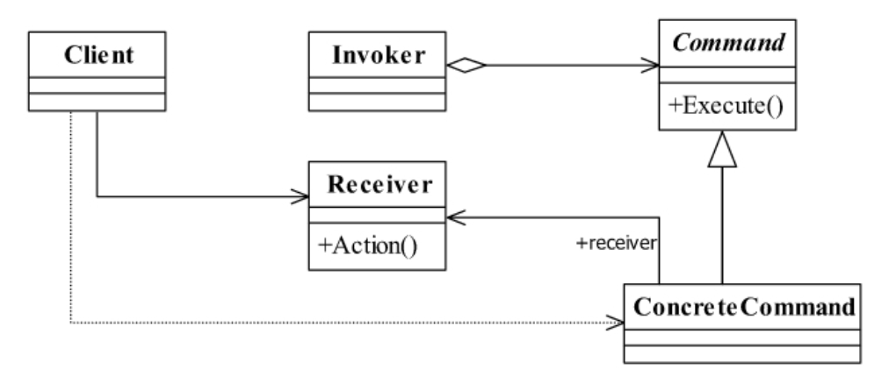
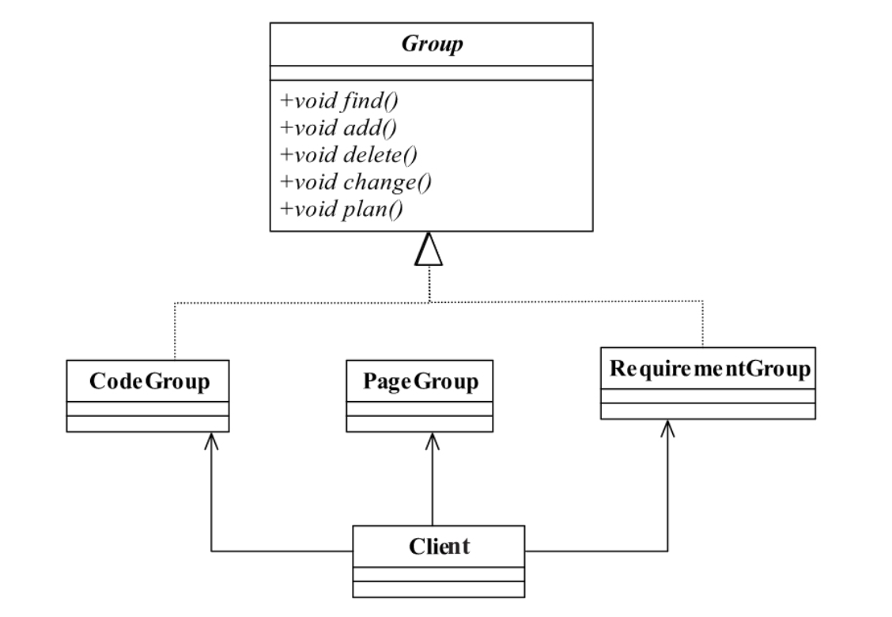
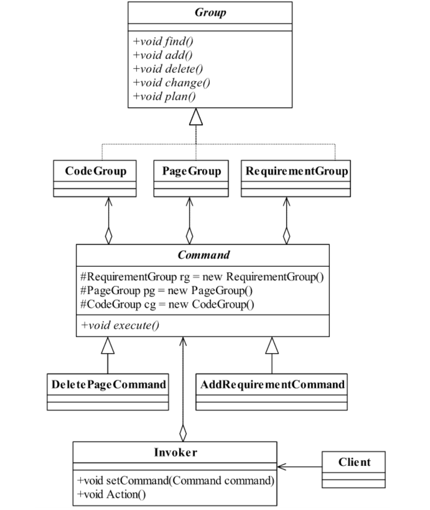

<!--
 * @description: 
 * @Author: Tian Zhi
 * @Date: 2020-05-18 09:47:30
 * @LastEditors: Tian Zhi
 * @LastEditTime: 2020-05-19 12:48:50
 -->
## 定义

命令模式是一个高内聚的模式，其定义为：

> Encapsulate a request as an object,therebyletting you parameterize clients with different requests,queue or log requests,and supportundoable operations.

> 将一个请求封装成一个对象，从而让你使用不同的请求把客户端参数化，对请求排队或者记录请求日志，可以提供命令的撤销和恢复功能。

## 类图



* Receive接收者角色

    该角色就是干活的角色，命令传递到这里是应该被执行的。

* Command命令角色

    需要执行的所有命令都在这里声明。

* Invoker调用者角色

    接收到命令，并执行命令。

## Java代码

命令模式比较简单，但是在项目中非常频繁地使用，因为它的封装性非常好，把请求方（Invoker）和执行方（Receiver）分开了，扩展性也有很好的保障，通用代码比较简单。

### 抽象Receiver类

```java
public abstract class Receiver {
    // 抽象接收者，定义每个接收者都必须完成的业务
    public abstract void doSomething();
}
```

### 具体Receiver类

```java
public class ConcreteReciver1 extends Receiver {
    // 每个接收者都必须处理一定的业务逻辑
    public void doSomething() {}
}
```

### 抽象Command类

```java
public abstract class Command {
     // 每个命令类都必须有一个执行命令的方法
     public abstract void execute();
}
```

### 具体Command类

```java
public class ConcreteCommand1 extends Command {
    // 对哪个Receiver类进行命令处理
    private Receiver receiver;
    // 构造函数传递接收者
    public ConcreteCommand1(Receiver _receiver) {
        this.receiver = _receiver;
    }
    // 必须实现一个命令
    public void execute() {
        // 业务处理
        this.receiver.doSomething();
    }
}
```

### 调用者Invoker类

```java
public class Invoker {
    private Command command;
    // 受气包，接受命令
    public void setCommand(Command _command) {
        this.command = _command;
    }
    // 执行命令
    public void action() {
        this.command.execute();
    }
}
```

### 场景类

```java
public class Client {
    public static void main(String[] args) {
        // 首先声明调用者Invoker
        Invoker invoker = new Invoker();
        // 定义接收者
        Receiver receiver = new ConcreteReciver1();
        // 定义一个发送给接收者的命令
        Command command = new ConcreteCommand1(receiver);
        // 把命令交给调用者去执行
        invoker.setCommand(command);
        invoker.action();
    }
}
```

## 案例-旅行社项目开发

现在有一个旅行社项目的开发，该项目的成员分工采用了常规的分工方式，分为需求组（Requirement Group,RG）、美工组（Page Group,PG）、代码组（Code Group，简称CG）。刚开始，客户（也就是旅行社，甲方）和每个组探讨，比如和需求组讨论需求、和美工讨论页面、和代码组讨论实现，告诉他们修改、删除、增加各种内容等。

这是一种比较常见的甲乙方合作模式，甲方深入到乙方的项目开发中，我们可以使用类图来表示这个过程：

### 类图-未使用命令模式



### Java实现-未使用命令模式

#### 抽象组

```java
public abstract class Group {
    // 甲乙双方分开办公，如果你要和某个组讨论，你首先要找到这个组
    public abstract void find();
    // 被要求增加功能
    public abstract void add();
    // 被要求删除功能
    public abstract void delete();
    // 被要求修改功能
    public abstract void change();
    // 被要求给出所有的变更计划
    public abstract void plan();
}   
```

#### 需求组（美工和代码组类似，省略代码）

```java
public class RequirementGroup extends Group {
    // 客户要求需求组过去和他们谈
    public void find() {
        System.out.println("找到需求组...");
    }
    // 客户要求增加一项需求
    public void add() {
        System.out.println("客户要求增加一项需求...");
    }
    // 客户要求修改一项需求
    public void change() {
        System.out.println("客户要求修改一项需求...");
    }
    // 客户要求删除一项需求
    public void delete() {
        System.out.println("客户要求删除一项需求...");
    }
    // 客户要求给出变更计划
    public void plan() {
        System.out.println("客户要求需求变更计划...");
    }
}
```

#### 场景类

```java
public class Client {
    public static void main(String[] args) {
        // 首先客户找到需求组说，过来谈需求，并修改
        System.out.println("-----------客户要求增加一项需求---------------");
        Group rg = new RequirementGroup();
        // 找到需求组
        rg.find();
        // 增加一个需求
        rg.add();
        // 要求变更计划
        rg.plan();
    }
}
```

#### 变化的场景类

```java
public class Client {
    public static void main(String[] args) {
        // 首先客户找到美工组说，过来谈页面，并修改
        System.out.println("----------客户要求删除一个页面--------------");
        Group pg = new PageGroup();
        // 找到需求组
        pg.find();
        // 删除一项需求
        pg.delete();
        // 要求变更计划
        pg.plan();
    }
}
```

问题是，每次的改动，都需要甲方亲自通知对应的组进行修改，而且这种方式很容易出错误，例如客户把美工叫过去了，要删除，可美工说需求是这么写的，然后客户又命令需求组过去。。。

其实想了想，甲方的需求无非就是执行一个命令，至于这个命令乙方内部具体怎么调度执行，不是他所关心的。我们再来看看下面的设计，我们增加一个对接人`invoker`，同时将“命令”虚拟成一个`Command`类：

### 类图-使用命令模式



### Java实现-使用命令模式

#### 抽象命令类

```java
public abstract class Command {
    // 把三个组都定义好，子类可以直接使用
    protected RequirementGroup rg = new RequirementGroup();  // 需求组
    protected PageGroup pg = new PageGroup();  // 美工组
    protected CodeGroup cg = new CodeGroup();  // 代码组
    // 只有一个方法，你要我做什么事情
    public abstract void execute();
}
```

#### 增加需求的命令

```java
public class AddRequirementCommand extends Command {
    // 执行增加一项需求的命令
    public void execute() {
        // 找到需求组
        super.rg.find();
        // 增加一份需求
        super.rg.add();
        // 给出计划
        super.rg.plan();
    }
}
```

#### 删除页面的命令

```java
public class DeletePageCommand extends Command {
    // 执行删除一个页面的命令
    public void execute() {
        // 找到页面组
        super.pg.find();
        // 删除一个页面
        super.rg.delete();
        // 给出计划
        super.rg.plan();
    }
}
```

#### 负责人

```java
public class Invoker {
    // 什么命令
    private Command command;
    // 客户发出命令
    public void setCommand(Command command) {
        this.command = command;
    }
    // 执行客户的命令
    public void action() {
        this.command.execute();
    }
}
```

#### 场景类

```java
public class Client {
    public static void main(String[] args) {
        // 定义我们的接头人
        Invoker xiaoSan = new Invoker();  // 接头人就是小三
        // 客户要求增加一项需求
        System.out.println("------------客户要求增加一项需求---------------");
        // 客户给我们下命令来
        Command command = new AddRequirementCommand();
        /** 如果需要需求变更 */
        // Command command = new DeletePageCommand();
        // 接头人接收到命令
        xiaoSan.setCommand(command);
        // 接头人执行命令
        xiaoSan.action();
    }
}
```

变更需求是不是比没有使用命令模式时快速简洁很多？

### TypeScript实现

```typescript
// 抽象组
abstract class Group {
    // 甲乙双方分开办公，如果你要和某个组讨论，你首先要找到这个组
    abstract find(): void;
    // 被要求增加功能
    abstract add(): void;
    // 被要求删除功能
    abstract delete(): void;
    // 被要求修改功能
    abstract change(): void;
    // 被要求给出所有的变更计划
    abstract plan(): void;
}  

// 需求组
class RequirementGroup extends Group {
    // 客户要求需求组过去和他们谈
    find() {
        console.log("找到需求组...");
    }
    // 客户要求增加一项需求
    add() {
        console.log("客户要求增加一项需求...");
    }
    // 客户要求修改一项需求
    change() {
        console.log("客户要求修改一项需求...");
    }
    // 客户要求删除一项需求
    delete() {
        console.log("客户要求删除一项需求...");
    }
    // 客户要求给出变更计划
    plan() {
        console.log("客户要求需求变更计划...");
    }
}

// 美工组
class PageGroup extends Group {
    // 客户要求美工组过去和他们谈
    find() {
        console.log("找到美工组...");
    }
    // 客户要求增加一个页面
    add() {
        console.log("客户要求增加一个页面...");
    }
    // 客户要求修改一个页面
    change() {
        console.log("客户要求修改一个页面...");
    }
    // 客户要求删除一个页面
    delete() {
        console.log("客户要求删除一个页面...");
    }
    // 客户要求给出变更计划
    plan() {
        console.log("客户要求美工变更计划...");
    }
}

// 代码组
class CodeGroup extends Group {
    // 客户要求代码过去和他们谈
    find() {
        console.log("找到代码...");
    }
    // 客户要求增加一段代码
    add() {
        console.log("客户要求增加一段代码...");
    }
    // 客户要求修改一段代码
    change() {
        console.log("客户要求修改一段代码...");
    }
    // 客户要求删除一段代码
    delete() {
        console.log("客户要求删除一段代码...");
    }
    // 客户要求给出变更计划
    plan() {
        console.log("客户要求代码组变更计划...");
    }
}

// 抽象命令类
abstract class Command {
    // 把三个组都定义好，子类可以直接使用
    protected rg: RequirementGroup = new RequirementGroup();  // 需求组
    protected pg: PageGroup = new PageGroup();  // 美工组
    protected cg: CodeGroup = new CodeGroup();  // 代码组
    // 只有一个方法，你要我做什么事情
    abstract execute(): void;
}

// 增加需求的命令
class AddRequirementCommand extends Command {
    constructor() {
        super();
    }
    // 执行增加一项需求的命令
    execute(): void {
        // 找到需求组
        this.rg.find();
        // 增加一份需求
        this.rg.add();
        // 给出计划
        this.rg.plan();
    }
}

// 删除页面的命令
class DeletePageCommand extends Command {
    constructor() {
        super();
    }
    // 执行删除一个页面的命令
    execute(): void  {
        // 找到页面组
        this.pg.find();
        // 删除一个页面
        this.pg.delete();
        // 给出计划
        this.pg.plan();
    }
}

// 负责人
class Invoker {
    // 什么命令
    private command: Command|undefined;
    // 客户发出命令
    public setCommand(cmd: Command): void {
        this.command = cmd;
    }
    // 执行客户的命令
    public action(): void {
        this.command?.execute();
    }
}

// 场景
(function() {
    // 定义我们的接头人
    const xiaoSan = new Invoker();  // 接头人就是小三
    // 客户要求增加一项需求
    console.log("------------客户要求增加一项需求---------------");
    // 客户给我们下命令来
    const command: Command = new AddRequirementCommand();
    /** 如果需要需求变更 */
    // const command: Command = new DeletePageCommand();
    // 接头人接收到命令
    xiaoSan.setCommand(command);
    // 接头人执行命令
    xiaoSan.action();
})()
```

## 命令模式的扩展

### 抽象Command依赖多个Receiver

在通用类图中，每个具体Command类初始化的时候需要传递进来一个Receiver；而案例中则是抽象Command类依赖三个Receiver。前者会造成高层模块比如Client类对Receiver类的依赖，而后者则会造成具体Command类产生不必要的Receiver依赖。

一般而言，每个Command都是对一个或多个Receiver的依赖，如果实在需要修改依赖，我们可以使用构造函数重载：

#### 完美的Command类

```java
public abstract class Command {
    // 定义一个子类的全局共享变量
    protected final Receiver receiver;
    // 实现类必须定义一个接收者
    public Command(Receiver _receiver) {
        this.receiver = _receiver;
    }
    // 每个命令类都必须有一个执行命令的方法
    public abstract void execute();
}
```

如果需要依赖多个Receiver，则可以考虑使用集合类型

#### 具体的命令类

```java
public class ConcreteCommand1 extends Command {
    // 声明自己的默认接收者
    public ConcreteCommand1() {
        super(new ConcreteReciver1());
    }
    // 设置新的接收者
    public ConcreteCommand1(Receiver _receiver) {
        super(_receiver);
    }
    // 每个具体的命令都必须实现一个命令
    public void execute() {
        // 业务处理
        super.receiver.doSomething();
    }
}
```

#### 场景类

```java
public class Client {
    public static void main(String[] args) {
        // 首先声明调用者Invoker
        Invoker invoker = new Invoker();
        // 定义一个发送给接收者的命令
        Command command = new ConcreteCommand1();
        // 把命令交给调用者去执行
        invoker.setCommand(command);
        invoker.action();
    }
}
```

### 反悔问题

返回问题指的是命令的撤销，我们可以为抽象Command类实现一个`rollBack`方法，利用日志的回滚机制进行回滚，还是来看下案例：

#### 修改后的Group类

```java
public abstract class Group {
    // 甲乙双方分开办公，你要和那个组讨论，你首先要找到这个组
    public abstract void find();
    // 被要求增加功能
    public abstract void add();
    // 被要求删除功能
    public abstract void delete();
    // 被要求修改功能
    public abstract void change();
    // 被要求给出所有的变更计划
    public abstract void plan();
    // 每个接收者都要对直接执行的任务可以回滚
    public void rollBack() {
        // 根据日志进行回滚
    }
}
```

#### 撤销命令

```java
public class CancelDeletePageCommand extends Command {
    // 撤销删除一个页面的命令
    public void execute() {
        super.pg.rollBack();
    }
}
```

客户选择了执行这个撤销动作，就可以进行撤销操作，该示意代码确实比较简单，真正实现起来那是异常复杂的，事务日志处理是非常繁琐的处理机制，想想数据库的日志处理吧，你就能想象出这个日志有多复杂！

## 使用场景

只要认为是命令的地方就可以采用命令模式，例如，在GUI开发中，一个按钮的点击是一个命令，可以采用命令模式；模拟DOS命令的时候，当然也要采用命令模式；触发－反馈机制的处理等。

## 最佳实践

最佳实践就是减少高层模块例如Client对底层模块例如Receiver的调用，通常Command对Receiver的依赖是固定的，很少会变更Receiver，这样我们便可以在Command类中封装Receiver，而不必Client类中指定Receiver传给Command。详见[抽象Command依赖多个Receiver](#抽象Command依赖多个Receiver)

## 与六大设计原则的结合

- [x] Single Responsibility Principle (SRP, 单一职责原则)

    符合SRP。一个具体Receiver类只执行他能够执行的任务；同时一个具体Command类只完成一个命令，当然，如果命令很多，类也会非常多，这也是命令模式的缺点之一。

- [x] Open Closed Principle (OCP, 开闭原则)

    符合OCP，命令模式中对Command类和Receiver类的扩展都很容易。

- [x] Liskov Substitution Principle (LSP, 里氏替换原则)

    符合LSP，Command类和Receiver类均使用抽象类。

- [x] Law of Demeter (LoD, 迪米特法则)

    符合LoD，每个Command只需要知道它依赖的Receiver，Client类也只需要知道Invoker类而不需要知道Receiver类。

- [ ] Interface Segragation Principle (ISP, 接口隔离原则)

    未提及。

- [x] Dependency Inversion Principle (DIP, 依赖倒置原则)

    符合DIP，高层Client不依赖底层Receiver，对于Command和Receiver都是面向抽象类进行编程。