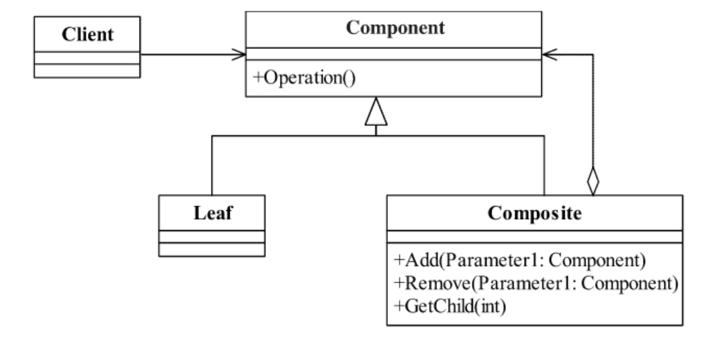
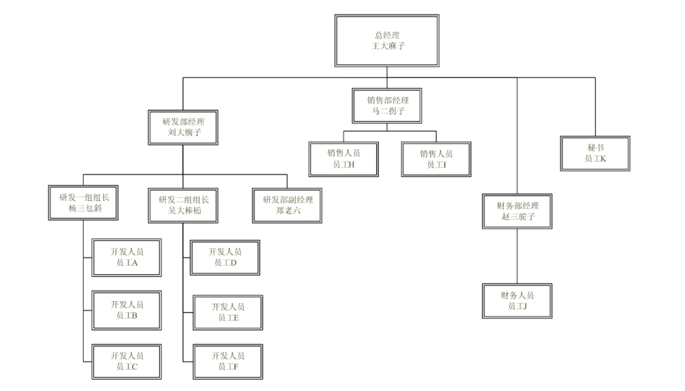
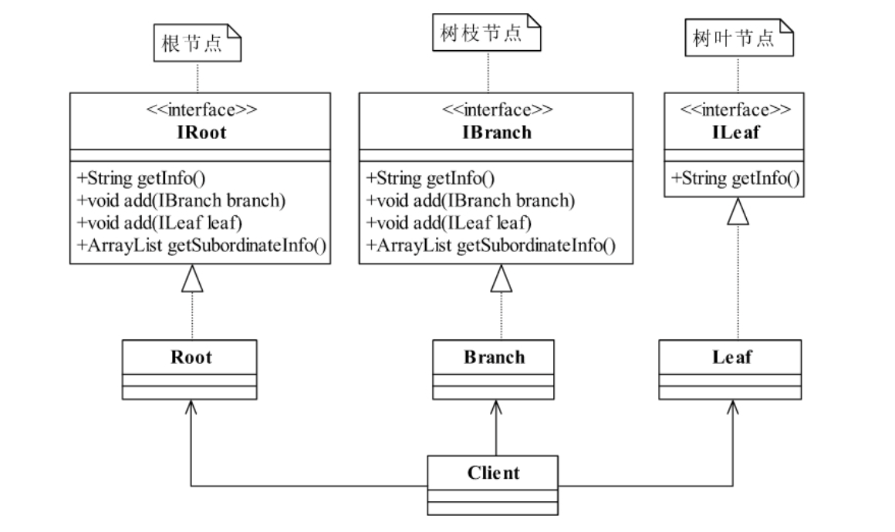
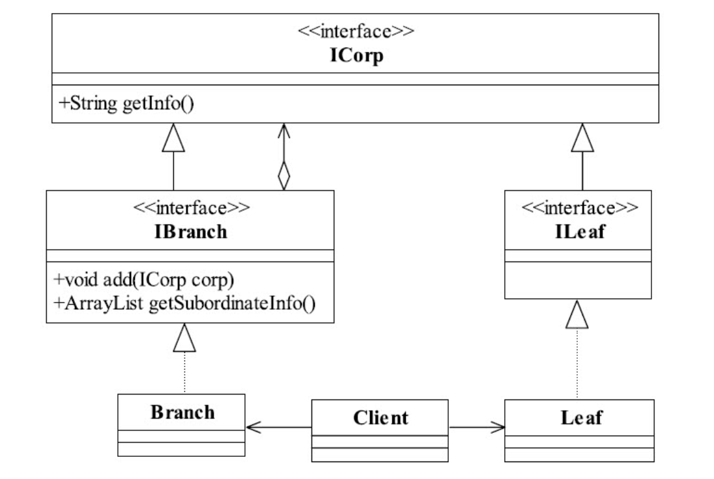
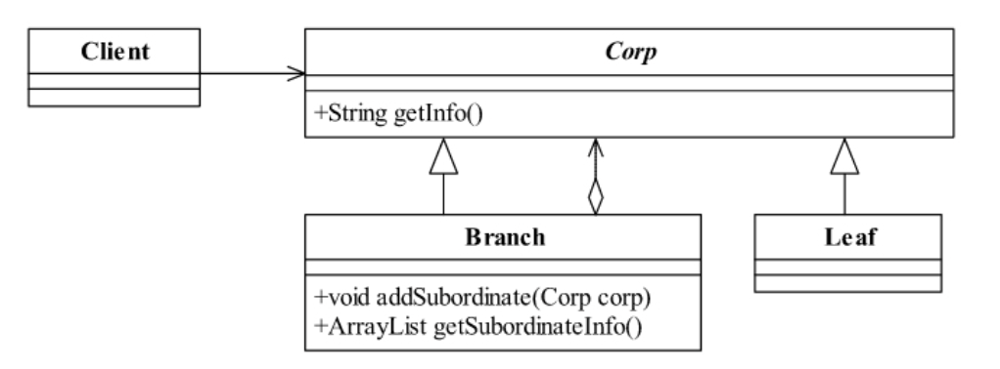
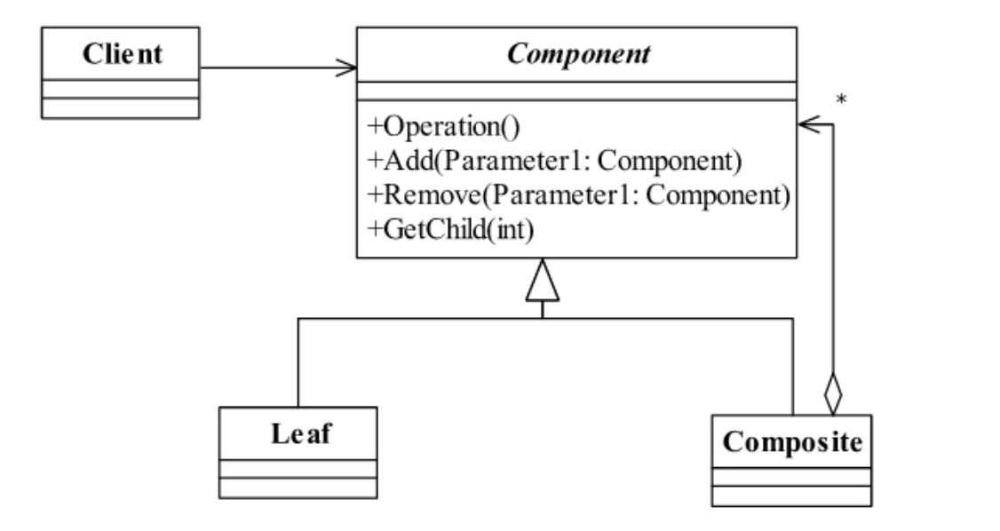

<!--
 * @description: 
 * @Author: Tian Zhi
 * @Date: 2020-06-10 09:46:11
 * @LastEditors: Tian Zhi
 * @LastEditTime: 2020-06-19 16:21:40
--> 
## 定义

组合模式(Composite Pattern)也叫合成模式，有时又叫做部分-整体模式（Part-Whole），主要是用来描述部分与整体的关系，其定义如下：

> Compose objects into tree structures to represent part-whole hierarchies.Composite letsclients treat individual objects and compositions of objects uniformly.

> 将对象组合成树形结构以表示“部分-整体”的层次结构，使得用户对单个对象和组合对象的使用具有一致性。

## 类图



组合模式有如下角色：

* Component抽象构件角色

    定义参加组合对象的共有方法和属性，可以定义一些默认的行为或属性。

* Leaf叶子构件

    叶子对象，其下再也没有其他的分支，也就是遍历的最小单位。

* Composite树枝构件

    树枝对象，它的作用是组合树枝节点和叶子节点形成一个树形结构。

## Java代码

### 抽象构件

```java
public abstract class Component {
    // 个体和整体都具有的共享
    public void doSomething() {
        // 编写业务逻辑
    }
}
```

**树枝构件是组合模式的重点：**

### 树枝构件

```java
public class Composite extends Component {
    // 构件容器
    private ArrayList<Component> componentArrayList = new ArrayList<Component>();
    // 增加一个叶子构件或树枝构件
    public void add(Component component) {
        this.componentArrayList.add(component);
    }
    // 删除一个叶子构件或树枝构件
    public void remove(Component component) {
        this.componentArrayList.remove(component);
    }
    // 获得分支下的所有叶子构件和树枝构件
    public ArrayList<Component> getChildren() {
        return this.componentArrayList;
    }
}
```

### 树叶构件

```java
public class Leaf extends Component {
    /*
    * 可以覆写父类方法
    * public void doSomething() {
    *
    * }
    */
}
```

### 场景类

```java
public class Client {
    public static void main(String[] args) {
        // 创建一个根节点
        Composite root = new Composite();
        root.doSomething();
        // 创建一个树枝构件
        Composite branch = new Composite();
        // 创建一个叶子节点
        Leaf leaf = new Leaf();
        // 建立整体
        root.add(branch);
        branch.add(leaf);
    }
    // 通过递归遍历树
    public static void display(Composite root) {
        for (Component c:root.getChildren()) {
            if (c instanceof Leaf) { //叶子节点
                    c.doSomething();
            } else { // 树枝节点
                    display((Composite)c);
            }
        }
    }
}
```

## 案例-人事架构

先来看看常规的公司人事组织架构图：



如果要用类图实现，很多人第一想到的最简单类图设计如下：



其中`getInfo`表示获取职员基本信息，`add`用于拥有管理权的职工增加下属，`getSubordinateInfo`表示遍历下属信息。但是这样的设计有明显缺陷：

1. `getInfo`冗余定义。

2. 最高管理人员（根节点）和基层管理人员（树枝节点）几乎完全相同，根节点其实是一种特殊的树枝节点。

3. 扩展性差，如果要增加一类职员信息，每一个类都需要改动。

接下来重新设计类图，将`getInfo`进行抽象提取，同时只分两类：有下属的职员（根节点和树枝节点）和无下属的职员（树叶节点）：



仔细看上面的类图，会发现有下属职员和无下属职员的接口有些多余，而且这两类接口的实现类也只有特定的两个。同时`getInfo`都是相同的，职员接口也可以替换成抽象类。因此我们还可以做进一步简化：



这样类图就精简了很多，最后来看看实现代码。

### Java实现

#### 抽象公司职员类

```java
public abstract class Corp {
    // 公司每个人都有名称
    private String name = "";
    // 公司每个人都职位
    private String position = "";
    // 公司每个人都有薪水
    private int salary =0;
    public Corp(String _name, String _position, int _salary) {
        this.name = _name;
        this.position = _position;
        this.salary = _salary;
    }
    // 获得员工信息
    public String getInfo() {
        String info = "";
        info = "姓名：" + this.name;
        info = info + "\t职位："+ this.position;
        info = info + "\t薪水：" + this.salary;
        return info;
    }
}
```

#### 树叶节点

```java
public class Leaf extends Corp {
    // 就写一个构造函数，这个是必需的
    public Leaf(String _name, String _position, int _salary) {
        super(_name, _position, _salary);
    }
}
```

#### 树枝节点

```java
public class Branch extends Corp {
    // 领导下边有哪些下级领导和小兵
    ArrayList<Corp> subordinateList = new ArrayList<Corp>();
    // 构造函数是必需的
    public Branch(String _name, String _position, int _salary) {
        super(_name, _position, _salary);
    }
    // 增加一个下属，可能是小头目，也可能是个小兵
    public void addSubordinate(Corp corp) {
        this.subordinateList.add(corp);
    }
    // 我有哪些下属
    public ArrayList<Corp> getSubordinate() {
        return this.subordinateList;
    }
}
```

#### 场景类

```java
public class Client {
    public static void main(String[] args) {
        // 首先是组装一个组织结构出来
        Branch ceo = compositeCorpTree();
        // 首先把CEO的信息打印出来
        System.out.println(ceo.getInfo());
        // 然后是所有员工信息
        System.out.println(getTreeInfo(ceo));
    }
    // 把整个树组装出来
    public static Branch compositeCorpTree() {
        // 首先产生总经理CEO
        Branch root = new Branch("王大麻子","总经理",100000);
        // 把两个部门经理产生出来
        Branch developDep = new Branch("刘大瘸子","研发部门经理",10000);
        Branch salesDep = new Branch("马二拐子","销售部门经理",20000);
        // 再把两个个小组长产生出来
        Branch firstDevGroup = new Branch("杨三乜斜","开发一组组长",5000);
        Branch secondDevGroup = new Branch("吴大棒槌","开发二组组长",6000);
        // 把所有的小兵都产生出来
        Leaf a = new Leaf("a","开发人员",2000);
        Leaf b = new Leaf("b","开发人员",2000);
        Leaf c = new Leaf("c","开发人员",2000);
        Leaf d = new Leaf("d","开发人员",2000);
        Leaf h = new Leaf("h","销售人员",5000);
        Leaf i = new Leaf("i","销售人员",4000);
        Leaf k = new Leaf("k","CEO秘书",8000);
        Leaf zhengLaoLiu = new Leaf("郑老六","研发部副经理",20000);
        // 开始组装
        // CEO下有三个部门经理和一个秘书
        root.addSubordinate(k);
        root.addSubordinate(developDep);
        root.addSubordinate(salesDep);
        // 研发部经理
        developDep.addSubordinate(zhengLaoLiu);
        developDep.addSubordinate(firstDevGroup);
        developDep.addSubordinate(secondDevGroup);
        // 看看两个开发小组下有什么
        firstDevGroup.addSubordinate(a);
        firstDevGroup.addSubordinate(b);
        secondDevGroup.addSubordinate(c);
        secondDevGroup.addSubordinate(d);
        // 再看销售部下的人员情况
        salesDep.addSubordinate(h);
        salesDep.addSubordinate(i);
        return root;
    }
    // 遍历整棵树,只要给我根节点，我就能遍历出所有的节点
    public static String getTreeInfo(Branch root) {
        ArrayList<Corp> subordinateList = root.getSubordinate();
        String info = "";
        for(Corp s :subordinateList) {
            if (s instanceof Leaf) { // 是员工就直接获得信息
                info = info + s.getInfo()+ "\n";
            } else { // 是个小头目
                info = info + s.getInfo() + "\n" + getTreeInfo((Branch)s);
            }
        }
        return info;
    }
}
```

### TypeScript实现

```typescript
// 职员类
abstract class Corp {
    // 公司每个人都有名称
    private name = "";
    // 公司每个人都职位
    private position = "";
    // 公司每个人都有薪水
    private salary =0;
    constructor(_name: string, _position: string, _salary: number) {
        this.name = _name;
        this.position = _position;
        this.salary = _salary;
    }
    // 获得员工信息
    getInfo() {
        let info = "";
        info = "姓名：" + this.name;
        info = info + "\t职位："+ this.position;
        info = info + "\t薪水：" + this.salary;
        return info;
    }
}

// 基层职员类
class Leaf extends Corp {
    // 就写一个构造函数，这个是必需的
    constructor(_name: string, _position: string, _salary: number) {
        super(_name, _position, _salary);
    }
}

// 管理层职员类
class Branch extends Corp {
    // 领导下边有哪些下级领导和小兵
    private subordinateList: Corp[] = [];
    // 构造函数是必需的
    constructor(_name: string, _position: string, _salary: number) {
        super(_name, _position, _salary);
    }
    // 增加一个下属，可能是小头目，也可能是个小兵
    addSubordinate(corp: Corp) {
        this.subordinateList.push(corp);
    }
    // 我有哪些下属
    getSubordinate() {
        return this.subordinateList;
    }
}

// 遍历整棵树,只要给我根节点，我就能遍历出所有的节点
function getTreeInfo(root: Branch) {
    const subordinateList = root.getSubordinate();
    let info = "";
    for(let s of subordinateList) {
        if (s instanceof Leaf) { // 是员工就直接获得信息
            info = info + s.getInfo()+ "\n";
        } else { // 是个小头目
            info = info + s.getInfo() + "\n" + getTreeInfo(s);
        }
    }
    return info;
}

// 把整个树组装出来
function compositeCorpTree() {
    // 首先产生总经理CEO
    const root = new Branch("王大麻子","总经理",100000);
    // 把两个部门经理产生出来
    const developDep = new Branch("刘大瘸子","研发部门经理",10000);
    const salesDep = new Branch("马二拐子","销售部门经理",20000);
    // 再把两个个小组长产生出来
    const firstDevGroup = new Branch("杨三乜斜","开发一组组长",5000);
    const secondDevGroup = new Branch("吴大棒槌","开发二组组长",6000);
    // 把所有的小兵都产生出来
    const a = new Leaf("a","开发人员",2000);
    const b = new Leaf("b","开发人员",2000);
    const c = new Leaf("c","开发人员",2000);
    const d = new Leaf("d","开发人员",2000);
    const h = new Leaf("h","销售人员",5000);
    const i = new Leaf("i","销售人员",4000);
    const k = new Leaf("k","CEO秘书",8000);
    const zhengLaoLiu = new Leaf("郑老六","研发部副经理",20000);
    // 开始组装
    // CEO下有三个部门经理和一个秘书
    root.addSubordinate(k);
    root.addSubordinate(developDep);
    root.addSubordinate(salesDep);
    // 研发部经理
    developDep.addSubordinate(zhengLaoLiu);
    developDep.addSubordinate(firstDevGroup);
    developDep.addSubordinate(secondDevGroup);
    // 看看两个开发小组下有什么
    firstDevGroup.addSubordinate(a);
    firstDevGroup.addSubordinate(b);
    secondDevGroup.addSubordinate(c);
    secondDevGroup.addSubordinate(d);
    // 再看销售部下的人员情况
    salesDep.addSubordinate(h);
    salesDep.addSubordinate(i);
    return root;
}

// 场景-遍历职员信息
(function() {
    // 首先是组装一个组织结构出来
    const ceo = compositeCorpTree();
    // 首先把CEO的信息打印出来
    console.log(ceo.getInfo());
    // 然后是所有员工信息
    console.log(getTreeInfo(ceo));
})()
```

## 使用场景

只要是树形结构，就要考虑使用组合模式。只要是要体现局部和整体的关系的时候，而且这种关系还可能比较深，就可以考虑一下组合模式。

* 维护和展示部分-整体关系的场景，如树形菜单、文件和文件夹管理。

* 从一个整体中能够独立出部分模块或功能的场景。

## 最佳实践

组合模式具有如下优缺点：

### 组合模式的优点

* 高层模块调用简单

    一棵树形结构中的所有节点都是Component，局部和整体对调用者来说没有任何区别，也就是说，高层模块不必关心自己处理的是单个对象还是整个组合结构，简化了高层模块的代码。

* 节点自由增加

    使用了组合模式后，我们可以看看，如果想增加一个树枝节点、树叶节点是不是都很容易，只要找到它的父节点就成，非常容易扩展，符合开闭原则，对以后的维护非常有利。

### 组合模式的缺点

组合模式有一个非常明显的缺点，例如在案例场景类中的定义，树叶和树枝定义直接使用了实现类！这在面向接口编程上是很不恰当的，与依赖倒置原则冲突，这限制了接口的影响范围。

正因为组合模式有上述缺点，我们可以对他进行扩展，来完成最佳实践：

### 透明的组合模式

组合模式有两种不同的实现：透明模式和安全模式，上面讲的就是安全模式，而透明模式的通用类图如下：



为了对比直接，这里再贴一下安全模式的通用类图：


可以看到，透明模式是把用来组合使用的方法放到抽象类中，比如`add()`、`remove()`以及`getChildren`等方法，不管叶子对象还是树枝对象都有相同的结构，通过判断`getChildren`的返回值确认是叶子节点还是树枝节点，如果处理不当，这个会在运行期出现问题，不是很建议的方式；安全模式就不同了，它是把树枝节点和树叶节点彻底分开，树枝节点单独拥有用来组合的方法，这种方法比较安全，案例中使用了安全模式。

透明模式通用代码如下：

### 透明组合模式通用代码：

#### 抽象构件

```java
public abstract class Component {
    // 个体和整体都具有的共享
    public void doSomething() {
        // 编写业务逻辑
    }
    // 增加一个叶子构件或树枝构件
    public abstract void add(Component component);
    // 删除一个叶子构件或树枝构件
    public abstract void remove(Component component);
    // 获得分支下的所有叶子构件和树枝构件
    public abstract ArrayList<Component> getChildren();
}
```

#### 树叶节点

```java
public class Leaf extends Component {
    @Deprecated
    public void add(Component component) throws UnsupportedOperationException {
        // 空实现,直接抛弃一个"不支持请求"异常
        throw new UnsupportedOperationException();
    }
    @Deprecated
    public void remove(Component component)throws UnsupportedOperationException {
        // 空实现
        throw new UnsupportedOperationException();
    }
    @Deprecated
    public ArrayList<Component> getChildren()throws UnsupportedOperationException {
        // 空实现
        throw new UnsupportedOperationException();
    }
}
```

#### 树结构遍历

```java
public class Client {
    // 通过递归遍历树
    public static void display(Component root) {
        for(Component c:root.getChildren()) {
            if(c instanceof Leaf) { // 叶子节点
                c.doSomething();
            } else { // 树枝节点
                display(c);
            }
        }
    }
}
```

组合模式在项目中到处都有，比如现在的页面结构一般都是上下结构，上面放系统的Logo，下边分为两部分：左边是导航菜单，右边是展示区，左边的导航菜单一般都是树形的结构，比较清晰，有非常多的JavaScript源码实现了类似的树形菜单。

还有，大家常用的XML结构也是一个树形结构，根节点、元素节点、值元素这些都与我们的组合模式相匹配，之所以本章节不以XML为例子讲解，是因为很少有人还直接读写XML文件，一般都是用JDOM或者DOM4J了。

还有一个非常重要的例子：我们自己本身也是一个树状结构的一个树枝或树叶。根据我能够找到我的父母，根据父亲又能找到爷爷奶奶，根据母亲能够找到外公外婆等，很典型的树形结构，而且还很规范（这个要是不规范那肯定乱套了）。

## 与六大设计原则的结合

- [ ] Single Responsibility Principle (SRP, 单一职责原则)

    未提及。

- [x] Open Closed Principle (OCP, 开闭原则)

    对于增加树叶节点或者树枝节点都非常简单，只需要找到其父节点即可，容易扩展，符合OCP。

- [ ] Liskov Substitution Principle (LSP, 里氏替换原则)

    未提及。

- [ ] Law of Demeter (LoD, 迪米特法则)

    未提及。

- [ ] Interface Segragation Principle (ISP, 接口隔离原则)

    未提及。

- [ ] Dependency Inversion Principle (DIP, 依赖倒置原则)

    高层调用树枝和叶子节点时，均使用了实现类，不符合DIP。
