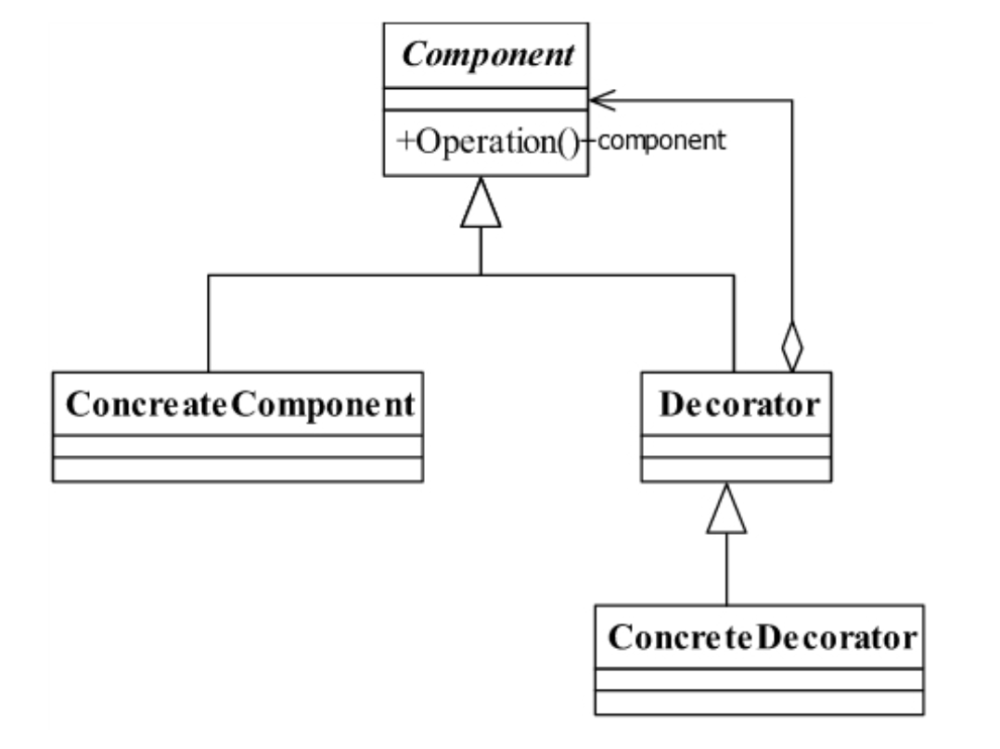
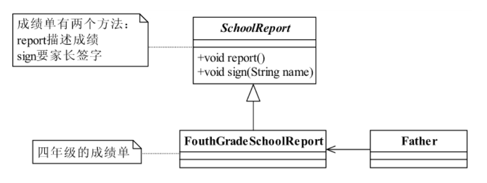
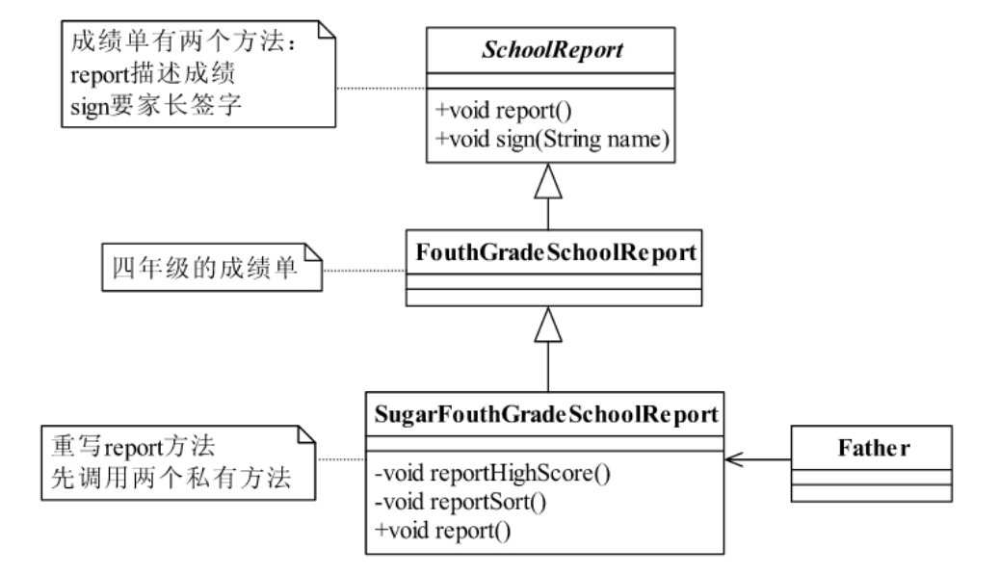
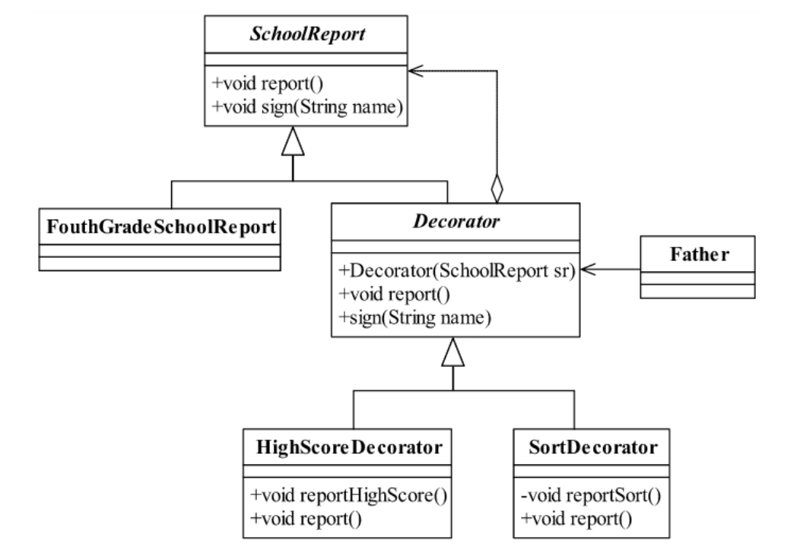

<!--
 * @description: 
 * @Author: Tian Zhi
 * @Date: 2020-05-25 09:38:27
 * @LastEditors: Tian Zhi
 * @LastEditTime: 2020-05-25 14:14:54
--> 
## 定义
装饰模式 *（Decorator Pattern）* 是一种比较常见的模式，其定义如下：

> Attach additionalresponsibilities to an object dynamically keeping the same interface.Decorators provide aflexible alternative to subclassing for extending functionality.

> 动态地给一个对象添加一些额外的职责。就增加功能来说，装饰模式相比生成子类更为灵活。

## 类图



类图中有四个角色：

* `Component`抽象构件

    `Component`是一个接口或者是抽象类，就是定义我们最核心的对象，也就是最原始的对象，如上面的成绩单。在装饰模式中，必然有一个最基本、最核心、最原始的接口或抽象类充当Component抽象构件。

* `ConcreteComponent`具体构件

    `ConcreteComponent`是最核心、最原始、最基本的接口或抽象类的实现，你要装饰的就是它。

* `Decorator`装饰角色

    一般是一个抽象类，实现接口或者抽象方法，它里面不一定有抽象的方法，但是在它的属性里必然有一个private变量指向`Component`抽象构件。

* 具体装饰角色

    `ConcreteDecoratorA`和`ConcreteDecoratorB`是两个具体的装饰类，你要把你最核心的、最原始的、最基本的东西装饰成其他东西，下面的案例就是把一个比较平庸的成绩单装饰成家长认可的成绩单。

## Java代码

### 抽象构件

```java
public abstract class Component {
     // 抽象的方法
     public abstract void operate();
}
```

### 具体构件

```java
public class ConcreteComponent extends Component {
    // 具体实现
    @Override
    public void operate() {
        System.out.println("do Something");
    }
}
```

### 抽象装饰者

```java
public abstract class Decorator extends Component {
    private Component component = null;
    // 通过构造函数传递被修饰者
    public Decorator(Component _component) {
        this.component = _component;
    }
    // 委托给被修饰者执行
    @Override
    public void operate() {
        this.component.operate();
    }
}
```

### 具体装饰者

```java
public class ConcreteDecorator1 extends Decorator {
    // 定义被修饰者
    public ConcreteDecorator1(Component _component) {
        super(_component);
    }
    // 定义自己的修饰方法
    private void method1() {
        System.out.println("method1 修饰");
    }
    // 重写父类的Operation方法
    public void operate() {
        this.method1();
        super.operate();
    }
}
```

### 装饰场景

```java
public class Client {
    public static void main(String[] args) {
        Component component = new ConcreteComponent();
        // 第一次修饰
        component = new ConcreteDecorator1(component);
        // 第二次修饰
        component = new ConcreteDecorator2(component);
        // 修饰后运行
        component.operate();
    }
}
```

## 案例-修饰成绩单

### 案例描述

考完试后，需要将成绩单交给家长签字。

### 类图-简单模式



### Java代码

#### 抽象成绩单

```java
public abstract class SchoolReport {
    // 成绩单主要展示的就是你的成绩情况
    public abstract void report();
    // 成绩单要家长签字，这个是最要命的
    public abstract void sign();
}
```

#### 四年级成绩单

```java
public class FouthGradeSchoolReport extends SchoolReport {
    // 我的成绩单
    public void report() {
        // 成绩单的格式是这个样子的
        System.out.println("尊敬的XXX家长:");
        System.out.println("  ......");
        System.out.println("  语文 62  数学65 体育 98  自然  63");
        System.out.println("  .......");
        System.out.println("               家长签名：       ");
    }
    // 家长签名
    public void sign(String name) {
        System.out.println("家长签名为："+name);
    }
}
```

#### 老爸查看成绩单

```java
public class Father {
    public static void main(String[] args) {
        // 把成绩单拿过来
        SchoolReport sr = new FouthGradeSchoolReport();
        // 看成绩单
        sr.report();
        // 签名？休想！
    }
}
```

这样的成绩老爸肯定不会签字的，我们需要做一些修饰：虽然自己成绩不高，但是全班最高成绩也不算高，先汇报一下最高成绩；而且由于最近有近10个同学退学（老爸不知道这事），自己的排名位列38，也算是钻了个空子，因此最后也可以描述下排名。

### 经过修饰后的类图



### Java代码

#### 修饰成绩单

```java
public class SugarFouthGradeSchoolReport extends FouthGradeSchoolReport {
    // 首先要定义你要美化的方法，先给老爸说学校最高成绩
    private void reportHighScore() {
        System.out.println("这次考试语文最高是75，数学是78，自然是80");
    }
    // 在老爸看完毕成绩单后，我再汇报学校的排名情况
    private void reportSort() {
        System.out.println("我是排名第38名...");
    }
    // 由于汇报的内容已经发生变更，那所以要重写父类
    @Override
    public void report() {
        this.reportHighScore();  // 先说最高成绩
        super.report();  // 然后老爸看成绩单
        this.reportSort(); // 然后告诉老爸学习学校排名
    }
}
```

#### 老爸查看修饰后的成绩单

```java
public class Father {
    public static void main(String[] args) {
        // 把美化过的成绩单拿过来
        SchoolReport sr= new SugarFouthGradeSchoolReport();
        // 看成绩单
        sr.report();
        // 然后老爸，一看，很开心，就签名了
        sr.sign("老三");  // 我叫小三，老爸当然叫老三
    }
}
```

虽然老爸成功签字。但是我们没考虑到特殊情况，万一老爸想先看排名，又或者是他看完成绩差距之后又不想看排名了。这样怎么办？继续扩展多个类吗？但是这还是一种比较简单的场景，如果需要装饰的条件非常多，例如有20个，如果还通过继承来扩展解决，那子类会非常多，而且各种条件组合包含了很多重复代码，我们需要避免这种情况。

**在面向对象的设计中，如果超过两层继承，就应该想想是不是出设计问题了，是不是应该重新找一条康庄大道了，这是经验值，不是什么绝对的，继承层次越多以后的维护成本越多。**

此时该使用我们的装饰模式了。

### 类图-装饰模式



增加一个抽象类和两个实现类，其中`Decorator`的作用是封装`SchoolReport`类，装饰类的作用也就是一个特殊的代理类，真实的执行者还是被代理的角色`FouthGradeSchoolReport`。

### Java代码

#### 修饰的抽象类

```java
public abstract class Decorator extends SchoolReport {
    // 首先我要知道是哪个成绩单
    private SchoolReport sr;
    // 构造函数，传递成绩单过来
    public Decorator(SchoolReport sr) {
        this.sr = sr;
    }
    // 成绩单还是要被看到的
    public void report() {
        this.sr.report();
    }
    // 看完还是要签名的
    public void sign(String name) {
        this.sr.sign(name);
    }
}
```

#### 最高成绩修饰

```java
public class HighScoreDecorator extends Decorator {
    // 构造函数
    public HighScoreDecorator(SchoolReport sr) {
        super(sr);
    }
    // 我要汇报最高成绩
    private void reportHighScore() {
        System.out.println("这次考试语文最高是75，数学是78，自然是80");
    }
    // 我要在老爸看成绩单前告诉他最高成绩，否则等他一看，就抡起扫帚揍我，我哪里还有机会说啊
    @Override
    public void report() {
        this.reportHighScore();
        super.report();
    }
}
```

#### 排名情况修饰

```java
public class SortDecorator extends Decorator {
    // 构造函数
    public SortDecorator(SchoolReport sr) {
        super(sr);
    }
    // 告诉老爸学校的排名情况
    private void reportSort() {
        System.out.println("我是排名第38名...");
    }
    //老爸看完成绩单后再告诉他，加强作用
    @Override
    public void report() {
        super.report();
        this.reportSort();
    }
}
```

#### 老爸查看修饰后的成绩单

```java
public class Father {
    public static void main(String[] args) {
        // 把成绩单拿过来
        SchoolReport sr;
        // 原装的成绩单
        sr = new FouthGradeSchoolReport();
        // 加了最高分说明的成绩单
        sr = new HighScoreDecorator(sr);
        // 又加了成绩排名的说明
        sr = new SortDecorator(sr);
        // 看成绩单
        sr.report();
        // 然后老爸一看，很开心，就签名了
        sr.sign("老三");  // 我叫小三，老爸当然叫老三
    }
}
```

### TypeScript实现

```typescript
/** 抽象成绩单 */
abstract class SchoolReport {
    // 成绩单主要展示的就是你的成绩情况
    abstract report(): void;
    // 成绩单要家长签字，这个是最要命的
    abstract sign(name: string): void;
}

/** 四年级成绩单 */
class FouthGradeSchoolReport extends SchoolReport {
    // 我的成绩单
    report() {
        // 成绩单的格式是这个样子的
        console.log("尊敬的XXX家长:");
        console.log("  ......");
        console.log("  语文 62  数学65 体育 98  自然  63");
        console.log("  .......");
        console.log("               家长签名：       ");
    }
    // 家长签名
    sign(name: string) {
        console.log("家长签名为："+name);
    }
}

/** 抽象修饰类 */
abstract class Decorator extends SchoolReport {
    // 首先我要知道是哪个成绩单
    private sr: SchoolReport;
    // 构造函数，传递成绩单过来
    constructor(sr: SchoolReport ) {
        super();
        this.sr = sr;
    }
    // 成绩单还是要被看到的
    report() {
        this.sr.report();
    }
    // 看完还是要签名的
    sign(name: string) {
        this.sr.sign(name);
    }
}

/** 最高成绩修饰 */
class HighScoreDecorator extends Decorator {
    // 构造函数
    constructor(sr: SchoolReport) {
        super(sr);
    }
    // 我要汇报最高成绩
    private reportHighScore() {
        console.log("这次考试语文最高是75，数学是78，自然是80");
    }
    // 我要在老爸看成绩单前告诉他最高成绩，否则等他一看，就抡起扫帚揍我，我哪里还有机会说啊
    report() {
        this.reportHighScore();
        super.report();
    }
}

/** 排名情况修饰 */
class SortDecorator extends Decorator {
    // 构造函数
    constructor(sr: SchoolReport ) {
        super(sr);
    }
    // 告诉老爸学校的排名情况
    private reportSort() {
        console.log("我是排名第38名...");
    }
    //老爸看完成绩单后再告诉他，加强作用
    public report() {
        super.report();
        this.reportSort();
    }
}

// 场景-老爸查看修饰后的成绩单
(function() {
    // 把成绩单拿过来
    let sr: SchoolReport;
    // 原装的成绩单
    sr = new FouthGradeSchoolReport();
    // 加了最高分说明的成绩单
    sr = new HighScoreDecorator(sr);
    // 又加了成绩排名的说明
    sr = new SortDecorator(sr);
    // 看成绩单
    sr.report();
    // 然后老爸一看，很开心，就签名了
    sr.sign("老三");  // 我叫小三，老爸当然叫老三
})()
```

## 使用场景

装饰类和被装饰类可以独立发展，而不会相互耦合。换句话说，`Component`类无须知道`Decorator`类，`Decorator`类是从外部来扩展`Component`类的功能，而`Decorator`也不用知道具体的构件。

装饰模式是继承关系的一个替代方案。装饰类`Decorator`不管装饰多少层，返回的对象还是`Component`，实现的还是*is-a*的关系。

然而装饰模式也有一个缺点：多层装饰的复杂性。就像剥洋葱一样，剥到了最后才发现是最里层的装饰出现了问题。因此，尽量减少装饰类的数量，以便降低系统的复杂度。

下面是装饰模式的一些使用场景：

1. 需要扩展一个类的功能，或给一个类增加附加功能。

2. 需要动态地给一个对象增加功能，这些功能可以再动态地撤销。

3. 需要为一批的兄弟类进行改装或加装功能。

## 最佳实践

装饰模式是对继承的有力补充。继承不是万能的，虽然可以解决实际问题，但是在项目中要考虑易维护、易扩展、易复用等，而且在一些情况下（比如上面那个成绩单例子）要是用继承就会增加很多子类，而且灵活性非常差，当然维护也不容易了，也就是说装饰模式可以替代继承，解决我们类膨胀的问题。同时，还要知道继承是静态地给类增加功能，而装饰模式则是动态地增加功能，在上面的那个例子中，当不想要`SortDecorator`这层的封装也很简单，于是直接在高层`Father`类中去掉就可以了，如果用继承就必须修改程序。

装饰模式还有一个非常好的优点：扩展性非常好。在一个项目中，会有非常多的因素考虑不到，特别是业务的变更，不时地冒出一个需求，尤其是提出一个令项目大量延迟的需求时。装饰模式可以给我们很好的帮助，通过装饰模式重新封装一个类，而不是通过继承来完成，简单点说，三个继承关系`Father`、`Son`、`GrandSon`类，要在`Son`类上增强一些功能怎么办？我们会思考：增强的功能是修改`Son`类中的方法吗？增加方法吗？对`GrandSon`的影响呢？特别是`GrandSon`有多个的情况该怎么办？这个评估的工作量巨大。如果通过建立`SonDecorator`类来修饰`Son`，相当于创建了一个新的类，这个对原有程序没有修改，通过扩展很好地完成了这次变更。

## 与六大设计原则的结合

- [x] Single Responsibility Principle (SRP, 单一职责原则)

    装饰模式实现了SRP，每一个装饰类都应该只做一个”职责“的装饰，这样才便于我们更好地组装搭配这些装饰。

- [x] Open Closed Principle (OCP, 开闭原则)

    装饰模式实现了OCP，我们扩展装饰类非常方便。

- [x] Liskov Substitution Principle (LSP, 里氏替换原则)

    使用装饰模式时，均使用的抽象类调用，符合LSP。

- [x] Law of Demeter (LoD, 迪米特法则)

    装饰模式降低了装饰类和被装饰类的耦合，`Decorator`类是从外部来扩展`Component`类的功能，`Component`无需知道`Decorator`，而`Decorator`也无需知道具体的`Component`。

- [ ] Interface Segragation Principle (ISP, 接口隔离原则)

    未提及。

- [x] Dependency Inversion Principle (DIP, 依赖倒置原则)

    高层依赖的是抽象装饰类，抽象装饰类中依赖的是抽象构件。均遵循DIP。