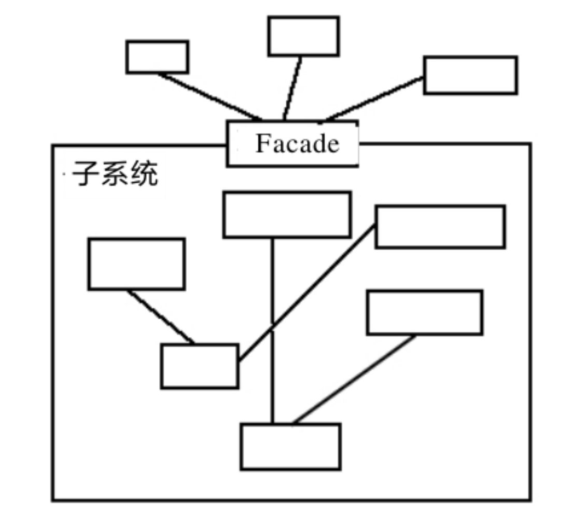

<!--
 * @description: 
 * @Author: Tian Zhi
 * @Date: 2020-07-13 20:09:36
 * @LastEditors: Tian Zhi
 * @LastEditTime: 2020-07-15 09:30:28
--> 
## 定义

门面模式（Facade Pattern）也叫做外观模式，是一种比较常用的封装模式，其定义如下：

> Provide a unified interface to a set of interfaces in a subsystem.Facade defines a higher-level interface that makes the subsystem easier to use.

> 对于子系统的接口，提供一个统一的接口进行访问。门面模式定义了一个更高层的接口，使得子系统更易于使用。

## 类图

门面模式注重“统一的对象”，也就是提供一个访问子系统的接口，除了这个接口不允许有任何访问子系统的行为发生，其通用类图如下所示：


类图中的角色就两种：

* Facade门面角色

    客户端可以调用这个角色的方法。此角色知晓子系统的所有功能和责任。一般情况下，本角色会将所有从客户端发来的请求委派到相应的子系统去，也就说该角色没有实际的业务逻辑，只是一个委托类。

* subsystem子系统角色

    可以同时有一个或者多个子系统。每一个子系统都不是一个单独的类，而是一个类的集合。子系统并不知道门面的存在。对于子系统而言，门面仅仅是另外一个客户端而已。

类图就是这么简单，但是它代表的意义非常复杂，我们再来看看结构图：



## Java代码

### 子系统

```java
public class ClassA {
    public void doSomethingA() {
        // 业务逻辑
    }
}
public class ClassB {
    public void doSomethingB() {
        // 业务逻辑
    }
}
public class ClassC {
    public void doSomethingC() {
        // 业务逻辑
    }
}
```

### 门面对象

```java
public class Facade {
    // 被委托的对象
    private ClassA a = new ClassA();
    private ClassB b = new ClassB();
    private ClassC c = new ClassC();
    // 提供给外部访问的方法
    public void methodA() {
        this.a.doSomethingA();
    }
    public void methodB() {
        this.b.doSomethingB();
    }
    public void methodC() {
        this.c.doSomethingC();
    }
}
```

## 案例-投递信件

写信的过程大家应该都还记得：先写信的内容，然后写信封，再把信放到信封中，封好，投递到信箱中进行邮递，这个过程还是比较简单的，虽然简单，但是这4个步骤都不可或缺！我们先把这个过程通过程序实现出来：


我们来看看这个过程，它与高内聚的要求相差甚远，更不要说迪米特法则、接口隔离原则了。写一封信，要知道这4个步骤，而且还要知道它们的顺序，一旦出错，信就不可能邮寄出去，这在面向对象的编程中是极度地不适合。下面我们想到一种新方案，只要把信件的必要信息告诉我，我给你发，我来完成这4个过程：


增加了一个ModenPostOffice类，负责对一个比较复杂的信件处理过程的封装，然后高层模块只要和它有交互。下面来看看代码：

### 写信过程接口

```java
public interface ILetterProcess {
    // 首先要写信的内容
    public void writeContext(String context);
    // 其次写信封
    public void fillEnvelope(String address);
    // 把信放到信封里
    public void letterInotoEnvelope();
    // 然后邮递
    public void sendLetter();
}
```

### 写信过程实现

```java
public class LetterProcessImpl implements ILetterProcess {
    // 写信
    public void writeContext(String context) {
        System.out.println("填写信的内容..." + context);
    }
    // 在信封上填写必要的信息
    public void fillEnvelope(String address) {
        System.out.println("填写收件人地址及姓名..." + address);
    }
    // 把信放到信封中，并封好
    public void letterInotoEnvelope() {
        System.out.println("把信放到信封中...");
    }
    // 塞到邮箱中，邮递
    public void sendLetter() {
        System.out.println("邮递信件...");
    }
}
```

### 现代化邮局

```java
public class ModenPostOffice {
    private ILetterProcess letterProcess = new LetterProcessImpl();
    // 写信，封装，投递，一体化
    public void sendLetter(String context, String address) {
        // 帮你写信
        letterProcess.writeContext(context);
        // 写好信封
        letterProcess.fillEnvelope(address);
        // 把信放到信封中
        letterProcess.letterInotoEnvelope();
        // 邮递信件
        letterProcess.sendLetter();
    }
}
```

### 场景类

```java
public class Client {
    public static void main(String[] args) {
        // 现代化的邮局，有这项服务，邮局名称叫Hell Road
        ModenPostOffice hellRoadPostOffice = new ModenPostOffice();
        // 你只要把信的内容和收信人地址给他，他会帮你完成一系列的工作
        // 定义一个地址
        String address = "Happy Road No.666,God Province,Heaven";
        // 信的内容
        String context = "Hello,It's me,do you know who I am? I'm your old lover.I'd like to....";
        // 你给我发送吧
        hellRoadPostOffice.sendLetter(context, address);
    }
}
```

现在我们有了一个扩展需求，比如一个非常时期，寄往God Province（上帝省）的邮件都必须进行安全检查，那我们就很好处理了：


### 信件检查类

```java
public class Police {
    // 检查信件，检查完毕后警察在信封上盖个戳：此信无病毒
    public void checkLetter(ILetterProcess letterProcess) {
        System.out.println(letterProcess+" 信件已经检查过了...");
    }
}
```

### 扩展后的现代邮局

```java
public class ModenPostOffice {
    private ILetterProcess letterProcess = new LetterProcessImpl();
    private Police letterPolice = new Police();
    // 写信，封装，投递，一体化了
    public void sendLetter(String context, String address) {
        // 帮你写信
        letterProcess.writeContext(context);
        // 写好信封
        letterProcess.fillEnvelope(address);
        // 警察要检查信件了
        letterPolice.checkLetter(letterProcess);
        // 把信放到信封中
        letterProcess.letterInotoEnvelope();
        // 邮递信件
        letterProcess.sendLetter();
    }
}
```

高层模块没有任何改动，但是信件却已经被检查过了。这正是我们设计所需要的模式，不改变子系统对外暴露的接口、方法，只改变内部的处理逻辑，其他兄弟模块的调用产生了不同的结果，确实是一个非常棒的设计。这就是门面模式。接下来看看TypeScript实现：

### TypeScript实现

```typescript
// 写信过程接口
interface ILetterProcess {
    // 首先要写信的内容
    writeContext(context: string): void;
    // 其次写信封
    fillEnvelope(address: string): void;
    // 把信放到信封里
    letterInotoEnvelope(): void;
    // 然后邮递
    sendLetter(): void;
}

// 写信过程实现
class LetterProcessImpl implements ILetterProcess {
    // 写信
    writeContext(context: string) {
        console.log("填写信的内容..." + context);
    }
    // 在信封上填写必要的信息
    fillEnvelope(address: string) {
        console.log("填写收件人地址及姓名..." + address);
    }
    // 把信放到信封中，并封好
    letterInotoEnvelope() {
        console.log("把信放到信封中...");
    }
    // 塞到邮箱中，邮递
    sendLetter() {
        console.log("邮递信件...");
    }
}

// 现代化邮局
class ModenPostOffice {
    private letterProcess: ILetterProcess  = new LetterProcessImpl();
    // 写信，封装，投递，一体化
    sendLetter(context: string, address: string) {
        // 帮你写信
        this.letterProcess.writeContext(context);
        // 写好信封
        this.letterProcess.fillEnvelope(address);
        // 把信放到信封中
        this.letterProcess.letterInotoEnvelope();
        // 邮递信件
        this.letterProcess.sendLetter();
    }
}

// 寄信场景
(function() {
    // 现代化的邮局，有这项服务，邮局名称叫Hell Road
    const hellRoadPostOffice = new ModenPostOffice();
    // 你只要把信的内容和收信人地址给他，他会帮你完成一系列的工作
    // 定义一个地址
    const address = "Happy Road No.666,God Province,Heaven";
    // 信的内容
    const context = "Hello,It's me,do you know who I am? I'm your old lover.I'd like to....";
    // 你给我发送吧
    hellRoadPostOffice.sendLetter(context, address);
})()
```

## 使用场景

### 门面模式的优点

* 减少系统的相互依赖

    如果我们不使用门面模式，外界访问直接深入到子系统内部，相互之间是一种强耦合关系，这样的强依赖是系统设计所不能接受的。门面模式的出现就很好地解决了该问题，所有的依赖都是对门面对象的依赖，与子系统无关。

* 提高了灵活性

    依赖减少了，灵活性自然提高了。不管子系统内部如何变化，只要不影响到门面对象，任你自由活动。

* 提高了安全性

    想让你访问子系统的哪些业务就开通哪些逻辑，不在门面上开通的方法，你休想访问到。

### 门面模式的缺点

门面模式不满足开闭原则，需求变更一般都需要更改门面类，又因为门面类依赖子系统，子系统的改变也有可能变更门面类。但这也可以说不算门面模式的缺点，因为门面模式是为了解决子系统依赖的问题，它将子系统与高层隔离，防止子系统的变更影响高层，但是OCP关注的是需求变更对一个类的影响，所以这也不是门面模式需要关注的内容。

### 门面模式的使用场景

* 为一个复杂的模块或子系统提供一个供外界访问的接口

* 子系统相对独立——外界对子系统的访问只要黑箱操作即可

    比如利息的计算问题，没有深厚的业务知识和扎实的技术水平是不可能开发出该子系统的，但是对于使用该系统的开发人员来说，他需要做的就是输入金额以及存期，其他的都不用关心，返回的结果就是利息，这时候，门面模式是非使用不可了。

* 预防低水平人员带来的风险扩散

    比如一个低水平的技术人员参与项目开发，为降低个人代码质量对整体项目的影响风险，一般的做法是“画地为牢”，只能在指定的子系统中开发，然后再提供门面接口进行访问操作。

### 门面模式的注意事项

#### 一个子系统可以有多个门面

一般情况下，一个子系统只要有一个门面足够了，但是在以下情况下可以考虑拆分门面：

* 门面已经庞大到不能忍受的程度

    比如一个纯洁的门面对象已经超过了200行的代码，虽然都是非常简单的委托操作，也建议拆分成多个门面，否则会给以后的维护和扩展带来不必要的麻烦。那怎么拆分呢？按照功能拆分是一个非常好的原则，比如一个数据库操作的门面可以拆分为查询门面、删除门面、更新门面等。

* 子系统可以提供不同访问路径

    我们以门面模式的通用源代码为例。`ClassA`、`ClassB`、`ClassC`是一个子系统的中3个对象，现在有两个不同的高层模块来访问该子系统，模块一可以完整的访问所有业务逻辑，也就是通用代码中的`Facade`类，它是子系统的信任模块；而模块二属于受限访问对象，只能访问`methodB`方法，这种情况就可以扩充门面：

新增门面

```java
public class Facade2 {
    // 引用原有的门面
    private Facade facade = new Facade();
    // 对外提供唯一的访问子系统的方法
    public void methodB() {
        this.facade.methodB();
    }
}
```

增加的门面非常简单，委托给了已经存在的门面对象`Facade`进行处理，注意使用委托而不再编写一个委托到子系统的方法，因为在面向对象的编程中，尽量保持相同的代码只编写一遍，避免以后到处修改相似代码的悲剧。

#### 门面不参与子系统的业务逻辑

门面只是委托子系统，不能耦合业务逻辑。比如我们把门面上的`methodC`上的逻辑修改一下，它必须先调用`ClassA`的`doSomethingA`方法，然后再调用`ClassC`的`doSomethingC`方法：

修改门面

```java
public class Facade {
    // 被委托的对象
    private ClassA a = new ClassA();
    private ClassB b = new ClassB();
    private ClassC c = new ClassC();
    // 提供给外部访问的方法
    public void methodA() {
        this.a.doSomethingA();
    }
    public void methodB() {
        this.b.doSomethingB();
    }
    public void methodC() {
        this.a.doSomethingA();
        this.c.doSomethingC();
    }
}
```

如果直接在`methodC`方法中增加了`doSomethingA()`方法的调用，就相当于进行了业务逻辑操作，会产生一个倒依赖的问题：**子系统必须依赖门面才能被访问**（正常是门面依赖子系统，而该业务作为子系统的职责，现在却需要依赖门面来访问）。这是设计上一个严重错误，不仅违反了单一职责原则，同时也破坏了系统的封装性。

对于这种情况，可以在子系统中建立一个封装类（相当于一个中介者），封装`ClassA`和`ClassC`的这部分逻辑，然后提供给门面对象，这样保证了业务始终存在于子系统，门面始终只进行委托。

封装类

```java
public class Context {
    // 委托处理
    private ClassA a = new ClassA();
    private ClassC c = new ClassC();
    // 复杂的计算
    public void complexMethod() {
        this.a.doSomethingA();
        this.c.doSomethingC();
    }
}
```

在门面模式中，门面角色应该是稳定，它不应该经常变化，一个系统一旦投入运行它就不应该被改变，它是一个系统对外的接口，变来变去就无法保证其他模块的稳定运行。但是，业务逻辑是会经常变化的，我们已经把它的变化封装在子系统内部，无论你如何变化，对外界的访问者来说，都还是同一个门面，同样的方法。这才是架构师最希望看到的结构。

## 最佳实践

门面模式是一个很好的封装方法，一个子系统比较复杂时，比如算法或者业务比较复杂，就可以封装出一个或多个门面出来，项目的结构简单，而且扩展性非常好。

还有，对于一个较大项目，为了避免人员带来的风险，也可以使用门面模式，技术水平比较差的成员，尽量安排独立的模块，然后把他写的程序封装到一个门面里，尽量让其他项目成员不用看到这些人的代码，看也看不懂。

我也遇到过一个“高人”写的代码，private方法、构造函数、常量基本都不用，你要一个public方法，好，一个类里就一个public方法，所有代码都在里面，然后你就看吧，一大坨程序，看着就能把人逼疯。使用门面模式后，对门面进行单元测试，约束项目成员的代码质量，对项目整体质量的提升也是一个比较好的帮助。

## 案例是否符合六大设计原则

- [ ] Single Responsibility Principle (SRP, 单一职责原则)

    未提及。

- [ ] Open Closed Principle (OCP, 开闭原则)

    不符合。

- [ ] Liskov Substitution Principle (LSP, 里氏替换原则)

    不符合。

- [x] Law of Demeter (LoD, 迪米特法则)

    门面模式就是为了解决高层模块和子系统的耦合，高层模块只需要知道门面类（例如在例子中只需要知道有邮局而不需要知道寄信的过程）。符合LoD。

- [ ] Interface Segragation Principle (ISP, 接口隔离原则)

    未提及。

- [ ] Dependency Inversion Principle (DIP, 依赖倒置原则)

    不符合。
