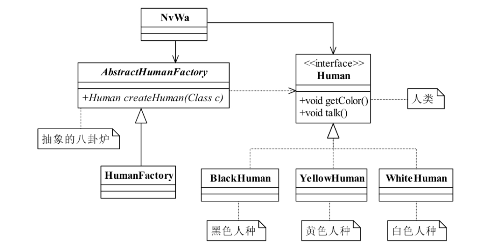

<!--
 * @description:
 * @Author: tianzhi
 * @Date: 2020-04-27 09:31:59
 * @LastEditors: tianzhi
 * @LastEditTime: 2020-04-28 09:54:19
 -->

## 定义

> Define an interface for creating an object,but let subclasses decide which class toinstantiate.Factory Method lets a class defer instantiation to subclasses.

> 定义一个用于创建对象的接口，让子类决定实例化哪一个类。工厂方法使一个类的实例化延迟到其子类。

## 使用场景

工厂方法具有良好的封装性，代码结构清晰。其约束了对象创建的条件，封装了对象创建的过程，降低了模块间的耦合。

当需要灵活可扩展的框架时，可以考虑采用工厂模式。例如：

> 需要设计一个连接邮件服务器的框架，有三种网络协议可供选择：POP3、IMAP、HTTP，我们就可以把这三种连接方法作为产品类，定义一个接口如 IConnectMail，然后定义对邮件的操作方法，用不同的方法实现三个具体的产品类（也就是连接方式）再定义一个工厂方法，按照不同的传入条件，选择不同的连接方式。如此设计，可以做到完美的扩展，如某些邮件服务器提供了 WebService 接口，很好，我们只要增加一个产品类就可以了。同时，当需要连接邮件服务器时，只要知道协议名称，不需要知道协议创建的细节。

## 类图


## Java 代码

### 抽象产品类

```java
public abstract class Product {
    // 产品类的公共方法
    public void method1() {
        // 业务逻辑处理
    }
    // 抽象方法
    public abstract void method2();
}
```

### 具体产品类

```java
public class ConcreteProduct1 extends Product {
    public void method2() {
        // 业务逻辑处理
    }
}
public class ConcreteProduct2 extends Product {
    public void method2() {
        // 业务逻辑处理
    }
}
```

### 抽象工厂类

```java
public abstract class Creator {
    /*
    * 创建一个产品对象，其输入参数类型可以自行设置
    * 通常为String、Enum、Class等，当然也可以为空
    */
    public abstract <T extends Product> T createProduct(Class<T> c);
}
```

### 具体工厂类

```java
public class ConcreteCreator extends Creator {
    public <T extends Product> T createProduct(Class<T> c) {
        Product product=null;
        try {
            product = (Product)Class.forName(c.getName()).newInstance();
        } catch (Exception e) {
            //异常处理
        }
        return (T)product;
    }
}
```

### 场景实现

```java
public class Client {
    public static void main(String[] args) {
        Creator creator = new ConcreteCreator();
        Product product = creator.createProduct(ConcreteProduct1.class);
        /*
        * 继续业务处理
        */
    }
}
```

## 案例-女娲造人

### 类图



### Java 实现

#### 人类接口

```java
public interface Human {
    // 每个人种的皮肤都有相应的颜色
    public void getColor();
    // 人类会说话
    public void talk();
}
```

#### 黑色人种

```java
public class BlackHuman implements Human {
    public void getColor(){
        System.out.println("黑色人种的皮肤颜色是黑色的！");
    }
    public void talk() {
        System.out.println("黑人会说话，一般人听不懂。");
    }
}
```

#### 黄色人种

```java
public class YellowHuman implements Human {
    public void getColor() {
            System.out.println("黄色人种的皮肤颜色是黄色的！");
    }
    public void talk() {
        System.out.println("黄色人种会说话，一般说的都是双字节。");
    }
}
```

#### 白色人种

```java
public class WhiteHuman implements Human {
    public void getColor() {
        System.out.println("白色人种的皮肤颜色是白色的！");
    }
    public void talk() {
        System.out.println("白色人种会说话，一般都是但是单字节。");
    }
}
```

#### 抽象人类创建工厂

```java
public abstract class AbstractHumanFactory {
    public abstract <T extends Human> T createHuman(Class<T> c);
}
```

#### 人类创建工厂-女娲锅炉

```java
public class HumanFactory extends AbstractHumanFactory {
   public <T extends Human> T createHuman(Class<T> c){
        // 定义一个生产的人种
        Human human=null;
        try {
            // 产生一个人种
            human = (T)Class.forName(c.getName()).newInstance();
        } catch (Exception e) {
            System.out.println("人种生成错误！");
        }
        return (T)human;
    }
}
```

#### 客户类-女娲

```java
public class NvWa {
    public static void main(String[] args) {
        // 声明阴阳八卦炉
        AbstractHumanFactory YinYangLu = new HumanFactory();
        // 女娲第一次造人，火候不足，于是白人产生了
        System.out.println("--造出的第一批人是白色人种--");
        Human whiteHuman = YinYangLu.createHuman(WhiteHuman.class);
        whiteHuman.getColor();
        whiteHuman.talk();
        // 女娲第二次造人，火候过足，于是黑人产生了
        System.out.println("\n--造出的第二批人是黑色人种--");
        Human blackHuman = YinYangLu.createHuman(BlackHuman.class);
        blackHuman.getColor();
        blackHuman.talk();
        // 第三次造人，火候刚刚好，于是黄色人种产生了
        System.out.println("\n--造出的第三批人是黄色人种--");
        Human yellowHuman = YinYangLu.createHuman(YellowHuman.class);
        yellowHuman.getColor();
        yellowHuman.talk();
    }
    // 打印结果：
    // --造出的第一批人是白色人种--
    // 白色人种的皮肤颜色是白色的！白色人种会说话，一般都是单字节。
    // --造出的第二批人是黑色人种--
    // 黑色人种的皮肤颜色是黑色的！黑人会说话，一般人听不懂。
    // --造出的第三批人是黄色人种--
    // 黄色人种的皮肤颜色是黄色的！黄色人种会说话，一般说的都是双字节。
}
```

### Typescript 实现

由于 Typescript 里的 class 不仅是一个“构造函数”，还是一个类型，但是这个类型是构造函数创建的实例类型，我们还需要定义一个类型用于表示这个 class 的类型。详情可以参考：[Difference between the static and instance sides of classes](https://www.typescriptlang.org/docs/handbook/interfaces.html#difference-between-the-static-and-instance-sides-of-classes)。

下面的代码我都我都显式给出了类型，由于 Typescript 类型支持协变，可以和 Java 的类型强转写法保持一致，例如：

> `Human whiteHuman = YinYangLu.createHuman(WhiteHuman.class);`
> 在 Typescript 中为：
> `const whiteHuman: Human = new WhiteHuman();`

```typescript
// 人类实例接口
interface Human {
  getColor(): void;
  talk(): void;
}
// 人类构造函数接口
interface HumanConstructor {
  new (): Human;
}

// 黑色人种
class BlackHuman implements Human {
  public getColor() {
    console.log("黑色人种的皮肤颜色是黑色的！");
  }
  public talk() {
    console.log("黑人会说话，一般人听不懂。");
  }
}

// 黄色人种
class YellowHuman implements Human {
  public getColor() {
    console.log("黄色人种的皮肤颜色是黄色的！");
  }
  public talk() {
    console.log("黄色人种会说话，一般说的都是双字节。");
  }
}

// 白色人种
class WhiteHuman implements Human {
  public getColor() {
    console.log("白色人种的皮肤颜色是白色的！");
  }
  public talk() {
    console.log("白色人种会说话，一般都是但是单字节。");
  }
}

// 抽象人类创建工厂
abstract class AbstractHumanFactory {
  abstract createHuman<T extends HumanConstructor>(humanClass: T): Human | null;
}

// 人类创建工厂
class HumanFactory extends AbstractHumanFactory {
  createHuman<T extends HumanConstructor>(humanClass: T) {
    let human: Human | null = null;
    try {
      human = new humanClass();
    } catch {
      console.log("人种生成错误！");
    }
    return human;
  }
}

// 女娲造人
function createHumanByNvWa() {
  // 声明锅炉
  const factory: AbstractHumanFactory = new HumanFactory();
  // 女娲第一次造人，火候不足，于是白人产生了
  console.log("--造出的第一批人是白色人种--");
  const whiteHuman: Human = new WhiteHuman();
  whiteHuman.getColor();
  whiteHuman.talk();
  // 女娲第二次造人，火候过足，于是黑人产生了
  console.log("--造出的第一批人是白色人种--");
  const blackHuman: Human = new BlackHuman();
  blackHuman.getColor();
  blackHuman.talk();
  // 第三次造人，火候刚刚好，于是黄色人种产生了
  console.log("--造出的第三批人是黄色人种--");
  const yellowHuman: Human = new YellowHuman();
  yellowHuman.getColor();
  yellowHuman.talk();
  // 打印结果：
  // --造出的第一批人是白色人种--
  // 白色人种的皮肤颜色是白色的！白色人种会说话，一般都是单字节。
  // --造出的第二批人是黑色人种--
  // 黑色人种的皮肤颜色是黑色的！黑人会说话，一般人听不懂。
  // --造出的第三批人是黄色人种--
  // 黄色人种的皮肤颜色是黄色的！黄色人种会说话，一般说的都是双字节。
}
// 开始造人
createHumanByNvWa();
```

## 扩展模式

工厂方法模式有很多扩展，而且可以与其他模式结合，这里介绍 4 种扩展模式（部分模式由于思路比较简单，我省略了代码）：

### 降级为-简单工厂模式

简单工厂模式本质就是没有抽象工厂，只有一个具体工厂。

**当设计仅仅需要一个工厂时，可以考虑使用。**

#### 类图


### 升级为-多工厂模式

具体来说就是将具体工厂再细分，比如女娲造人的例子，现在是一个工厂可以创造三类人种，细分之后变成一个工厂只能创造一类人，总共需要实现三个具体工厂。

**当项目较为复杂，且初始化对象过程很耗费精力的话，可以考虑不同产品使用不同类工厂去创建。**

### 替代单例模式

#### 类图


#### 代码部分

##### 单例类

```java
public class Singleton {
    // 不允许通过new产生一个对象
    private Singleton() {}
    public void doSomething() {
        // 业务处理
    }
}
```

##### 负责生产单例类的工厂

```java
public class SingletonFactory {
    private static Singleton singleton;
    static {
        try {
            Class cl= Class.forName(Singleton.class.getName());
            // 获得无参构造
            Constructor constructor=cl.getDeclaredConstructor();
            // 设置无参构造是可访问的
            constructor.setAccessible(true);
            // 产生一个实例对象
            singleton = (Singleton)constructor.newInstance();
        } catch (Exception e) {
            // 异常处理
        }
    }
    public static Singleton getSingleton() {
        return singleton;
    }
}
```

以上通过工厂方法模式创建了一个单例对象，该框架可以继续扩展，在一个项目中可以产生一个单例构造器，所有需要产生单例的类都遵循一定的规则（构造方法是private），然后通过扩展该框架，只要输入一个类型就可以获得唯一的一个实例。

### 延迟初始化

何为延迟初始化（Lazy initialization）？一个对象被消费完毕后，并不立刻释放，工厂类保持其初始状态，等待再次被使用。延迟初始化是工厂方法模式的一个扩展应用。

**延迟加载还可以用在对象初始化比较复杂的情况下，例如硬件访问，涉及多方面的交互，则可以通过延迟加载降低对象的产生和销毁带来的复杂性。**

#### 类图


#### 代码部分

##### 延迟加载的工厂类

Java中`synchronized`可以[有效处理对静态方法的多线程访问](https://stackoverflow.com/a/21812514)。

```java
public class ProductFactory {
    private static final Map<String,Product> prMap = new HashMap();
    public static synchronized Product createProduct(String type) throws Exception {
        Product product = null;
        // 如果Map中已经有这个对象
        if (prMap.containsKey(type)) {
            product = prMap.get(type);
        } else {
            if (type.equals("Product1")) {
                product = new ConcreteProduct1();
            } else {
                product = new ConcreteProduct2();
            }
            // 同时把对象放到缓存容器中
            prMap.put(type,product);
        }
        return product;
    }
}
```

上面的代码是可以扩展的，例如限制某一个产品类的最大实例化数量，可以通过判断Map中已有的对象数量来实现，这样的处理是非常有意义的，例如JDBC连接数据库，都会要求设置一个MaxConnections最大连接数量，该数量就是内存中最大实例化的数量。


## 最佳实践

工厂方法模式在项目中使用得非常频繁，以至于很多代码中都包含工厂方法模式。该模式几乎尽人皆知，但不是每个人都能用得好。熟能生巧，熟练掌握该模式，多思考工厂方法如何应用，而且工厂方法模式还可以与其他模式混合使用（例如模板方法模式、单例模式、原型模式等），变化出无穷的优秀设计，这也正是软件设计和开发的乐趣所在。

## 与六大设计原则的结合

- [x] Single Responsibility Principle (SRP, 单一职责原则)
工厂方法模式实现了单一职责原则，我们可以做到一类工厂生产一类商品。

- [x] Open Closed Principle (OCP, 开闭原则)
我们可以方便的增加一个产品类或者扩展一个工厂类，同时不需要修改已有的底层模块或者是接口、抽象类。

- [x] Liskov Substitution Principle (LSP, 里氏替换原则)
使用产品子类替代产品父类，没问题！

- [x] Law of Demeter (LoD, 迪米特法则)
工厂方法模式是典型的解耦框架。高层模块只需要知道产品的抽象类，其他的实现类都不用关心。而且如果使用多工厂模式进行扩展，会进一步解耦。符合迪米特法则。

- [ ] Interface Segragation Principle (ISP, 接口隔离原则)
接口隔离原则我认为在工厂方法模式中没有特殊体现。

- [x] Dependency Inversion Principle (DIP, 依赖倒置原则)
工厂方法模式很好的实现了面向接口编程，产品和工厂都由抽象实现（抽象类或接口）.