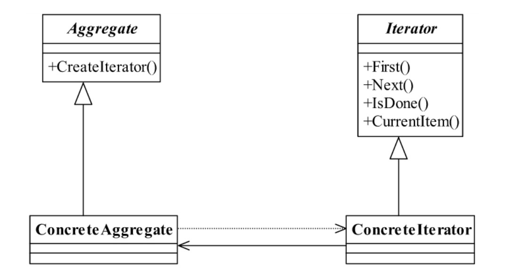
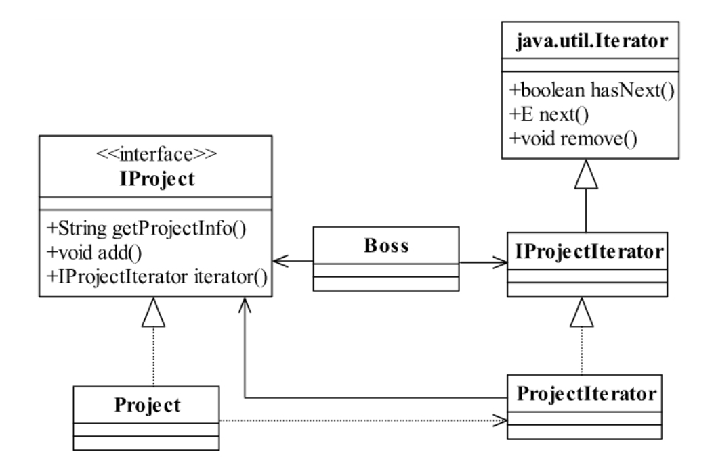

<!--
 * @description: 
 * @Author: Tian Zhi
 * @Date: 2020-06-01 16:19:51
 * @LastEditors: Tian Zhi
 * @LastEditTime: 2020-06-02 10:29:12
--> 
## 定义

迭代器模式（Iterator Pattern）目前已经是一个没落的模式，基本上没人会单独写一个迭代器，除非是产品性质的开发，其定义如下：

> Provide a way to access the elements of an aggregate object sequentially withoutexposing its underlying representation.

> 它提供一种方法访问一个容器对象中各个元素，而又不需暴露该对象的内部细节。

## 类图

迭代器是为容器服务的，能容纳对象的所有类型都可以称之为容器，例如`Collection`集合类型、`Set`类型等，迭代器模式就是为解决遍历这些容器中的元素而诞生的。通用类图如下：



迭代器模式提供了遍历容器的方便性，容器只要管理增减元素就可以了，需要遍历时交由迭代器进行。迭代器模式正是由于使用得太频繁，所以大家才会忽略，我们来看看迭代器模式中的各个角色：

* *`Iterator`* 抽象迭代器

    抽象迭代器负责定义访问和遍历元素的接口，而且基本上是有固定的3个方法：`first()`获得第一个元素，`next()`访问下一个元素，`isDone()`是否已经访问到底部（Java叫做`hasNext()`方法）。

* `ConcreteIterator`具体迭代器

    具体迭代器角色要实现迭代器接口，完成容器元素的遍历。

* `Aggregate`抽象容器

    容器角色负责提供创建具体迭代器角色的接口，必然提供一个类似`createIterator()`这样的方法，在Java中一般是`iterator()`方法。

* `Concrete Aggregate`具体容器

    具体容器实现容器接口定义的方法，创建出容纳迭代器的对象。

## Java代码

### 抽象迭代器

```java
public interface Iterator {
    // 遍历到下一个元素
    public Object next();
    // 是否已经遍历到尾部
    public boolean hasNext();
    // 删除当前指向的元素
    public boolean remove();
}
```

### 具体迭代器

```java
public class ConcreteIterator implements Iterator {
    private Vector vector = new Vector();
    // 定义当前游标
    public int cursor = 0;
    @SuppressWarnings("unchecked")
    public ConcreteIterator(Vector _vector) {
        this.vector = _vector;
    }
     // 判断是否到达尾部
    public boolean hasNext() {
        if (this.cursor == this.vector.size()) {
            return false;
        } else {
            return true;
        }
    }
    // 返回下一个元素
    public Object next() {
        Object result = null;
        if (this.hasNext()) {
            result = this.vector.get(this.cursor++);
        } else {
            result = null;
        }
        return result;
    }
    // 删除当前元素
    public boolean remove() {
        this.vector.remove(this.cursor);
        return true;
    }
}
```

**开发系统时，迭代器的删除方法应该完成两个逻辑：一是删除当前元素，二是当前游标指向下一个元素。**

### 抽象容器

```java
public interface Aggregate {
    // 是容器必然有元素的增加
    public void add(Object object);
    // 减少元素
    public void remove(Object object);
    // 由迭代器来遍历所有的元素
    public Iterator iterator();
}
```

### 具体容器

```java
public class ConcreteAggregate implements Aggregate {
    // 容纳对象的容器
    private Vector vector = new Vector();
    // 增加一个元素
    public void add(Object object) {
        this.vector.add(object);
    }
    // 返回迭代器对象
    public Iterator iterator() {
        return new ConcreteIterator(this.vector);
    }
    // 删除一个元素
    public void remove(Object object) {
        this.remove(object);
    }
}
```

### 场景类

```java
public class Client {
    public static void main(String[] args) {
        // 声明出容器
        Aggregate agg = new ConcreteAggregate();
        // 产生对象数据放进去
        agg.add("abc");
        agg.add("aaa");
        agg.add("1234");
        // 遍历一下
        Iterator iterator = agg.iterator();
        while (iterator.hasNext()) {
            System.out.println(iterator.next());
        }
    }
}
```

## 案例-查看项目信息

这个案例非常简单，就是遍历所有的项目对象，输出项目有关的信息。只不过使用自定义的迭代器实现：

### 类图



### 代码部分-Java实现

#### 项目信息接口

```java
public interface IProject {
    // 增加项目
    public void add(String name, int num, int cost);
    // 从老板这里看到的就是项目信息
    public String getProjectInfo();
    // 获得一个可以被遍历的对象
    public IProjectIterator iterator();
}
```

#### 项目信息

```java
public class Project implements IProject {
    // 定义一个项目列表，说有的项目都放在这里
    private ArrayList<IProject> projectList = new ArrayList<IProject>();
    // 项目名称
    private String name = "";
    // 项目成员数量
    private int num = 0;
    // 项目费用
    private int cost = 0;
    public Project() {}
    //定义一个构造函数，把所有老板需要看到的信息存储起来
    private Project(String name,int num,int cost) {
        // 赋值到类的成员变量中
        this.name = name;
        this.num = num;
        this.cost=cost;
    }
    // 增加项目
    public void add(String name,int num,int cost) {
        this.projectList.add(new Project(name,num,cost));
    }
    // 得到项目的信息
    public String getProjectInfo() {
        String info = "";
        // 获得项目的名称
        info = info+ "项目名称是：" + this.name;
        // 获得项目人数
        info = info + "\t项目人数: "+ this.num;
        // 项目费用
        info = info+ "\t 项目费用："+ this.cost;
        return info;
    }
    // 产生一个遍历对象
    public IProjectIterator iterator() {
        return new ProjectIterator(this.projectList);
    }
}
```

#### 项目迭代器接口

```java
public interface IProjectIterator extends Iterator {}
```

#### 项目迭代器

```java
public class ProjectIterator implements IProjectIterator {
    // 所有的项目都放在ArrayList中
    private ArrayList<IProject> projectList = new ArrayList<IProject>();
    private int currentItem = 0;
    // 构造函数传入projectList
    public ProjectIterator(ArrayList<IProject> projectList) {
        this.projectList = projectList;
    }
    // 判断是否还有元素，必须实现
    public boolean hasNext() {
        // 定义一个返回值
        boolean b = true;
        if (this.currentItem >= projectList.size() || this.projectList.get(this.currentItem) == null) {
            b = false;
        }
        return b;
    }
    // 取得下一个值
    public IProject next() {
        return (IProject)this.projectList.get(this.currentItem++);
    }
    // 删除一个对象
    public void remove() {
        // 暂时没有使用到
    }
}
```

#### 老板查看项目

```java
public class Boss {
    public static void main(String[] args) {
        // 定义一个List，存放所有的项目对象
        IProject project = new Project();
        // 增加星球大战项目
        project.add("星球大战项目ddddd", 10, 100000);
        // 增加扭转时空项目
        project.add("扭转时空项目", 100, 10000000);
        // 增加超人改造项目
        project.add("超人改造项目", 10000, 1000000000);
        // 这边100个项目
        for (int i = 4; i < 104; i++) {
            project.add("第" + i + "个项目", i * 5, i * 1000000);
        }
        // 遍历一下ArrayList，把所有的数据都取出
        IProjectIterator projectIterator = project.iterator();
        while (projectIterator.hasNext()) {
            IProject p = (IProject)projectIterator.next();
            System.out.println(p.getProjectInfo());
        }
    }
}
```

### TypeScript实现

相对于Java中的`java.util.Iterable`接口，TypeScript中也提供对应的[Iterator接口](./https://www.typescriptlang.org/docs/handbook/release-notes/typescript-2-3.html#iterators)，下面的例子将借用该接口实现：

```typescript
// 项目信息接口
interface IProject {
    // 增加项目
    add(name: string, num: number, cost: number): void;
    // 从老板这里看到的就是项目信息
    getProjectInfo(): string;
    // 获得一个可以被遍历的对象
    iterator(): IProjectIterator;
}

// 项目迭代器接口
interface IProjectIterator extends Iterator<IProject, IProject> {}

// 项目迭代器
class ProjectIterator implements IProjectIterator {
    // 所有的项目都放在ArrayList中
    private projectList: IProject[];
    private currentItem = 0;
    // 构造函数传入projectList
    constructor(projectList: IProject[]) {
        this.projectList = projectList;
    }
    // 实现Iterator接口，取得下一个值
    next() {
        // 定义一个返回值
        let done = false;
        if (this.currentItem >= this.projectList.length || this.projectList[this.currentItem] == null) {
            done = true;
        }
        return { done, value: this.projectList[this.currentItem++] };
    }
    // 删除一个对象
    remove() {
        // 暂时没有使用到
    }
}

// 项目信息
class Project implements IProject {
    // 定义一个项目列表，说有的项目都放在这里
    private projectList: IProject[] = [];
    // 项目名称
    private name: string;
    // 项目成员数量
    private num: number;
    // 项目费用
    private cost: number;
    //定义一个构造函数，把所有老板需要看到的信息存储起来
    constructor(name?: string, num?: number, cost?: number) {
        // 赋值到类的成员变量中
        this.name = name || '';
        this.num = num || 0;
        this.cost = cost || 0;
    }
    // 增加项目
    public add(name: string, num: number, cost: number) {
        this.projectList.push(new Project(name, num, cost));
    }
    // 得到项目的信息
    getProjectInfo() {
        let info = "";
        // 获得项目的名称
        info = info+ "项目名称是：" + this.name;
        // 获得项目人数
        info = info + "\t项目人数: "+ this.num;
        // 项目费用
        info = info+ "\t 项目费用："+ this.cost;
        return info;
    }
    // 产生一个遍历对象
    public iterator(): IProjectIterator {
        return new ProjectIterator(this.projectList);
    }
}

// 场景-老板查看项目
(function() {
    // 定义一个List，存放所有的项目对象
    const project = new Project();
    // 增加星球大战项目
    project.add("星球大战项目ddddd", 10, 100000);
    // 增加扭转时空项目
    project.add("扭转时空项目", 100, 10000000);
    // 增加超人改造项目
    project.add("超人改造项目", 10000, 1000000000);
    // 这边2个项目
    for (let i = 4; i < 6; i++) {
        project.add("第" + i + "个项目", i * 5, i * 1000000);
    }
    // 遍历一下ArrayList，把所有的数据都取出
    const projectIterator: IProjectIterator = project.iterator();
    let next = projectIterator.next();
    while (!next.done) {
        const p: IProject = next.value;
        console.log(p.getProjectInfo());
        next = projectIterator.next();
    }
})()
```

其实在ES6中，我们可以使用[Iteration protocols](./https://developer.mozilla.org/en-US/docs/Web/JavaScript/Reference/Iteration_protocols#The_iterable_protocol)来实现迭代器，并配合``for...of...`语法使用。

比如有个需求，项目有私密和非私密之分，只能查看非私密的项目，基于ES6的Iterator协议实现如下：

```typescript
// 项目接口
interface Project {
    /** 项目名称 */
    name: string;
    /** 项目人数 */
    count: number;
    /** 项目费用 */
    cost: number;
    /** 是否为私密项目 */
    secret: boolean;
}

// 项目列表(实现迭代器)
interface ProjectIterable extends Iterable<string> {
    projectList: Project[]
    add(name: string, count: number, cost: number, secret: boolean): void;
}

const projectIterable: ProjectIterable = {
    add(name, count, cost, secret) {
        this.projectList.push({ name, cost, count, secret });
    },
    projectList: [],
    [Symbol.iterator]() {
        const projectList = this.projectList;
        return {
            index: 0,
            next() {
                if (this.index >= projectList.length) {
                    /** 这里在TypeScript里有个BUG，true无法识别为true类型，所以加了断言 */
                    return { done: true as true, value: undefined }
                }
                let project = projectList[this.index++];
                while (project.secret) {
                    project = projectList[this.index++];
                }
                const info = `项目名称是：${project.name}, 项目人数：${project.count}, 项目费用：${project.cost}`;
                return { done: false, value: info };
            }
        }
    }
};

/** 添加项目 */ 
// 增加星球大战项目
projectIterable.add("星球大战项目ddddd", 10, 100000, true);
// 增加扭转时空项目
projectIterable.add("扭转时空项目", 100, 10000000, true);
// 增加超人改造项目
projectIterable.add("超人改造项目", 10000, 1000000000, true);
// 这边2个项目
for (let i = 4; i < 6; i++) {
    projectIterable.add("第" + i + "个项目", i * 5, i * 1000000, false);
}

// 场景-老板查看项目（只能查看非私密项目）
(function() {
    for (let projectInfo of projectIterable) {
        console.log(projectInfo);
    }
})()
```

## 使用场景

我们再来看看`Iterable`接口。`java.util.Iterable`接口只有一个方法：`iterator()`，也就说，通过`iterator()`这个方法去遍历聚集类中的所有方法或属性，基本上现在所有的高级语言都有`Iterator`这个接口或者实现，Java已经把迭代器给我们准备好了，我们再去写迭代器，就有点多余了。所以呀，这个迭代器模式也有点没落了，基本上很少有项目再独立写迭代器了，直接使用`Collection`下的实现类就可以完美地解决问题。

迭代器现在应用得越来越广泛了，甚至已经成为一个最基础的工具。一些大师级人物甚至建议把迭代器模式从23个模式中删除，就是因为现在它太普通了，已经融入到各个语言和工具中了，比如PHP中你能找到它的身影，Perl也有它的存在，甚至是前台的页面技术AJAX也可以有它的出现（如在Struts2中就可以直接使用iterator）。基本上，只要你不是在使用那些古董级（指版本号）的编程语言的话，都不用自己动手写迭代器。

## 最佳实践

如果你是做Java开发，尽量不要自己写迭代器模式！省省吧，使用Java提供的`Iterator`一般就能满足你的要求了。

## 与六大设计原则的结合

- [ ] Single Responsibility Principle (SRP, 单一职责原则)

    没有提及。

- [x] Open Closed Principle (OCP, 开闭原则)

    在实际应用中，我们很方便地增加不同的迭代器或容器，不影响其他代码，符合OCP。

- [x] Liskov Substitution Principle (LSP, 里氏替换原则)

    迭代器模式中的迭代器和容器均使用接口定义，符合LSP。

- [ ] Law of Demeter (LoD, 迪米特法则)

    没有提及。


- [ ] Interface Segragation Principle (ISP, 接口隔离原则)

    没有提及。

- [x] Dependency Inversion Principle (DIP, 依赖倒置原则)

    迭代器模式使用是都是依赖于容器和迭代器的抽象接口，符合DIP。