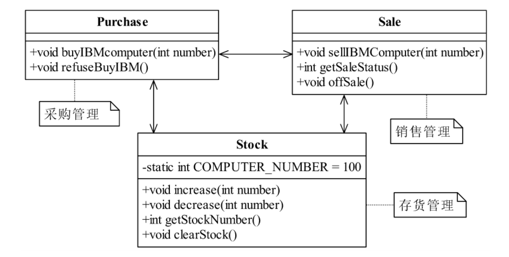
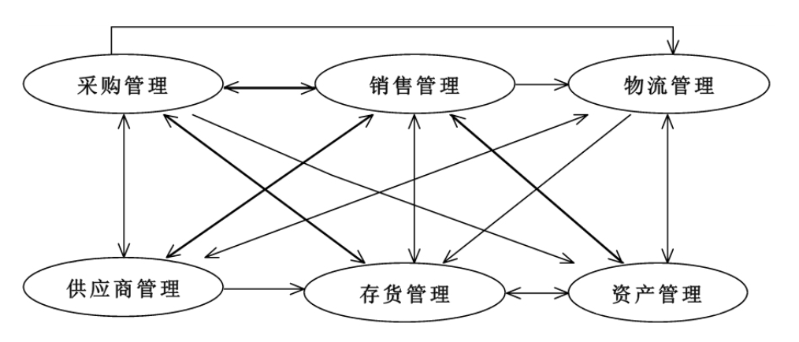
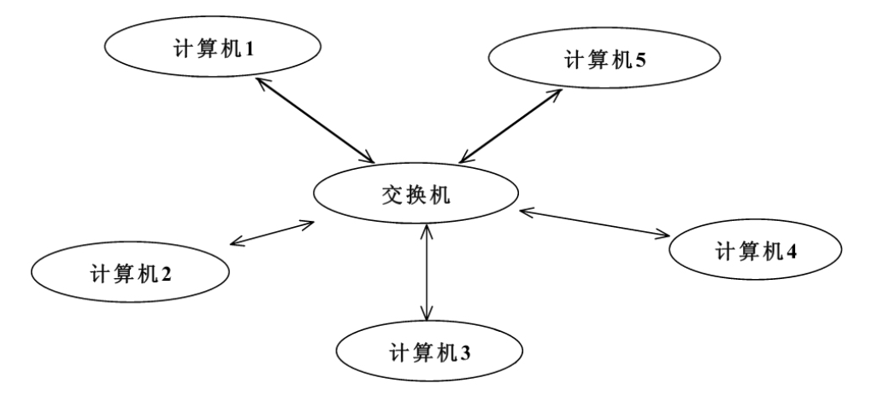
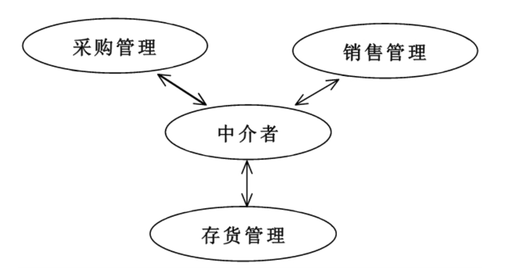

<!--
 * @description:
 * @Author: Tian Zhi
 * @Date: 2020-05-14 09:50:45
 * @LastEditors: Tian Zhi
 * @LastEditTime: 2020-05-14 20:18:36
 -->

## 定义

> Define an object that encapsulates how a set of objectsinteract.Mediator promotes loose coupling by keeping objects from referring to eachother explicitly,and it lets you vary their interaction independently.

> 用一个中介对象封装一系列的对象交互，中介者使各对象不需要显示地相互作用，从而使其耦合松散，而且可以独立地改变它们之间的交互。

## 类图


从类图中看，中介者模式由以下几部分组成：

- Mediator 抽象中介者角色

  抽象中介者角色定义统一的接口，用于各同事角色之间的通信。

- Concrete Mediator 具体中介者角色

  具体中介者角色通过协调各同事角色实现协作行为，因此它必须依赖于各个同事角色。

- Colleague 同事角色

  每一个同事角色都知道中介者角色，而且与其他的同事角色通信的时候，一定要通过中介者角色协作。每个同事类的行为分为两种：一种是同事本身的行为，比如改变对象本身的状态，处理自己的行为等，这种行为叫做自发行为（Self-Method），与其他的同事类或中介者没有任何的依赖；第二种是必须依赖中介者才能完成的行为，叫做依赖方法（Dep-Method）。

## Java 代码

### 抽象中介者

```java
public abstract class Mediator {
    // 定义同事类
    protected ConcreteColleague1 c1;
    protected ConcreteColleague2 c2;
    // 通过getter/setter方法把同事类注入进来
    public ConcreteColleague1 getC1() {
        return c1;
    }
    public void setC1(ConcreteColleague1 c1) {
        this.c1 = c1;
    }
    public ConcreteColleague2 getC2() {
        return c2;
    }
    public void setC2(ConcreteColleague2 c2) {
        this.c2 = c2;
    }
    // 中介者模式的业务逻辑
    public abstract void doSomething1();
    public abstract void doSomething2();
}
```

在`Mediator`抽象类中我们只定义了同事类的注入，为什么使用同事实现类注入而不使用抽象类注入呢？那是因为同事类虽然有抽象，但是没有每个同事类必须要完成的业务方法，当然如果每个同事类都有相同的方法，比如`execute`、`handler`等，那当然注入抽象类，做到依赖倒置。

### 中介者

```java
public class ConcreteMediator extends Mediator {
    @Override
    public void doSomething1() {
        // 调用同事类的方法，只要是public方法都可以调用
        super.c1.selfMethod1();
        super.c2.selfMethod2();
    }
    public void doSomething2() {
        super.c1.selfMethod1();
        super.c2.selfMethod2();
    }
}
```

### 抽象同事类

```java
public abstract class Colleague {
    protected Mediator mediator;
    public Colleague(Mediator _mediator) {
        this.mediator = _mediator;
    }
}
```

### 具体同事类

```java
public class ConcreteColleague1 extends Colleague {
    // 通过构造函数传递中介者
    public ConcreteColleague1(Mediator _mediator) {
        super(_mediator);
    }
    // 自有方法 self-method
    public void selfMethod1() {
        // 处理自己的业务逻辑
    }
    // 依赖方法 dep-method
    public void depMethod1() {
        // 处理自己的业务逻辑
        // 自己不能处理的业务逻辑，委托给中介者处理
        super.mediator.doSomething1();
    }
}
```

为什么同事类要使用构造函数注入中介者，而中介者使用`getter/setter`方式注入同事类呢？这是因为同事类必须有中介者，而中介者却可以只有部分同事类。

## 案例-进销存管理

进销存管理指的是公司的采购、销售和存货管理部门，三个部门做管理的时候互相依赖。例如采购部门会根据销售部门的销售业绩和库存管理部门的库存作出采购决策；同时，库存管理部门还有可能因为库存爆满而让采购部门停止采购，同时销售部门打折销售等等。

这里以一个终端销售商采购 IBM 电脑为例，讲解进销存管理中中介者模式的应用。

### 类图-未使用中介者模式



### Java 代码-未使用中介者模式

`Purchase`负责采购管理，`buyIBMComputer`指定了采购 IBM 电脑，`refuseBuyIBM`是指不再采购 IBM 了：

#### 采购管理类

```java
public class Purchase {
    // 采购IBM电脑
    public void buyIBMcomputer(int number) {
        // 访问库存
        Stock stock = new Stock();
        // 访问销售
        Sale sale = new Sale();
        // 电脑的销售情况
        int saleStatus = sale.getSaleStatus();
        if (saleStatus > 80) {  // 销售情况良好
            System.out.println("采购IBM电脑:" + number + "台");
            stock.increase(number);
        } else {  // 销售情况不好
            int buyNumber = number/2;  // 折半采购
            System.out.println("采购IBM电脑：" + buyNumber + "台");
        }
    }
    // 不再采购IBM电脑
    public void refuseBuyIBM() {
        System.out.println("不再采购IBM电脑");
    }
}
```

`Purchase`定义了采购电脑的标准：如果销售情况比较好，大于 80 分，你让我采购多少我就采购多少；销售情况不好，你让我采购 100 台，我就采购 50 台，对折采购。

电脑采购完毕，需要放到库房中，因此要调用库存的方法，增加库存电脑数量。我们继续来看库房`Stock`类：

#### 库存管理类

```java
public class Stock {
    // 刚开始有100台电脑
    private static int COMPUTER_NUMBER = 100;
    // 库存增加
    public void increase(int number) {
        COMPUTER_NUMBER = COMPUTER_NUMBER + number;
        System.out.println("库存数量为：" + COMPUTER_NUMBER);
    }
    // 库存降低
    public void decrease(int number) {
        COMPUTER_NUMBER = COMPUTER_NUMBER - number;
        System.out.println("库存数量为：" + COMPUTER_NUMBER);
    }
    // 获得库存数量
    public int getStockNumber() {
        return COMPUTER_NUMBER;
    }
    // 存货压力大了，就要通知采购人员不要采购，销售人员要尽快销售
    public void clearStock() {
        Purchase purchase = new Purchase();
        Sale sale = new Sale();
        System.out.println("清理存货数量为：" + COMPUTER_NUMBER);
        // 要求折价销售
        sale.offSale();
        // 要求采购人员不要采购
        purchase.refuseBuyIBM();
    }
}
```

库房中的货物数量肯定有增减，同时库房还有一个容量显示，达到一定的容量后就要求对一些商品进行折价处理，以腾出更多的空间容纳新产品。于是就有了`clearStock`方法。

既然是清仓处理肯定就要折价销售了，于是在`Sale`类中就有了`offSale`方法，我们来看`Sale`源代码：

#### 销售管理类

`Sale`类中的`getSaleStatus`是获得销售情况。

```java
public class Sale {
    // 销售IBM电脑
    public void sellIBMComputer(int number) {
        // 访问库存
        Stock stock = new Stock();
        // 访问采购
        Purchase purchase = new Purchase();
        if (stock.getStockNumber() < number) {  // 库存数量不够销售
            purchase.buyIBMcomputer(number);
        }
        System.out.println("销售IBM电脑" + number+"台");
        stock.decrease(number);
    }
    // 反馈销售情况，0～100之间变化，0代表根本就没人卖，100代表非常畅销，出一个卖一个
    public int getSaleStatus() {
        Random rand = new Random(System.currentTimeMillis());
        int saleStatus = rand.nextInt(100);
        System.out.println("IBM电脑的销售情况为：" + saleStatus);
        return saleStatus;
    }
    // 折价处理
    public void offSale() {
        // 库房有多少卖多少
        Stock stock = new Stock();
        System.out.println("折价销售IBM电脑" + stock.getStockNumber() + "台");
    }
}
```

#### 场景类

```java
public class Client {
    public static void main(String[] args) {
        // 采购人员采购电脑
        System.out.println("------采购人员采购电脑--------");
        Purchase purchase = new Purchase();
        purchase.buyIBMcomputer(100);
        // 销售人员销售电脑
        System.out.println("\n------销售人员销售电脑--------");
        Sale sale = new Sale();
        sale.sellIBMComputer(1);
        // 库房管理人员管理库存
        System.out.println("\n------库房管理人员清库处理--------");
        Stock stock = new Stock();
        stock.clearStock();
    }
}
```

进销存管理仅仅是三个模块的耦合，如果我们把进销存管理扩展一下：



可以看到，在这种蜘蛛网结构中，每个对象都要和其他对象交流，交流成本变得很大，我们的编码成本也随之升高。学过计网的同学应该知道网络拓扑中有一种星型结构：



我们可以将它加入到我们的设计中来，这样就有了中介者模式，我们先来看看修改后的进销存示意图：



加入了一个中介者作为三个模块的交流核心，每个模块之间不再相互交流，要交流就通过中介者进行。每个模块只负责自己的业务逻辑，不属于自己的则丢给中介者来处理，简化了各模块之间的耦合关系。我们来看看类图和代码。

### 类图-中介者模式


### Java 代码-中介者模式

#### 抽象中介者类

```java
public abstract class AbstractMediator {
    protected Purchase purchase;
    protected Sale sale;
    protected Stock stock;
    // 构造函数
    public AbstractMediator() {
        purchase = new Purchase(this);
        sale = new Sale(this);
        stock = new Stock(this);
    }
    // 中介者最重要的方法叫做事件方法，处理多个对象之间的关系
    public abstract void execute(String str,Object...objects);
}
```

#### 具体中介者类

```java
public class Mediator extends AbstractMediator {
    // 中介者最重要的方法
    public void execute(String str,Object...objects) {
        if (str.equals("purchase.buy")) { //采购电脑
            this.buyComputer((Integer)objects[0]);
        } else if (str.equals("sale.sell")) { //销售电脑
            this.sellComputer((Integer)objects[0]);
        } else if (str.equals("sale.offsell")) { //折价销售
            this.offSell();
        } else if(str.equals("stock.clear")) { //清仓处理
            this.clearStock();
        }
    }
    // 采购电脑
    private void buyComputer(int number) {
        int saleStatus = super.sale.getSaleStatus();
        if (saleStatus > 80) {  // 销售情况良好
            System.out.println("采购IBM电脑:" + number + "台");
            super.stock.increase(number);
        } else {  // 销售情况不好
            int buyNumber = number/2;  // 折半采购
            System.out.println("采购IBM电脑：" + buyNumber + "台");
        }
    }
    // 销售电脑
    private void sellComputer(int number) {
        if (super.stock.getStockNumber() < number) {  // 库存数量不够销售
            super.purchase.buyIBMcomputer(number);
        }
        super.stock.decrease(number);
    }
    // 折价销售电脑
    private void offSell() {
        System.out.println("折价销售IBM电脑" + stock.getStockNumber() + "台");
    }
    // 清仓处理
    private void clearStock() {
        // 要求清仓销售
        super.sale.offSale();
        // 要求采购人员不要采购
        super.purchase.refuseBuyIBM();
    }
}
```

> 注意：中介者`Mediator`定义了多个 private 方法，其目的是处理各个对象之间的依赖关系，就是说把原有一个对象要依赖多个对象的情况移到中介者的 private 方法中实现。在实际项目中，一般的做法是中介者按照职责进行划分，每个中介者处理一个或多个类似的关联请求。

#### 抽象同事类

```java
public abstract class AbstractColleague {
    protected AbstractMediator mediator;
    public AbstractColleague(AbstractMediator _mediator) {
        this.mediator = _mediator;
    }
}
```

#### 采购管理类

```java
public class Purchase extends AbstractColleague {
    public Purchase(AbstractMediator _mediator) {
        super(_mediator);
    }
    // 采购IBM电脑
    public void buyIBMcomputer(int number) {
        super.mediator.execute("purchase.buy", number);
    }
    // 不再采购IBM电脑
    public void refuseBuyIBM() {
        System.out.println("不再采购IBM电脑");
    }
}
```

#### 库存管理类

```java
public class Stock extends AbstractColleague {
    public Stock(AbstractMediator _mediator) {
        super(_mediator);
    }
    // 刚开始有100台电脑
    private static int COMPUTER_NUMBER = 100;
    // 库存增加
    public void increase(int number) {
        COMPUTER_NUMBER = COMPUTER_NUMBER + number;
        System.out.println("库存数量为：" + COMPUTER_NUMBER);
    }
    // 库存降低
    public void decrease(int number) {
        COMPUTER_NUMBER = COMPUTER_NUMBER - number;
        System.out.println("库存数量为：" + COMPUTER_NUMBER);
    }
    //获得库存数量
    public int getStockNumber() {
        return COMPUTER_NUMBER;
    }
    // 存货压力大了，就要通知采购人员不要采购，销售人员要尽快销售
    public void clearStock() {
        System.out.println("清理存货数量为：" + COMPUTER_NUMBER);
        super.mediator.execute("stock.clear");
    }
}
```

#### 销售管理类

```java
public class Sale extends AbstractColleague {
    public Sale(AbstractMediator _mediator) {
        super(_mediator);
    }
    // 销售IBM电脑
    public void sellIBMComputer(int number) {
        super.mediator.execute("sale.sell", number);
        System.out.println("销售IBM电脑" + number + "台");
    }
    // 反馈销售情况，0～100变化，0代表根本就没人买，100代表非常畅销，出一个卖一个
    public int getSaleStatus() {
        Random rand = new Random(System.currentTimeMillis());
        int saleStatus = rand.nextInt(100);
        System.out.println("IBM电脑的销售情况为：" + saleStatus);
        return saleStatus;
    }
    // 折价处理
    public void offSale() {
        super.mediator.execute("sale.offsell");
    }
}
```

#### 场景类

```java
public class Client { 
    public static void main(String[] args) {
        AbstractMediator mediator = new Mediator();
        // 采购人员采购电脑
        System.out.println("------采购人员采购电脑--------");
        Purchase purchase = new Purchase(mediator);
        purchase.buyIBMcomputer(100);
        // 销售人员销售电脑
        System.out.println("\n------销售人员销售电脑--------");
        Sale sale = new Sale(mediator);
        sale.sellIBMComputer(1);
        // 库房管理人员管理库存
        System.out.println("\n------库房管理人员清库处理--------");
        Stock stock = new Stock(mediator);
        stock.clearStock();
    }
}
```

在场景类中增加了一个中介者，然后分别传递到三个同事类中，三个类都具有相同的特性：只负责处理自己的活动（行为），与自己无关的活动就丢给中介者处理，程序运行的结果是相同的。

### TypeScript实现

```typescript
// 中介者可以执行的方法
type MediatorExcuteMethod = 'buyComputer' | 'sellComputer' | 'offSell' | 'clearStock';

// 抽象同事类
abstract class AbstractColleague {
    protected mediator: AbstractMediator;
    constructor(_mediator: AbstractMediator) {
        this.mediator = _mediator;
    }
}

// 采购管理类
class Purchase extends AbstractColleague {
    constructor(_mediator: AbstractMediator) {
        super(_mediator);
    }
    // 采购IBM电脑
    buyIBMcomputer(number: number) {
        this.mediator.execute('buyComputer', number);
    }
    // 不再采购IBM电脑
    refuseBuyIBM() {
        console.log("不再采购IBM电脑");
    }
}

// 库存管理类
class Stock extends AbstractColleague {
    constructor(_mediator: AbstractMediator) {
        super(_mediator);
    }
    // 刚开始有100台电脑
    private static COMPUTER_NUMBER = 100;
    // 库存增加
    increase(number: number) {
        Stock.COMPUTER_NUMBER = Stock.COMPUTER_NUMBER + number;
        console.log("库存数量为：" + Stock.COMPUTER_NUMBER);
    }
    // 库存降低
    decrease(number: number) {
        Stock.COMPUTER_NUMBER = Stock.COMPUTER_NUMBER - number;
        console.log("库存数量为：" + Stock.COMPUTER_NUMBER);
    }
    //获得库存数量
    getStockNumber() {
        return Stock.COMPUTER_NUMBER;
    }
    // 存货压力大了，就要通知采购人员不要采购，销售人员要尽快销售
    clearStock() {
        console.log("清理存货数量为：" + Stock.COMPUTER_NUMBER);
        this.mediator.execute('clearStock');
    }
}

// 销售管理类
class Sale extends AbstractColleague {
    constructor(_mediator: AbstractMediator ) {
        super(_mediator);
    }
    // 销售IBM电脑
    sellIBMComputer(number: number) {
        this.mediator.execute('sellComputer', number);
        console.log("销售IBM电脑" + number + "台");
    }
    // 反馈销售情况，0～100变化，0代表根本就没人买，100代表非常畅销，出一个卖一个
    getSaleStatus() {
        const saleStatus = Math.floor(Math.random() * 100);
        console.log("IBM电脑的销售情况为：" + saleStatus);
        return saleStatus;
    }
    // 折价处理
    offSale() {
        this.mediator.execute('offSell');
    }
}

// 抽象中介者类
abstract class AbstractMediator {
    protected purchase: Purchase;
    protected sale: Sale;
    protected stock: Stock;
    // 构造函数
    constructor() {
        this.purchase = new Purchase(this);
        this.sale = new Sale(this);
        this.stock = new Stock(this);
    }
    // 中介者最重要的方法叫做事件方法，处理多个对象之间的关系
    abstract execute(methodStr: MediatorExcuteMethod, ...args: any[]): void;
}

// 具体中介者类
class Mediator extends AbstractMediator {
    constructor() {
        super();
        this.execute.bind(this);
        this.buyComputer.bind(this);
        this.sellComputer.bind(this);
        this.offSell.bind(this);
        this.clearStock.bind(this);
    }
    // 中介者最重要的方法
    execute(methodName: MediatorExcuteMethod, ...args: any[]) {
        if (typeof this[methodName] === 'function') {
            if (methodName === 'buyComputer' || methodName === 'sellComputer') {
                this[methodName](Number(args[0]));
            } else {
                this[methodName]();
            }
        }
    }
    // 采购电脑
    private buyComputer(number: number) {
        const saleStatus = this.sale.getSaleStatus();
        if (saleStatus > 80) {  // 销售情况良好
            console.log("采购IBM电脑:" + number + "台");
            this.stock.increase(number);
        } else {  // 销售情况不好
            const buyNumber = number / 2;  // 折半采购
            console.log("采购IBM电脑：" + buyNumber + "台");
        }
    }
    // 销售电脑
    private sellComputer(number: number) {
        if (this.stock.getStockNumber() < number) {  // 库存数量不够销售
            this.purchase.buyIBMcomputer(number);
        }
        this.stock.decrease(number);
    }
    // 折价销售电脑
    private offSell() {
        console.log("折价销售IBM电脑" + this.stock.getStockNumber() + "台");
    }
    // 清仓处理
    private clearStock() {
        // 要求清仓销售
        this.sale.offSale();
        // 要求采购人员不要采购
        this.purchase.refuseBuyIBM();
    }
}

// 场景方法
function runScenario() {
    const mediator: AbstractMediator = new Mediator();
    // 采购人员采购电脑
    console.log("------采购人员采购电脑--------");
    const purchase = new Purchase(mediator);
    purchase.buyIBMcomputer(100);
    // 销售人员销售电脑
    console.log("\n------销售人员销售电脑--------");
    const sale = new Sale(mediator);
    sale.sellIBMComputer(1);
    // 库房管理人员管理库存
    console.log("\n------库房管理人员清库处理--------");
    const stock = new Stock(mediator);
    stock.clearStock();
}

// 执行场景方法
runScenario();
```

从项目设计上来看，加入了中介者，设计结构清晰了很多，而且类间的耦合性大大减少，代码质量也有了很大的提升。

## 使用场景

类之间的依赖关系是必然存在的，一个类依赖多个类的情况也是存在的，存在即合理，那是否可以说只要有多个依赖关系就考虑使用中介者模式呢？答案是否定的。中介者模式未必能帮你把原本凌乱的逻辑整理得清清楚楚，而且中介者模式也是有缺点的，这个缺点在使用不当时会被放大，比如原本就简单的几个对象依赖关系，如果为了使用模式而加入了中介者，必然导致中介者的逻辑复杂化，因此中介者模式的使用需要“量力而行”！

中介者模式适用于多个对象之间紧密耦合的情况，紧密耦合的标准是：在类图中出现了**蜘蛛网状结构**。在这种情况下一定要考虑使用中介者模式，这有利于把蜘蛛网梳理为星型结构，使原本复杂混乱的关系变得清晰简单。

下面举一些在开发和生活中遇到的例子：

- MVC 框架

  Controller 作为中介者，用于协调 Model 层和 View 层的依赖：将 Model 层获得的数据结合 View 层的界面，展示最终页面；或者是转发 View 层的请求到 Model 层进行处理。

- 媒体网关

  比如使用 MSN 时，张三发消息给李四，是由 MSN 服务器（中介者）进行中转的。与此相反的就是 IPMsg（也叫飞鸽），它没有使用中介者，而直接使用了 UDP 广播的方式，每个客户端既是客户端也是服务器端。

- 机场调度中心

  机场调度中心充当中介者，用来调度每一架要降落和起飞的飞机。

  比如，某架飞机（同事类）飞到机场上空了，就询问调度中心（中介者）“我是否可以降落”以及“降落到哪个跑道”，调度中心（中介者）查看其他飞机（同事类）情况，然后通知飞机降落。如果没有机场调度中心，飞机飞到机场了，飞行员要先看看有没有飞机和自己一起降落的，有没有空跑道，停机位是否具备等情况，这种局面是难以想象的！

- 中介服务

  现在中介服务非常多，比如租房中介、出国中介，这些也都是中介模式的具体体现。

## 最佳实践


## 与六大设计原则的结合

- [ ] Single Responsibility Principle (SRP, 单一职责原则)

  中介者模式没有提到 SRP。个人认为，在同事类的设计中可以遵循 SRP，但是中介类很难符合 SRP，他需要协调多个同事类的交互，难以拆分。

- [ ] Open Closed Principle (OCP, 开闭原则)

  个人认为，如果要增加同事类，如果新增的同事类会更改之前同事类间的很多依赖，则中介类也要进行改动，不符合开闭原则；但是中介者的扩展可以符合开闭原则。

- [ ] Liskov Substitution Principle (LSP, 里氏替换原则)

  对于同事类或者中介者类，他们之间都没有什么共性，子类无法替换父类，不符合 LSP。

- [x] Law of Demeter (LoD, 迪米特法则)

  中介者很好的诠释了 LoD，减少了类间的依赖，对于一个同事类，除了自己的逻辑，就只需要跟中介者类打交道，降低了类间的耦合。同时，中介者模式的缺点也是 LoD 原则的缺点：产生了中转类，原来复杂的依赖关系变成了复杂的中转类的逻辑。

- [ ] Interface Segragation Principle (ISP, 接口隔离原则)

  没有涉及。

- [ ] Dependency Inversion Principle (DIP, 依赖倒置原则)

  同 LSP，因为没有共性，所以很少使用接口或抽象类，不符合 DIP。
