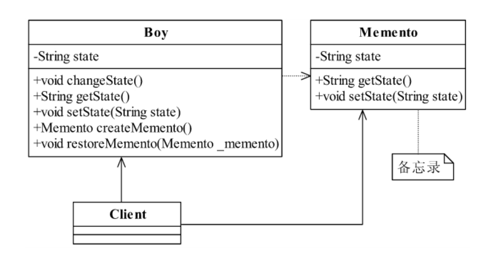

<!--
 * @description: 
 * @Author: Tian Zhi
 * @Date: 2020-07-16 19:58:55
 * @LastEditors: Tian Zhi
 * @LastEditTime: 2020-07-17 18:30:39
--> 
## 定义

备忘录模式（Memento Pattern）提供了一种弥补真实世界缺陷的方法，让“后悔药”在程序的世界中真实可行，其定义如下：

> Without violating encapsulation,capture and externalize an object's internal state so thatthe object can be restored to this state later.

> 在不破坏封装性的前提下，捕获一个对象的内部状态，并在该对象之外保存这个状态。这样以后就可将该对象恢复到原先保存的状态。

这里的封装性，通俗来说就是该对象的内部状态仍然无法从外部直接获取，那如何恢复到这一状态呢？使用备忘录！此时外部只知道用备忘录可以恢复，但是要限制外部无法从备忘录上读取到该对象的内部状态。

## 类图


类图中一个三个角色：

* Originator发起人角色

    记录当前时刻的内部状态，负责定义哪些属于备份范围的状态，负责创建和恢复备忘录数据。

* Memento备忘录角色

    负责存储Originator发起人对象的内部状态，在需要的时候提供发起人需要的内部状态。

* Caretaker备忘录管理员角色

    对备忘录进行管理、保存和提供备忘录。

## Java代码

### 第一种设计思路

#### 发起人角色

```java
public class Originator {
    // 内部状态
    private String state = "";
    public String getState() {
        return state;
    }
    public void setState(String state) {
        this.state = state;
    }
    // 创建一个备忘录
    public Memento createMemento() {
        return new Memento(this.state);
    }
    // 恢复一个备忘录
    public void restoreMemento(Memento _memento) {
        this.setState(_memento.getState());
    }
}
```

#### 备忘录角色

```java
public class Memento {
    // 发起人的内部状态
    private String state = "";
    // 构造函数传递参数
    public Memento(String _state) {
        this.state = _state;
    }
    public String getState() {
        return state;
    }
    public void setState(String state) {
        this.state = state;
    }
}
```

#### 备忘录管理员角色

```java
public class Caretaker {
    // 备忘录对象
    private Memento memento;
    public Memento getMemento() {
        return memento;
    }
    public void setMemento(Memento memento) {
        this.memento = memento;
    }
}
```

#### 场景类

```java
public class Client {
    public static void main(String[] args) {
        // 定义出发起人
        Originator originator = new Originator();
        // 定义出备忘录管理员
        Caretaker caretaker = new Caretaker();
        // 创建一个备忘录
        caretaker.setMemento(originator.createMemento());
        // 恢复一个备忘录
        originator.restoreMemento(caretaker.getMemento());
    }
}
```

### 第二种设计思路[（参考案例）](#更进一步的设计思路)

## 案例-追求女孩

尼古拉斯·凯奇主演的《Next》（中文译名为《预见未来》）中，尼古拉斯·凯奇饰演一个可以预视并且扭转未来的人，其中有一个情节很是让人心动：男女主角见面，Cris Johnson（尼古拉斯·凯奇饰演）坐在咖啡吧台前，看着离自己近在咫尺的CallieFerris（朱莉安·摩尔饰演），计划着怎么认识这个命中注定的女人，看Cris Johnson如何利用自己的特异功能：

Cris Johnson端着一杯咖啡走过去，说“你好，可以认识你吗？”被拒绝，恢复到坐在咖啡吧台前的状态。走过去询问是否可以搭车，被拒绝，恢复原状。帮助解决困境，被拒绝，恢复原状。采用嬉皮士的方式解决困境，被拒绝，恢复原状。帮助解决困境，被打伤，装可怜，Callie Ferris怜惜，于是乎相识了。

我们这里的场景中最重要的就是原始状态（男孩搭讪前）的保留和恢复这块。我们可以定义一个中间变量，保留这个原始状态，先看看类图：


**男孩状态类**

```java
public class Boy {
    // 男孩的状态
    private String state = "";
    // 认识女孩子后状态肯定改变，比如心情、手中的花等
    public void changeState() {
        this.state = "心情可能很不好";
    }
    public String getState() {
        return state;
    }
    public void setState(String state) {
        this.state = state;
    }
}
```

**场景类**

```java
public class Client {
    public static void main(String[] args) {
        // 声明出主角
        Boy boy = new Boy();
        // 初始化当前状态
        boy.setState("心情很棒！");
        System.out.println("=====男孩现在的状态======");
        System.out.println(boy.getState());
        // 需要记录下当前状态呀
        Boy backup = new Boy();
        backup.setState(boy.getState());
        // 男孩去追女孩，状态改变
        boy.changeState();
        System.out.println("\n=====男孩追女孩子后的状态======");
        System.out.println(boy.getState());
        // 追女孩失败，恢复原状
        boy.setState(backup.getState());
        System.out.println("\n=====男孩恢复后的状态======");
        System.out.println(boy.getState());
    }
}
```

类图很简单，但仔细看来也有一个问题：为什么一个状态的保存和恢复要让高层模块来负责？这应该是`Boy`类的职责，而不应该让高层模块来完成，也就是破坏了`Boy`类的封装，或者说`Boy`类没有封装好，它应该是把backup的定义容纳进来，而不应该让高层模块来定义。

如果在Boy类中再增加一个方法或者其他的内部类来保存这个状态，则对单一职责原则是一种破坏，`Boy`类本身的职责是追求女孩子，而保留和恢复原始状态则应该由另外一个类来承担，我们把这个类取名叫做备忘录：



**改进后的男孩状态类**

```java
public class Boy {
    // 男孩的状态
    private String state = "";
    // 认识女孩子后状态肯定改变，比如心情、手中的花等
    public void changeState() {
        this.state = "心情可能很不好";
    }
    public String getState() {
        return state;
    }
    public void setState(String state) {
        this.state = state;
    }
    // 保留一个备份
    public Memento createMemento() {
        return new Memento(this.state);
    }
    // 恢复一个备份
    public void restoreMemento(Memento _memento) {
        this.setState(_memento.getState());
    }
}
```

**备忘录**

```java
public class Memento {
    // 男孩的状态
    private String state = "";
    // 通过构造函数传递状态信息
    public Memento(String _state) {
        this.state = _state;
    }
    public String getState() {
        return state;
    }
    public void setState(String state) {
        this.state = state;
    }
}
```

**改进后的场景类**

```java
public class Client {
    public static void main(String[] args) {
        // 声明出主角
        Boy boy = new Boy();
        // 初始化当前状态
        boy.setState("心情很棒！");
        System.out.println("=====男孩现在的状态======");
        System.out.println(boy.getState());
        // 需要记录下当前状态呀
        Memento mem = boy.createMemento();
        // 男孩去追女孩，状态改变
        boy.changeState();
        System.out.println("\n=====男孩追女孩子后的状态======");
        System.out.println(boy.getState());
        // 追女孩失败，恢复原状
        boy.restoreMemento(mem);
        System.out.println("\n=====男孩恢复后的状态======");
        System.out.println(boy.getState());
    }
}
```

### 更进一步的设计思路

**注意：在书中作者指出上述代码：**

> 虽然程序中不再重复定义`Boy`类的对象了，但是我们还是要关心备忘录，这对迪米特法则是一个亵渎，它告诉我们只和朋友类通信，那这个备忘录对象是我们必须要通信的朋友类吗？对高层模块来说，它最希望要做的就是创建一个备份点，然后在需要的时候再恢复到这个备份点就成了，它不用关心到底有没有备忘录这个类。

因此作者对案例进一步完善，以下是完善后的类图：


类图新增了一个`Caretaker`（备忘录管理类），此时客户类无需知道备忘录的存在，只需要和管理类打交道就行，先来看看代码：

**备忘录管理类**

```java
public class Caretaker {
    // 备忘录对象
    private Memento memento;
    public Memento getMemento() {
        return memento;
    }
    public void setMemento(Memento memento) {
        this.memento = memento;
    }
}
```

**进一步改进后的场景类**

```java
public class Client {
    public static void main(String[] args) {
        // 声明出主角
        Boy boy = new Boy();
        // 声明出备忘录的管理者
        Caretaker caretaker = new Caretaker();
        // 初始化当前状态
        boy.setState("心情很棒！");
        System.out.println("=====男孩现在的状态======");
        System.out.println(boy.getState());
        // 需要记录下当前状态呀
        caretaker.setMemento(boy.createMemento());
        // 男孩去追女孩，状态改变
        boy.changeState();
        System.out.println("\n=====男孩追女孩子后的状态======");
        System.out.println(boy.getState());
        // 追女孩失败，恢复原状
        boy.restoreMemento(caretaker.getMemento());
        System.out.println("\n=====男孩恢复后的状态======");
        System.out.println(boy.getState());
    }
}
```

**但是对于上述设计，我并不是很认同，理由如下：**

> 我觉得备忘录应该是男孩的一个特异功能（聚合备忘录），然后高层类只需要知道男孩有这个特异功能，能够备忘和恢复备忘即可，既不需要知道备忘录也不需要知道备忘录管理（`Caretaker`类），这才符合LoD。

经过详细的搜寻资料，发现关于备忘录模式，确实存在两种设计，其中一种便是作者完善之后的，还有一种就是类似我的想法，[维基百科](https://en.wikipedia.org/wiki/Memento_pattern)也是这种设计思路，设计如下：


在这种设计下，`Caretaker`作为客户类，里面仍然维护这备忘录列表，但是此时备忘录是`Originator`（案例中的男孩）的一个静态类成员，对外部是不可知的，只能通过`Originator`创建后返回。看看代码：

```java
import java.util.List;
import java.util.ArrayList;
class Originator {
    private String state;
    // The class could also contain additional data that is not part of the
    // state saved in the memento..
 
    public void set(String state) {
        this.state = state;
        System.out.println("Originator: Setting state to " + state);
    }
 
    public Memento saveToMemento() {
        System.out.println("Originator: Saving to Memento.");
        return new Memento(this.state);
    }
 
    public void restoreFromMemento(Memento memento) {
        this.state = memento.getSavedState();
        System.out.println("Originator: State after restoring from Memento: " + state);
    }
 
    public static class Memento {
        private final String state;

        public Memento(String stateToSave) {
            state = stateToSave;
        }
 
        // accessible by outer class only
        private String getSavedState() {
            return state;
        }
    }
}
 
class Caretaker {
    public static void main(String[] args) {
        List<Originator.Memento> savedStates = new ArrayList<Originator.Memento>();
 
        Originator originator = new Originator();
        originator.set("State1");
        originator.set("State2");
        savedStates.add(originator.saveToMemento());
        originator.set("State3");
        // We can request multiple mementos, and choose which one to roll back to.
        savedStates.add(originator.saveToMemento());
        originator.set("State4");
 
        originator.restoreFromMemento(savedStates.get(1));   
    }
}
```

#### TypeScript代码

到目前为止，TS对类表达式的类型推导[仍存在一些问题](https://github.com/microsoft/TypeScript/issues/17293)，这导致类表达式内部属性只能使用`public`修饰，而内部类`Memento`在TS中又只能使用类表达式定义，因此`Memento`中的`Originator`状态泄露（因为`state`只能为`public`），**破坏了`Originator`的封装性**。

```typescript
interface MementoInstance {
    state: string;
    getState(): string;
}

class Originator {
    private state: string = '';
    
    setState(state: string) {
        this.state = state;
        console.log("Originator: Setting state to " + state);
    }
    
    saveToMemento() {
        console.log("Originator: Saving to Memento.");
        return new Originator.Memento(this.state);
    }

    restoreFromMemento(memento: MementoInstance) {
        const state = memento.getState();
        this.state = state;
        console.log("Originator: State after restoring from Memento: " + state);
    }

    private static Memento = class implements MementoInstance {
        constructor(public state: string) {
            this.state = state;
        }
        
        getState() {
            return this.state;
        }
    }
}

class Caretaker {
    private mementoList: MementoInstance[] = [];

    setMemento(memento: MementoInstance) {
        this.mementoList.push(memento);
    }

    getMemento(idx: number) {
        return this.mementoList[idx];
    }
}

(function() {
    const careTaker = new Caretaker();
    const originator = new Originator();

    originator.setState("State1");
    originator.setState("State2");
    careTaker.setMemento(originator.saveToMemento());
    originator.setState("State3");
    // We can request multiple mementos, and choose which one to roll back to.
    careTaker.setMemento(originator.saveToMemento());
    originator.setState("State4");

    originator.restoreFromMemento(careTaker.getMemento(1));
})()
```

由于在TS中把`Memento`当做`Originator`内部类会破坏`Originator`的封装性，我还是将`Memento`单独拿了出来：

```typescript
class Memento {
    constructor(private state: string) {
        this.state = state;
    }
    
    getState() {
        return this.state;
    }
}

class Originator {
    private state: string = '';
    
    setState(state: string) {
        this.state = state;
        console.log("Originator: Setting state to " + state);
    }
    
    saveToMemento() {
        console.log("Originator: Saving to Memento.");
        return new Memento(this.state);
    }

    restoreFromMemento(memento: Memento) {
        const state = memento.getState();
        this.state = state;
        console.log("Originator: State after restoring from Memento: " + state);
    }
}

class Caretaker {
    private mementoList: Memento[] = [];

    setMemento(memento: Memento) {
        this.mementoList.push(memento);
    }

    getMemento(idx: number) {
        return this.mementoList[idx];
    }
}

(function() {
    const careTaker = new Caretaker();
    const originator = new Originator();

    originator.setState("State1");
    originator.setState("State2");
    careTaker.setMemento(originator.saveToMemento());
    originator.setState("State3");
    // We can request multiple mementos, and choose which one to roll back to.
    careTaker.setMemento(originator.saveToMemento());
    originator.setState("State4");

    originator.restoreFromMemento(careTaker.getMemento(1));
})()
```

## 使用场景

需要保存和恢复数据的相关状态场景都可以使用备忘录模式：

* 提供一个可回滚（rollback）的操作；比如Word中的CTRL+Z组合键，IE浏览器中的后退按钮，文件管理器上的backspace键等。

* 需要监控的副本场景中。例如要监控一个对象的属性，但是监控又不应该作为系统的主业务来调用，它只是边缘应用，即使出现监控不准、错误报警也影响不大，因此一般的做法是备份一个主线程中的对象，然后由分析程序来分析。

* 数据库连接的事务管理就是用的备忘录模式，想想看，如果你要实现一个JDBC驱动，你怎么来实现事务？还不是用备忘录模式嘛！

同时，备忘录模式使用时也有一些注意事项：

* 备忘录的生命期

    备忘录创建出来就要在“最近”的代码中使用，要主动管理它的生命周期，建立就要使用，不使用就要立刻删除其引用，等待垃圾回收器对它的回收处理。

* 备忘录的性能

    不要在频繁建立备份的场景中使用备忘录模式（比如一个for循环中），原因有二：一是控制不了备忘录建立的对象数量；二是大对象的建立是要消耗资源的，系统的性能需要考虑。因此，如果出现这样的代码，设计师就应该好好想想怎么修改架构了。

## 备忘录模式的扩展

### clone方式的备忘录


**发起人角色（发起人自身的拷贝就是一张备忘录）**

```java
public class Originator implements Cloneable {
    // 内部状态
    private String state = "";
    public String getState() {
        return state;
    }
    public void setState(String state) {
        this.state = state;
    }
    // 创建一个备忘录
    public Originator createMemento() {
        return this.clone();
    }
    // 恢复一个备忘录
    public void restoreMemento(Originator _originator) {
        this.setState(_originator.getState());
    }
    // 克隆当前对象
    @Override
    protected Originator clone() {
        try {
            return (Originator)super.clone();
        } catch (CloneNotSupportedException e) {
            e.printStackTrace();
        }
        return null;
    }
}
```

**备忘录管理员角色**

```java
public class Caretaker {
    // 发起人对象
    private Originator originator;
    public Originator getOriginator() {
        return originator;
    }
    public void setOriginator(Originator originator) {
        this.originator = originator;
    }
}
```

现在由于备忘录角色就是发起人，因此可以由发起人自身进行备份，进一步精简，删除备忘录管理员角色：

**发起人自主备份和恢复**

```java
public class Originator implements Cloneable {
    private Originator backup;
    // 内部状态
    private String state = "";
    public String getState() {
        return state;
    }
    public void setState(String state) {
        this.state = state;
    }
    // 创建一个备忘录
    public void createMemento() {
        this.backup = this.clone();
    }
    // 恢复一个备忘录
    public void restoreMemento() {
        // 在进行恢复前应该进行断言，防止空指针
        this.setState(this.backup.getState());
    }
    // 克隆当前对象
    @Override
    protected Originator clone() {
        try {
            return (Originator)super.clone();
        } catch (CloneNotSupportedException e) {
            e.printStackTrace();
        }
        return null;
    }
}
```

可能这和备忘录模式的定义不相符，它定义是“在该对象之外保存这个状态”，现在却把这个状态保存在了发起人内部。需要知道的是，**设计模式定义的诞生比Java的出世略早**，它没有想到Java程序是这么有活力，有远见，而且在面向对象的设计中，即使把一个类封装在另一个类中也是可以做到的，一个小小的对象复制，这是它的设计模式完全没有预见到的。

最后看看客户类代码

**场景类**

```java
public class Client {
    public static void main(String[] args) {
        // 定义发起人
        Originator originator = new Originator();
        // 建立初始状态
        originator.setState("初始状态...");
        System.out.println("初始状态是：" + originator.getState());
        // 建立备份
        originator.createMemento();
        // 修改状态
        originator.setState("修改后的状态...");
        System.out.println("修改后状态是：" + originator.getState());
        // 恢复原有状态
        originator.restoreMemento();
        System.out.println("恢复后状态是：" + originator.getState());
    }
}
```

> **注意** 使用Clone方式的备忘录模式，可以使用在比较简单的场景或者比较单一的场景中，尽量不要与其他的对象产生严重的耦合关系。因为Clone是浅拷贝的，如果发起人自身与备忘录（自身的克隆）发生复杂的依赖或耦合，会让程序逻辑变得混乱，而且出现错误也难以跟踪。

### 多状态的备忘录模式

上面的所有例子都是一个单一状态，但是在实际开发中，一个对象可能不止有一个状态，下面介绍的就是全状态的备份方案，它有多种处理方式，比如使用Clone的方式就可以解决，使用数据技术也可以解决（DTO回写到临时表中）等，我们要讲的方案就对备忘录模式继续扩展一下，实现一个JavaBean对象的所有状态的备份和还原：


类图增加了一个`BeanUtils`类，其中`backupProp`是把发起人的所有属性值转换到`HashMap`中，方便备忘录角色存储；`restoreProp`方法则是把HashMap中的值返回到发起人角色中。来看看代码：

**发起人角色**

```java
public class Originator {
    // 内部状态
    private String state1 = "";
    private String state2 = "";
    private String state3 = "";
    public String getState1() {
        return state1;
    }
    public void setState1(String state1) {
        this.state1 = state1;
    }
    public String getState2() {
        return state2;
    }
    public void setState2(String state2) {
        this.state2 = state2;
    }
    public String getState3() {
        return state3;
    }
    public void setState3(String state3) {
        this.state3 = state3;
    }
    // 创建一个备忘录
    public Memento createMemento() {
        return new Memento(BeanUtils.backupProp(this));
    }
    // 恢复一个备忘录
    public void restoreMemento(Memento _memento) {
        BeanUtils.restoreProp(this, _memento.getStateMap());
    }
    // 增加一个toString方法
    @Override
    public String toString() {
        return "state1=" + state1 + "\nstat2=" + state2 + "\nstate3=" + state3;
    }
}
```

**BeanUtils工具类**

```java
public class BeanUtils {
    // 把bean的所有属性及数值放入到Hashmap中
    public static HashMap<String,Object> backupProp(Object bean) {
        HashMap<String,Object> result = new HashMap<String,Object>();
        try {
            // 获得Bean描述
            BeanInfo beanInfo = Introspector.getBeanInfo(bean.getClass());
            // 获得属性描述
            PropertyDescriptor[] descriptors=beanInfo.getPropertyDescriptors();
            // 遍历所有属性
            for (PropertyDescriptor des:descriptors) {
                // 属性名称
                String fieldName = des.getName();
                // 读取属性的方法
                Method getter = des.getReadMethod();
                // 读取属性值
                Object fieldValue=getter.invoke(bean,new Object[]{});
                if (!fieldName.equalsIgnoreCase("class")) {
                    result.put(fieldName, fieldValue);
                }
            }
        } catch (Exception e) {
            // 异常处理
        }
        return result;
    }
    // 把HashMap的值返回到bean中
    public static void restoreProp(Object bean,HashMap<String,Object> propMap) {
        try {
            // 获得Bean描述
            BeanInfo beanInfo = Introspector.getBeanInfo(bean.getClass());
            // 获得属性描述
            PropertyDescriptor[] descriptors = beanInfo.getPropertyDescriptors();
            // 遍历所有属性
            for (PropertyDescriptor des:descriptors) {
                // 属性名称
                String fieldName = des.getName();
                // 如果有这个属性
                if (propMap.containsKey(fieldName)) {
                    // 写属性的方法
                    Method setter = des.getWriteMethod();
                    setter.invoke(bean, new Object[]{propMap.get(fieldName)});
                }
            }
        } catch (Exception e) {
            // 异常处理
            System.out.println("shit");
            e.printStackTrace();
        }
    }
}
```

**备忘录角色**

```java
public class Memento {
    // 接受HashMap作为状态
    private HashMap<String,Object> stateMap;
    // 接受一个对象，建立一个备份
    public Memento(HashMap<String,Object> map) {
        this.stateMap = map;
    }
    public HashMap<String,Object> getStateMap() {
        return stateMap;
    }
    public void setStateMap(HashMap<String,Object> stateMap) {
        this.stateMap = stateMap;
    }
}
```

**场景类**

```java
public class Client {
    public static void main(String[] args) {
        // 定义出发起人
        Originator ori = new Originator();
        // 定义出备忘录管理员
        Caretaker caretaker = new Caretaker();
        // 初始化
        ori.setState1("中国");
        ori.setState2("强盛");
        ori.setState3("繁荣");
        System.out.println("===初始化状态===\n"+ori);
        // 创建一个备忘录
        caretaker.setMemento(ori.createMemento());
        // 修改状态值
        ori.setState1("软件");
        ori.setState2("架构");
        ori.setState3("优秀");
        System.out.println("\n===修改后状态===\n"+ori);
        // 恢复一个备忘录
        ori.restoreMemento(caretaker.getMemento());
        System.out.println("\n===恢复后状态===\n"+ori);
    }
}
```

通过这种方式的改造，不管有多少状态都没有问题，直接把原有的对象所有属性都备份了一遍，想恢复当时的数据也非常容易。

> **注意** 如果要设计一个在运行期决定备份状态的框架，则建议采用AOP框架来实现，避免采用动态代理无谓地增加程序逻辑复杂性。

### 多备份的备忘录

对于多备份的备忘录，可以使用`ArrayList`，也可以使用`HashMap`，上面的设计已经提到过使用`ArrayList`，替换成`HashMap`也可以。再来看看其中的代码片段：

```java
class Originator {
    public void restoreFromMemento(Memento memento) {
        // 只有这里能访问 Memento实例的getSavedState方法
        this.state = memento.getSavedState();
        System.out.println("Originator: State after restoring from Memento: " + state);
    }
    public static class Memento {
        // state为final修饰，一旦设置不可更改
        private final String state;
 
        // 使用private限制方法只能在Originator内部被访问
        private String getSavedState() {
            return state;
        }
    }
}

class Caretaker {
    public static void main(String[] args) {
        // 使用了ArrayList，也可以使用HashMap
        List<Originator.Memento> savedStates = new ArrayList<Originator.Memento>(); 
    }
}
```

上面的设计还有几个关键点：

1. `Memento`是`Originator`的内部类，是为了做进一步封装。

2. `Memento上`的记录（也就是`Originator`的状态）是`final`修饰的，这确保了备忘录上的状态一旦备忘后无法篡改。

3. `Memento`上的`getSavedState`方法只能被其外部类`Originator`访问，这缩小了`Originator`创建的备忘录的阅读权限，确保只有`Originator`可读。

除了上面这样的设计，书中还提到了一种设计，也是用内部类，但是限制访问权限的做法稍有不同，书中的内部类`Memento`进一步封装，使用`private`修饰，然后创建一个空接口，当需要引用`Memento`时则使用空接口，代码如下：

**发起人角色**

```java
public class Originator {
    // 内部状态
    private String state = "";
    public String getState() {
        return state;
    }
    public void setState(String state) {
        this.state = state;
    }
    // 创建一个备忘录
    public IMemento createMemento() {
        return new Memento(this.state);
    }
    // 恢复一个备忘录
    public void restoreMemento(IMemento _memento) {
        this.setState(((Memento)_memento).getState());
    }
    // 内置类
    private class Memento implements IMemento {
        // 发起人的内部状态
        private String state = "";
        // 构造函数传递参数
        private Memento(String _state) {
            this.state = _state;
        }
        private String getState() {
            return state;
        }
        private void setState(String state) {
            this.state = state;
        }
    }
}
```

**备忘录的空接口**

```java
public interface IMemento {}
```

**备忘录管理者**

```java
public class Caretaker {
    // 备忘录对象
    private IMemento memento;
    public IMemento getMemento() {
        return memento;
    }
    public void setMemento(IMemento memento) {
        this.memento = memento;
    }
}
```

这里使用的**双接口设计**也是一种常见的设计方法，一个类可以实现多个接口，在系统设计时，如果考虑对象的安全问题，则可以提供两个接口，一个是业务的正常接口，实现必要的业务逻辑，叫做宽接口；另外一个接口是一个空接口，什么方法都没有，其目的是提供给子系统外的模块访问，比如容器对象，这个叫做窄接口，由于窄接口中没有提供任何操纵数据的方法，因此相对来说比较安全。

为什么说是相对安全？因为如果使用reflect反射的话，仍然可以访问甚至修改内部类`Memento`的数据。

## 最佳实践

备忘录模式是我们设计上“月光宝盒”，可以让我们回到需要的年代；是程序数据的“后悔药”，吃了它就可以返回上一个状态；是设计人员的定心丸，确保即使在最坏的情况下也能获得最近的对象状态。如果大家看懂了的话，请各位在设计的时候就不要使用数据库的临时表作为缓存备份数据了，虽然是一个简单的办法，但是它加大了数据库操作的频繁度，把压力下放到数据库了，最好的解决办法就是使用备忘录模式。

## 案例是否符合六大设计原则

- [x] Single Responsibility Principle (SRP, 单一职责原则)

    案例中，男孩类负责自己的事，备忘录类负责备忘男孩的状态，符合SRP。

- [ ] Open Closed Principle (OCP, 开闭原则)

    个人认为案例不涉及OCP。

- [ ] Liskov Substitution Principle (LSP, 里氏替换原则)

    个人认为案例不涉及LSP。

- [x] Law of Demeter (LoD, 迪米特法则)

    使用`Caretaker`后的案例使得高层无需知道创建备忘录的逻辑，将这部分逻辑转移到`Caretaker`，符合LoD。

- [ ] Interface Segragation Principle (ISP, 接口隔离原则)

    个人认为案例不涉及ISP。

- [ ] Dependency Inversion Principle (DIP, 依赖倒置原则)

    个人认为案例不涉及DIP。
