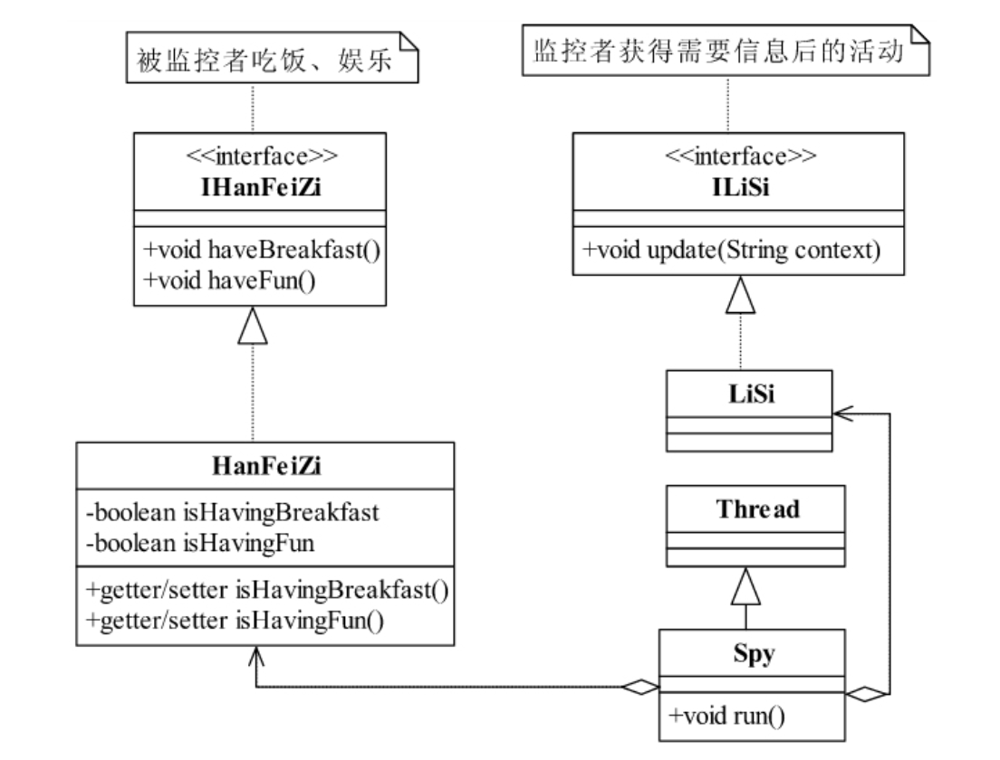
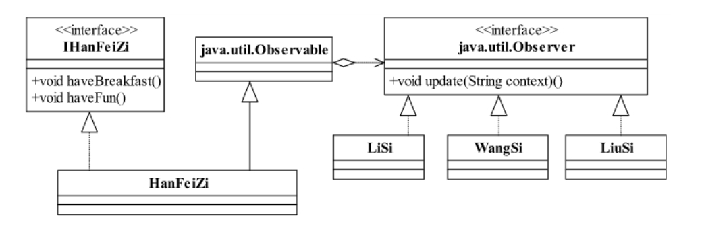

<!--
 * @description: 
 * @Author: Tian Zhi
 * @Date: 2020-06-24 10:02:26
 * @LastEditors: Tian Zhi
 * @LastEditTime: 2020-07-08 10:22:35
-->

## 定义

观察者模式（Observer Pattern）也叫做发布订阅模式（Publish/subscribe）,它是一个在项目中经常使用的模式，其定义如下：

> Define a one-to-many dependency between objects so that when one object changesstate,all its dependents are notified and updated automatically.

> 定义对象间一种一对多的依赖关系，使得每当一个对象改变状态，则所有依赖于它的对象都会得到通知并被自动更新。

## 类图


先来解释一下观察者模式的几个角色名称：

- Subject 被观察者

  定义被观察者必须实现的职责，它必须能够动态地增加、取消观察者。它一般是抽象类或者是实现类，仅仅完成作为被观察者必须实现的职责：管理观察者并通知观察者

- Observer 观察者

  观察者接收到消息后，即进行 update（更新方法）操作，对接收到的信息进行处理。

- ConcreteSubject 具体的被观察者

  定义被观察者自己的业务逻辑，同时定义对哪些事件进行通知。

- ConcreteObserver 具体的观察者

  每个观察在接收到消息后的处理反应是不同，各个观察者有自己的处理逻辑。

## Java 代码

### 被观察者

```java
public abstract class Subject {
    // 定义一个观察者数组
    private Vector<Observer> obsVector = new Vector<Observer>();
    // 增加一个观察者
    public void addObserver(Observer o) {
        this.obsVector.add(o);
    }
    // 删除一个观察者
    public void delObserver(Observer o) {
        this.obsVector.remove(o);
    }
    // 通知所有观察者
    public void notifyObservers() {
        for (Observer o:this.obsVector) {
            o.update();
        }
    }
}
```

### 具体被观察者

```java
public class ConcreteSubject extends Subject {
    // 具体的业务
    public void doSomething() {
        /*
        * do something
        */
        super.notifyObservers();
    }
}
```

### 观察者

```java
public interface Observer {
    // 更新方法
    public void update();
}
```

### 具体观察者

```java
public class ConcreteObserver implements Observer {
    // 实现更新方法
    public void update() {
        System.out.println("接收到信息，并进行处理！");
    }   
}
```

### 场景类

```java
public class Client {
    public static void main(String[] args) {
        // 创建一个被观察者
        ConcreteSubject subject = new ConcreteSubject();
        // 定义一个观察者
        Observer obs = new ConcreteObserver();
        // 观察者观察被观察者
        subject.addObserver(obs);
        // 观察者开始活动了
        subject.doSomething();
    }
}
```

## 案例-韩非子身边的卧底

韩非子，法家的代表人物，主张建立法制社会，实施重罚制度。法家还有一个非常重要的代表人物——李斯，李斯是秦国的丞相，最终被残忍车裂，李斯和韩非子都是荀子的学生，李斯是师兄，韩非子是师弟。

若干年后，李斯成为最强诸侯国秦国的上尉，致力于统一全国，于是安插了间谍到各个国家的重要人物的身边，以获取必要的信息，韩非子作为韩国的重量级人物，身边自然有不少间谍，韩非子做的事，李斯都了如指掌，那可是相隔千里！怎么做到的呢？间谍呀！我们先通过程序把这个过程展现一下，看看李斯是怎么监控韩非子的，先看两个主角的类图，如下图所示：


仅有这两个对象还是不够的，我们要解决的是李斯是怎么监控韩非子的？最容易想到的是创建一个后台线程一直处于运行状态，一旦发现韩非子在吃饭或者娱乐就触发事件。这是真实世界的翻版，安排了一个间谍，观察韩非子的生活起居，并上报给李斯，然后李斯再触发 update 事件，类图继续扩充：



我们主要来看下 Spy 类的实现：

```java
class Spy extends Thread {
    private HanFeiZi hanFeiZi;
    private LiSi liSi;
    private String type;
    // 通过构造函数传递参数，我要监控的是谁，谁来监控，要监控什么
    public Spy(HanFeiZi _hanFeiZi,LiSi _liSi,String _type) {
        this.hanFeiZi =_hanFeiZi;
        this.liSi = _liSi;
        this.type = _type;
    }
    @Override
    public void run() {
        while(true) {
            if (this.type.equals("breakfast")) { // 监控是否在吃早餐
                // 如果发现韩非子在吃饭，就通知李斯
                if (this.hanFeiZi.isHavingBreakfast()) {
                    this.liSi.update("韩非子在吃饭");
                    // 重置状态，继续监控
                    this.hanFeiZi.setHavingBreakfast(false);
                }
            } else { // 监控是否在娱乐
                if (this.hanFeiZi.isHavingFun()) {
                    this.liSi.update("韩非子在娱乐");
                    this.hanFeiZi.setHavingFun(false);
                }
            }
        }
    }
}
```

监控程序继承了`java.lang.Thread`类，可以同时启动多个线程进行监控，Java 的多线程机制还是比较简单的，继承`Thread`类，重写`run()`方法，然后`new SubThread()`，再然后`subThread.start()`就可以启动一个线程了。

用线程监控设计非常简单，但是有两个明显的不足：

1. `while(true)`进行监控会造成资源大量浪费。

2. 设计是面向过程而非面向对象的。

其实除了这个方法，我们还可以通过将李斯类聚合到韩非子类中实现同样的效果：


通过聚集方式的被观察者：

```java
public class HanFeiZi implements IHanFeiZi {
    // 把李斯声明出来
    private ILiSi liSi = new LiSi();
    // 韩非子要吃饭了
    public void haveBreakfast() {
        System.out.println("韩非子:开始吃饭了...");
        // 通知李斯
        this.liSi.update("韩非子在吃饭");
    }
    // 韩非子开始娱乐了
    public void haveFun() {
        System.out.println("韩非子:开始娱乐了...");
        this.liSi.update("韩非子在娱乐");
    }
}
```

针对这种方式做进一步抽象，便可以实现观察者模式：


`Observable`是被观察者，就是类似韩非子这样的人，在`Observable`接口中有三个比较重要的方法，分别是`addObserver`增加观察者，`deleteObserver`删除观察者，`notifyObservers`通知所有的观察者。代码清单如下：

被观察者接口：

```java
public interface Observable {
    // 增加一个观察者
    public void addObserver(Observer observer);
    // 删除一个观察者
    public void deleteObserver(Observer observer);
    // 既然要观察，我发生改变了他也应该有所动作，通知观察者
    public void notifyObservers(String context);
}
```

被观察者实现类：

```java
public class HanFeiZi implements Observable, IHanFeiZi {
    // 定义个变长数组，存放所有的观察者
    private ArrayList<Observer> observerList = new ArrayList<Observer>();
    // 增加观察者
    public void addObserver(Observer observer) {
        this.observerList.add(observer);
    }
    // 删除观察者
    public void deleteObserver(Observer observer) {
        this.observerList.remove(observer);
    }
    // 通知所有的观察者
    public void notifyObservers(String context) {
        for (Observer observer:observerList) {
            observer.update(context);
        }
    }
    // 韩非子要吃饭了
    public void haveBreakfast() {
        System.out.println("韩非子:开始吃饭了...");
        // 通知所有的观察者
        this.notifyObservers("韩非子在吃饭");
    }
    // 韩非子开始娱乐了
    public void haveFun() {
        System.out.println("韩非子:开始娱乐了...");
        this.notifyObservers("韩非子在娱乐");
    }
}
```

观察者接口：

```java
public interface Observer {
    // 一发现别人有动静，自己也要行动起来
    public void update(String context);
}
```

具体的观察者：

```java
public class LiSi implements Observer {
    // 首先李斯是个观察者，一旦韩非子有活动，他就知道，他就要向老板汇报
    public void update(String str) {
        System.out.println("李斯：观察到韩非子活动，开始向老板汇报了...");
        this.reportToQinShiHuang(str);
        System.out.println("李斯：汇报完毕...\n");
    }
    // 汇报给秦始皇
    private void reportToQinShiHuang(String reportContext) {
        System.out.println("李斯：报告，秦老板！韩非子有活动了-->" + reportContext);
    }
}
```

场景类：

```java
public class Client {
    public static void main(String[] args) {
        // 三个观察者产生出来
        Observer liSi = new LiSi();
        Observer wangSi = new WangSi();
        Observer liuSi = new LiuSi();
        // 定义出韩非子
        HanFeiZi hanFeiZi = new HanFeiZi();
        // 我们后人根据历史，描述这个场景，有三个人在观察韩非子
        hanFeiZi.addObserver(liSi);
        hanFeiZi.addObserver(wangSi);
        hanFeiZi.addObserver(liuSi);
        // 然后这里我们看看韩非子在干什么
        hanFeiZi.haveBreakfast();
    }
}
```

### TypeScript 实现

```typescript
// 观察者接口
interface Observer {
  // 观察者ID
  id: string;
  // 一发现别人有动静，自己也要行动起来
  update(context: string): void;
}

// 被观察者接口
interface Observable {
  // 增加一个观察者
  addObserver(observer: Observer): void;
  // 删除一个观察者
  deleteObserver(observer: Observer): void;
  // 既然要观察，我发生改变了他也应该有所动作，通知观察者
  notifyObservers(context: string): void;
}

// 韩非子相关活动接口
interface IHanFeiZi {
  // 吃早饭
  haveBreakfast(): void;
  // 娱乐
  haveFun(): void;
}

// 被观察者实现类
class HanFeiZi implements Observable, IHanFeiZi {
  // 定义个变长数组，存放所有的观察者
  private observerList: Observer[] = [];
  // 增加观察者
  addObserver(observer: Observer) {
    this.observerList.push(observer);
  }
  // 删除观察者
  deleteObserver(observer: Observer) {
    this.observerList.filter((obs) => obs.id !== observer.id);
  }
  // 通知所有的观察者
  notifyObservers(context: string) {
    for (let obs of this.observerList) {
      obs.update(context);
    }
  }
  // 韩非子要吃饭了
  haveBreakfast() {
    console.log("韩非子:开始吃饭了...");
    // 通知所有的观察者
    this.notifyObservers("韩非子在吃饭");
  }
  // 韩非子开始娱乐了
  haveFun() {
    console.log("韩非子:开始娱乐了...");
    this.notifyObservers("韩非子在娱乐");
  }
}

// 观察者实现类
class LiSi implements Observer {
  public id: string = "lisi";
  // 首先李斯是个观察者，一旦韩非子有活动，他就知道，他就要向老板汇报
  update(str: string) {
    console.log("李斯：观察到韩非子活动，开始向老板汇报了...");
    this.reportToQinShiHuang(str);
    console.log("李斯：汇报完毕...\n");
  }
  // 汇报给秦始皇
  private reportToQinShiHuang(reportContext: string) {
    console.log("李斯：报告，秦老板！韩非子有活动了-->" + reportContext);
  }
}

// 场景
(function () {
  // 观察者产生出来
  const liSi = new LiSi();
  // 定义出韩非子
  const hanFeiZi = new HanFeiZi();
  // 观察韩非子
  hanFeiZi.addObserver(liSi);
  // 然后这里我们看看韩非子在干什么
  hanFeiZi.haveBreakfast();
})();
```

## 使用场景

### 观察者模式的优点

1. 观察者和被观察者之间是抽象耦合，扩展非常容易。

2. 观察者模式形成了一个触发链条。

### 观察者模式的缺点

对观察者的通知一般是顺序进行，一个观察者卡壳会影响整体效率。

### 观察者模式的使用场景

1. 关联行为场景。需要注意的是，关联行为是可拆分的，而不是“组合”关系。

2. 事件多级触发场景。

3. 跨系统的消息交换场景，如消息队列的处理机制。

## 最佳实践

### Java 中的最佳实践

JDK 中提供了`java.util.Observable`实现类和`java.util.Observer`接口，可以用来替换类图中的观察者和被观察者抽象：



### 项目中真实的观察者模式

在真实的系统设计中会对观察者模式进行改造或改装，主要聚焦在以下 3 个方面：

1. 观察者和被观察者之间的消息沟通

   被观察者状态改变会触发观察者的一个行为，同时会传递一个消息给观察者，这是正确的，在实际中一般的做法是：观察者中的`update`方法接受两个参数，一个是被观察者，一个是 DTO（Data Transfer Object，据传输对象），DTO 一般是一个纯洁的 JavaBean,由被观察者生成，由观察者消费。当然，如果考虑到远程传输，一般消息是以 XML 格式传递。

2. 观察者响应方式

   在一个观察者多个被观察者的情况下，性能就需要考虑了。如果观察者来不及响应，被观察者的执行时间也会被拉长。观察者如何快速响应？

   - 一是采用多线程技术，甭管是被观察者启动线程还是观察者启动线程，都可以明显地提高系统性能，这也就是大家通常所说的异步架构。

   - 二是缓存技术，准备足够的资源。这当然也是一种比较好方案，代价就是开发难度很大，而且压力测试要做的足够充分，这种方案也就是大家说的同步架构。

3. 被观察者尽量自己做主

   被观察者的状态改变不一定要通知观察者。在设计的时候要灵活考虑，否则会加重观察者的处理逻辑，一般是对被观察者的业务逻辑`doSomething`方法实现重载，如增加一个`doSomething(boolean isNotifyObs)`方法，决定是否通知观察者，而不是在消息到达观察者时才判断是否要消费。

### 生活中常见的案例

1. 文件系统

   比如，在一个目录下新建立一个文件，这个动作会同时通知目录管理器增加该目录，并通知磁盘管理器减少 1KB 的空间，也就说“文件”是一个被观察者，“目录管理器”和“磁盘管理器”则是观察者。

2. 猫鼠游戏

   夜里猫叫一声，家里的老鼠撒腿就跑，同时也吵醒了熟睡的主人，这个场景中，“猫”就是被观察者，老鼠和人则是观察者。

3. ATM 取钱

   比如你到 ATM 机器上取钱，多次输错密码，卡就会被 ATM 吞掉，吞卡动作发生的时候，会触发如下事件：第一，摄像头连续快拍，第二，通知监控系统，吞卡发生；第三，初始化 ATM 机屏幕，返回最初状态。一般前两个动作都是通过观察者模式来完成的，后一个动作是异常来完成。

4. 广播收音机

   电台在广播，你可以打开一个收音机，或者两个收音机来收听，电台就是被观察者，收音机就是观察者。

## 案例是否满足 6 大设计模式


- [x] Single Responsibility Principle (SRP, 单一职责原则)

  本案例符合 SRP，每一个抽象被观察者只负责新建、删除和通知观察者。而业务被观察者都可以实现自身逻辑；对于观察者也是一样。

- [x] Open Closed Principle (OCP, 开闭原则)

  在该案例下，扩展被观察者和观察者非常容易，而且不会影响之前已存在的被观察者和观察者。

- [x] Liskov Substitution Principle (LSP, 里氏替换原则)

  案例中被观察者和观察者均使用抽象接口或者类，且父类替换成子类不会有问题，符合 LSP。

- [ ] Law of Demeter (LoD, 迪米特法则)

  案例未提及。

- [x] Interface Segragation Principle (ISP, 接口隔离原则)

  在被观察者中，自身活动相关的方法被隔离到单独的接口，符合 ISP。

- [x] Dependency Inversion Principle (DIP, 依赖倒置原则)

  案例中的依赖通过抽象发生，符合 DIP。
