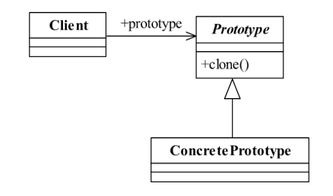
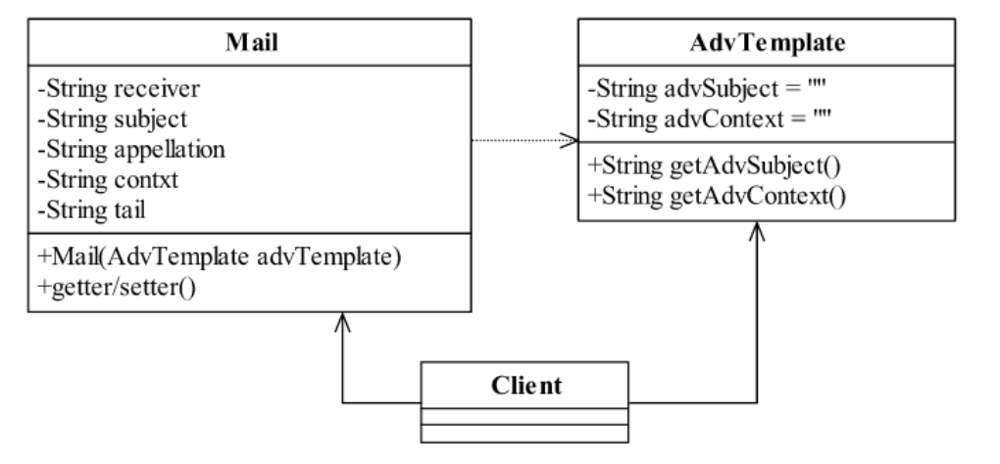

<!--
 * @description:
 * @Author: Tian Zhi
 * @Date: 2020-05-12 15:56:24
 * @LastEditors: Tian Zhi
 * @LastEditTime: 2020-05-12 19:45:09
 -->

## 定义

> Specify the kinds of objects to create using a prototypical instance,and create newobjects by copying this prototype.

> 用原型实例指定创建对象的种类，并且通过拷贝这些原型创建新的对象。

## 使用场景

- 资源优化场景

  类初始化需要消化非常多的资源，这个资源包括数据、硬件资源等。

- 性能和安全要求的场景

  通过 new 产生一个对象需要非常繁琐的数据准备或访问权限，则可以使用原型模式。

- 一个对象多个修改者的场景

  一个对象需要提供给其他对象访问，而且各个调用者可能都需要修改其值时，可以考虑使用原型模式拷贝多个对象供调用者使用。

在实际项目中，原型模式很少单独出现，一般是和工厂方法模式一起出现，通过`clone`方法创建一个对象，然后由工厂方法提供给调用者。原型模式已经与 Java 融为一体，可以很方便地使用。

不过，原型模式使用时也有以下几点注意事项：

1. 对象拷贝时构造函数不会执行

2. 原型模式是浅拷贝，也就是只拷贝基础类型的变量，不拷贝引用对象。

3. 如果存在`final`关键字声明的成员变量，那么深拷贝时无法使用`clone`方法对其进行深拷贝。

## 类图



## Java 代码

### 原型模式通用源码

原型模式的核心是一个`clone`方法，通过该方法进行对象的拷贝，Java 提供了一个`Cloneable`接口来标示这个对象是可拷贝的。为什么说是“标示”呢？翻开 JDK 的帮助看看`Cloneable`是一个方法都没有的，这个接口只是一个标记作用，在 JVM 中具有这个标记的对象才有可能被拷贝。

那怎么才能从“有可能被拷贝”转换为“可以被拷贝”呢？方法是覆盖`clone`方法。在方法上增加一个注解`@Override`，用于覆写 Object 类中的`clone`方法。

```java
public class PrototypeClass  implements Cloneable{
    // 覆写父类Object方法
    @Override
    public PrototypeClass clone() {
        PrototypeClass prototypeClass = null;
        try {
            prototypeClass = (PrototypeClass)super.clone();
        } catch (CloneNotSupportedException e) {
            // 异常处理
        }
        return prototypeClass;
   }
}
```

## 案例-个性化电子账单

### 非原型模式（只有 Java 实现）

#### 类图



#### 广告信模板类

```java
public class AdvTemplate {
    // 广告信名称
    private String advSubject = "XX银行国庆信用卡抽奖活动";
    // 广告信内容
    private String advContext = "国庆抽奖活动通知：只要刷卡就送你一百万！...";
    // 取得广告信的名称
    public String getAdvSubject() {
        return this.advSubject;
    }
    // 取得广告信的内容
    public String getAdvContext() {
        return this.advContext;
    }
}
```

#### 邮件类

```java
public class Mail {
    // 收件人
    private String receiver;
    // 邮件名称
    private String subject;
    // 称谓
    private String appellation;
    // 邮件内容
    private String contxt;
    // 邮件的尾部，一般都是加上"XXX版权所有"等信息
    private String tail;
    // 构造函数
    public Mail(AdvTemplate advTemplate) {
        this.contxt = advTemplate.getAdvContext();
        this.subject = advTemplate.getAdvSubject();
    }
    // 以下为getter/setter方法
    // 由于方法类似，省略其余私有成员的getter/setter方法
    public String getReceiver() {
        return receiver;
    }
    public void setReceiver(String receiver) {
        this.receiver = receiver;
    }
}
```

#### 场景类

```java
public class Client {
    // 发送账单的数量，这个值是从数据库中获得
    private static int MAX_COUNT = 6;
    public static void main(String[] args) {
        // 模拟发送邮件
        int i = 0;
        // 把模板定义出来，这个是从数据库中获得
        Mail mail = new Mail(new AdvTemplate());
        mail.setTail("XX银行版权所有");
        while (i<MAX_COUNT) {
            // 以下是每封邮件不同的地方
            mail.setAppellation(getRandString(5) + " 先生（女士）");
            mail.setReceiver(getRandString(5) + "@" + getRandString(8) + ".com");
            // 然后发送邮件
            sendMail(mail);
            i++;
        }
    }
    // 发送邮件
    public static void sendMail(Mail mail){
        System.out.println("标题：" + mail.getSubject() + "\t收件人：" + mail.getReceiver() + "\t...发送成功！");
    }
    // 获得指定长度的随机字符串
    public static String getRandString(int maxLength) {
        String source ="abcdefghijklmnopqrskuvwxyzABCDEFGHIJKLMNOPQRSTUVWXYZ";
        StringBuffer sb = new StringBuffer();
        Random rand = new Random();
        for (int i = 0; i < maxLength; i++) {
            sb.append(source.charAt(rand.nextInt(source.length())));
        }
        return sb.toString();
    }
}
```

上面场景中的使用，可能会存在如下问题：

1. 如果`sendMail`是单线程，那么当发送的邮件很多时，程序运行时间将会非常长，假设一封邮件发出去需要0.02秒，600万封邮件需要33个小时，也就是一个整天都发送不完。

2. 如果将`sendMail`改为多线程，如果邮件1的线程启动了但是没结束，邮件2的线程也启动了，就会修改邮件的数据，线程不安全。

3. 如果每一个循环都新建一个`mail`对象，如果`mail`对象的初始化特别耗费资源，也不是一个可取的选择。

那么有没有什么好的解决方案？可能方案有N多种，但是这里我们使用一种新的模式：通过对象的复制，也就是原型模式来解决它。

### 原型模式（Java & TypesScript 实现）

#### 类图


#### Java 实现

##### 修改后的邮件类

修改后的邮件类其余都不变，唯一变化的是实现了`Cloneable`接口，覆写了`clone`方法。

```java
public class Mail implements Cloneable {
    // ...
    @Override
    public Mail clone() {
        Mail mail = null;
        try {
            mail = (Mail)super.clone();
        } catch (CloneNotSupportedException e) {
            // TODO Auto-generated catch block
            e.printStackTrace();
        }
        return mail;
    }
    // ...
}
```

##### 修改后的场景类

唯一不同的是每一个循环里都会克隆一个新的`mail`

```java
public class Client {
    // ...
    public static void main(String[] args) {
        // ...
        // 把模板定义出来，这个是从数据中获得
        Mail mail = new Mail(new AdvTemplate());
        while(i<MAX_COUNT) {
            // 以下是每封邮件不同的地方
            Mail cloneMail = mail.clone();
            // ...
        }
    }  
}
```

#### TypeScript 实现

```typescript
// Cloneable接口
interface Cloneable {
  clone(): Object;
}

// 广告信模板
class AdvTemplate {
  // 广告信名称
  private advSubject = "xx银行国庆信用卡抽奖活动";
  // 广告信 内容
  private advContent = "国庆抽奖活动通知：只要刷卡就送你一百万！...";
  // Getters
  getAdvSubject() {
    return this.advSubject;
  }
  getAdvContent() {
    return this.advContent;
  }
}

// 邮件类代码
class Mail implements Cloneable {
  // 收件人
  private receiver: string = "";
  // 邮件名称
  private subject: string = "";
  // 称谓
  private appellation: string = "";
  // 邮件尾部，一般加上“XXX版权所有”等信息
  private tail: string = "";
  // 邮件内容
  private content: string = "";

  constructor(advTemp: AdvTemplate) {
    this.content = advTemp.getAdvContent();
    this.subject = advTemp.getAdvSubject();
    this.clone.bind(this);
  }

  clone() {
    return Object.assign({}, this);
  }

  // Getter & Setter
  getReceiver() {
    return this.receiver;
  }
  setReceiver(r: string) {
    this.receiver = r;
  }
  getAppellation() {
    return this.appellation;
  }
  setAppellation(appellation: string) {
    this.appellation = appellation;
  }
  getTail() {
    return this.tail;
  }
  setTail(tail: string) {
    this.tail = tail;
  }
  getContent() {
    return this.content;
  }
  setContent(content: string) {
    this.content = content;
  }
  getSubject() {
    return this.subject;
  }
  setSubject(subject: string) {
    this.subject = subject;
  }
}

// 获得指定长度的随机字符串
function getRandString(maxLength: number) {
  const src = "abcdefghijklmnopqrstuvwxyzABCDEFGHIJKLMNOPQRSTUVWXYZ";
  let str = "";
  for (let i = 0; i < maxLength; i++) {
    const index = Math.floor(src.length * Math.random());
    str = str.concat(src[index]);
  }
  return str;
}

// 随机性别
function getGender(str: string) {
  return /[A-Z][A-Z][A-Z]/.test(str);
}

// 发送邮件场景
function sendMailScenario() {
  const MAX_COUNT = 6;
  let startIndex = 0;
  const mail = new Mail(new AdvTemplate());
  mail.setTail("XXX银行版权所有");
  while (startIndex++ < MAX_COUNT) {
    // 以下是每封邮件不同的地方
    const name = getRandString(5);
    const appellation = `${name} ${getGender(name) ? "先生" : "女士"}`;
    const mailHost = getRandString(8);
    mail.setAppellation(appellation);
    mail.setReceiver(`${name}@${mailHost}.com`);
    sendMail(mail);
  }
}

// 发送邮件
function sendMail(mail: Mail) {
  console.log("标题：" + mail.getSubject());
  console.log("收件人：" + mail.getReceiver());
  console.log(
    "内容：" +
      `尊敬的${mail.getAppellation()}: ${mail.getContent()}\n ${mail.getTail()}`
  );
  console.log("发送成功！");
}

sendMailScenario();
```

## 最佳实践

原型模式先产生出一个包含大量共有信息的类，然后可以拷贝出副本，修正细节信息，建立了一个完整的个性对象。

不知道大家有没有看过施瓦辛格演的《第六日》这部电影，电影的主线也就是一个人被复制，然后正本和副本对掐。我们今天讲的原型模式也就是由一个正本可以创建多个副本的概念。

可以这样理解：一个对象的产生可以不由零起步，直接从一个已经具备一定雏形的对象克隆，然后再修改为生产需要的对象。也就是说，产生一个人，可以不从 1 岁长到 2 岁，再到 3 岁……也可以直接找一个人，从其身上获得 DNA，然后克隆一个，直接修改一下就是 30 岁了！我们讲的原型模式也就是这样的功能。

## 与六大设计原则的结合

原型模式实现了`Cloneable`接口，但这个接口并没有内容，只是作为 JVM 判断可拷贝对象的标识。更重要的是它覆写了`Object`的`clone`方法。

因此原型模式较为简单，这里面并没有体现六大设计原则。

- [ ] Single Responsibility Principle (SRP, 单一职责原则)

* [ ] Open Closed Principle (OCP, 开闭原则)

- [ ] Liskov Substitution Principle (LSP, 里氏替换原则)

* [ ] Law of Demeter (LoD, 迪米特法则)

- [ ] Interface Segragation Principle (ISP, 接口隔离原则)

* [ ] Dependency Inversion Principle (DIP, 依赖倒置原则)
