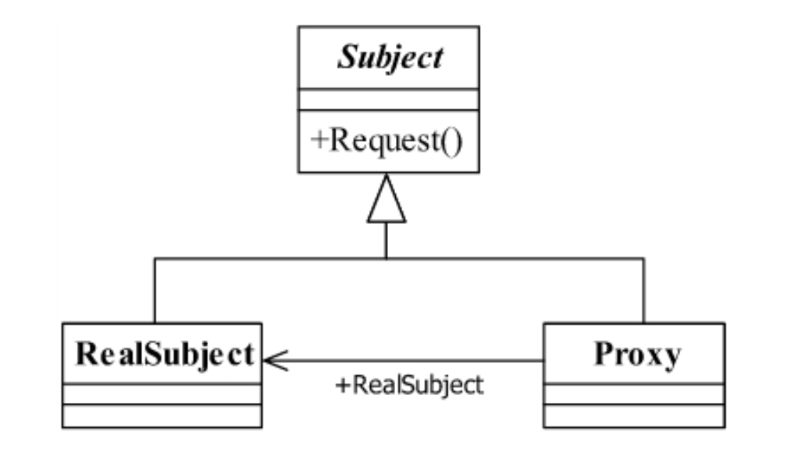
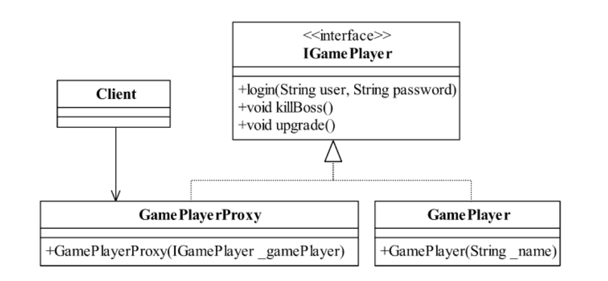
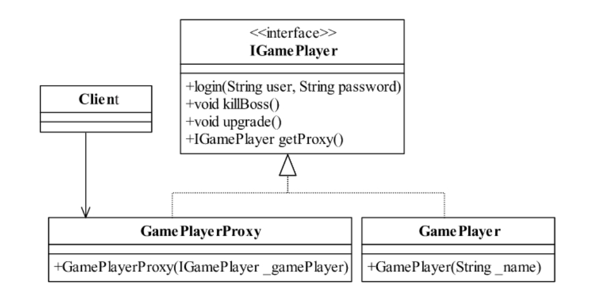
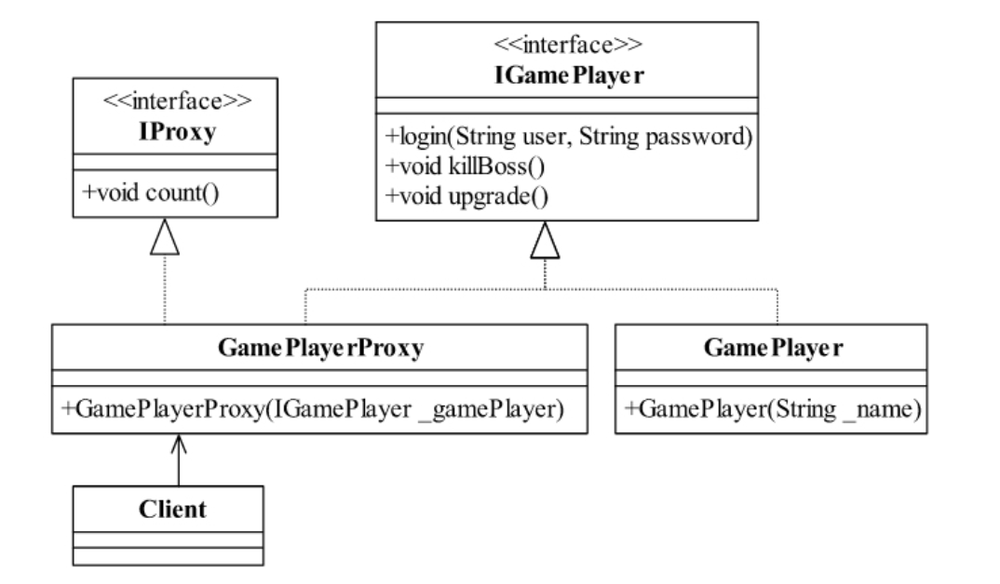
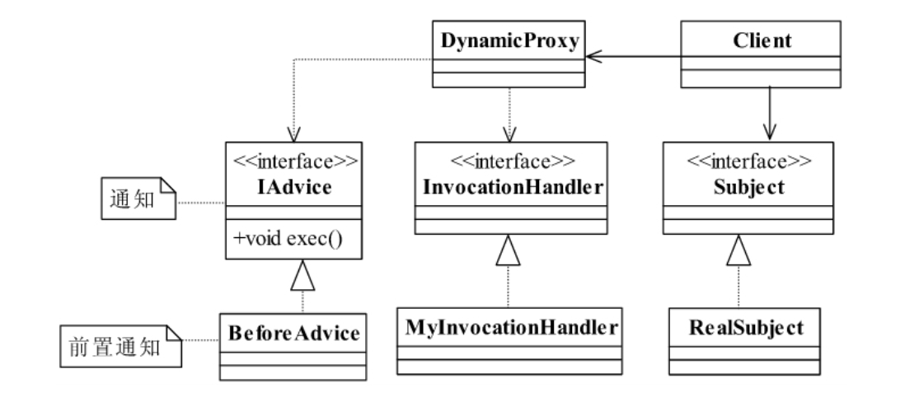
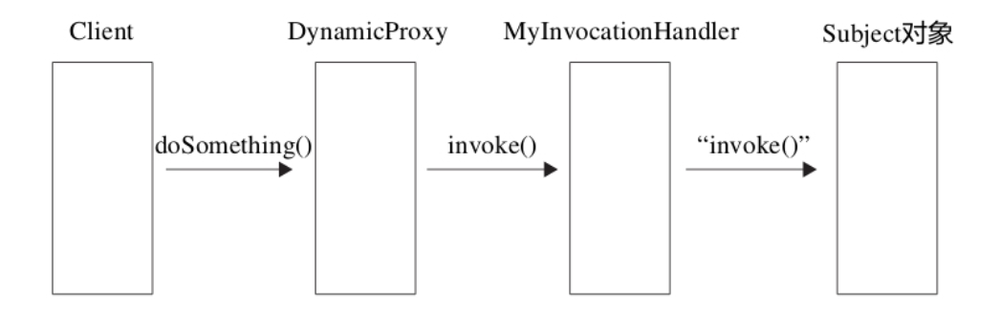

<!--
 * @description: 
 * @Author: Tian Zhi
 * @Date: 2020-05-11 11:23:38
 * @LastEditors: Tian Zhi
 * @LastEditTime: 2020-05-12 09:35:10
 -->
## 定义

代理模式（Proxy Pattern）是一个使用率非常高的模式，其定义如下：

> Provide a surrogate or placeholder for another object to control access to it.

> 为其他对象提供一种代理以控制对这个对象的访问。

## 使用场景

代理模式也叫做委托模式，它是一项基本设计技巧。许多其他的模式，如状态模式、策略模式、访问者模式本质上是在更特殊的场合采用了委托模式，而且在日常的应用中，代理模式可以提供非常好的访问控制。在一些著名开源软件中也经常见到它的身影，如Struts2的Form元素映射就采用了代理模式（准确地说是动态代理模式）。

在现实世界中，打官司为什么要找个律师？因为你不想参与中间过程的是是非非，只要完成自己的答辩就成，其他的比如事前调查、事后追查都由律师来搞定，这就是为了减轻你的负担。

代理模式的使用场景非常多，大家可以看看Spring AOP，这是一个非常典型的动态代理。

## 类图



我们看一下类图中的三个角色的定义：

* Subject抽象主题角色

    抽象主题类可以是抽象类也可以是接口，是一个最普通的业务类型定义，无特殊要求。

* RealSubject具体主题角色

    也叫做被委托角色、被代理角色。它才是冤大头，是业务逻辑的具体执行者。

* Proxy代理主题角色

    也叫做委托类、代理类。它负责对真实角色的应用，把所有抽象主题类定义的方法限制委托给真实主题角色实现，并且在真实主题角色处理完毕前后做预处理和善后处理工作。

## Java代码

### 抽象主题类

```java
public interface Subject {
    // 定义一个方法
    public void request();
}
```

### 真实主题类

```java
public class RealSubject implements Subject {
    // 实现方法
    public void request() {
        // 业务逻辑处理
    }
}
```

### 代理类

```java
public class Proxy implements Subject {
    // 要代理哪个实现类
    private Subject subject = null;
    // 默认被代理者
    public Proxy(Subject _subject) {
        this.subject = _subject;
    }
    // 实现接口中定义的方法
    public void request() {
        this.before();
        this.subject.request();
        this.after();
    }
    // 预处理
    private void before() {
        // do something
    }
    // 善后处理
    private void after() {
        // do something
    }
}
```

## 案例-游戏代练

### 类图



### Java实现

#### 游戏者接口

```java
public interface IGamePlayer {
    // 登录游戏
    public void login(String user,String password);
    // 杀怪，网络游戏的主要特色
    public void killBoss();
    // 升级
    public void upgrade();
}
```

#### 游戏者

```java
public class GamePlayer implements IGamePlayer {
    private String name = "";
    // 通过构造函数传递名称
    public GamePlayer(String _name) {
        this.name = _name;
    }
    // 打怪，最期望的就是杀老怪
    public void killBoss() {
        System.out.println(this.name + "在打怪！");
    }
    // 进游戏之前你肯定要登录吧，这是一个必要条件
    public void login(String user, String password) {
        System.out.println("登录名为" + user + "的用户" + this.name + "登录成功！");
    }
    // 升级，升级有很多方法，花钱买是一种，做任务也是一种
    public void upgrade() {
        System.out.println(this.name + " 又升了一级！");
    }
}
```

#### 代练者-proxy

```java
public class GamePlayerProxy implements IGamePlayer {
    private IGamePlayer gamePlayer = null;
    // 通过构造函数传递要对谁进行代练
    public GamePlayerProxy(IGamePlayer _gamePlayer) {
        this.gamePlayer = _gamePlayer;
    }
    // 代练杀怪
    public void killBoss() {
        this.gamePlayer.killBoss();
    }
    // 代练登录
    public void login(String user, String password) {
        this.gamePlayer.login(user, password);
    }
    // 代练升级
    public void upgrade() {
        this.gamePlayer.upgrade();
    }
}
```

#### 场景类

```java
public class Client {
    public static void main(String[] args) {
        // 定义一个痴迷的玩家
        IGamePlayer player = new GamePlayer("张三");
        // 然后再定义一个代练者
        IGamePlayer proxy = new GamePlayerProxy(player);
        // 开始打游戏，记下时间戳
        System.out.println("开始时间是：2009-8-25 10:45");
        proxy.login("zhangSan", "password");
        // 开始杀怪
        proxy.killBoss();
        // 升级
        proxy.upgrade();
        // 记录结束游戏时间
        System.out.println("结束时间是：2009-8-26 03:40");
    }
}
```

### TypeScript实现

```typescript
// 抽象游戏者
interface IGamePlayer {
    // 登录游戏
    login(user: string, pwd: string): void;
    // 杀怪
    killBoss(): void;
    // 升级
    upgrade(): void;
}

// 游戏者
class GamePlayer implements IGamePlayer {
    private name: string;
    constructor(name: string) {
        this.name = name;
    }
    login(user: string, pwd: string) {
        console.log('登录名为' + user + '的用户' + this.name + '登录成功！')
    }
    killBoss() {
        console.log(this.name + '在打怪！');
    }
    upgrade() {
        console.log(this.name + '又升了一级！');
    }
}

// 代练者
class GamePlayerProxy implements IGamePlayer {
    private gamePlayer: IGamePlayer | null = null;
    constructor(gp: IGamePlayer) {
        this.gamePlayer = gp;
    }
    killBoss() {
        this.gamePlayer?.killBoss();
    }
    login(user: string, pwd: string) {
        this.gamePlayer?.login(user, pwd);
    }
    upgrade() {
        this.gamePlayer?.upgrade();
    }
}

// 游戏场景方法
function playGame() {
    // 定义一个痴迷玩家
    const player = new GamePlayer('张三');
    // 定义一个代练
    const playerProxy = new GamePlayerProxy(player);
    // 开始打游戏，记下时间戳
    console.log('开始时间是：2009-08-25 10:45');
    playerProxy.login('zhangsan', 'pwd');
    // 开始杀怪
    playerProxy.killBoss();
    // 开始升级
    playerProxy.upgrade();
    // 记录结束游戏时间
    console.log('结束时间是：2009-08-26 03:40');
}

// 开始游戏
playGame();
```

## 代理模式的扩展

### 普通代理 vs 强制代理

在网络上代理服务器设置分为透明代理和普通代理：

> 透明代理就是用户不用设置代理服务器地址，就可以直接访问，也就是说代理服务器对用户来说是透明的，不用知道它存在的；普通代理则是需要用户自己设置代理服务器的IP地址，用户必须知道代理的存在。

我们设计模式中的普通代理和强制代理也是类似的一种结构，普通代理就是我们要知道代理的存在，也就是类似上述例子中的`GamePlayerProxy`这个类的存在，然后才能访问；强制代理则是调用者直接调用真实角色，而不用关心代理是否存在，其代理的产生是由真实角色决定的，我们来看看例子。

#### 普通代理的类图


Game Player初始化的时候必须传入一个proxy，否则无法初始化。也就是说用户必须自己设置代理。

#### 普通代理的游戏者

```java
public class GamePlayer implements IGamePlayer {
    private String name = "";
    // 构造函数限制谁能创建对象，并同时传递姓名
    public GamePlayer(IGamePlayer _gamePlayer, String _name) throws Exception {
        if(_gamePlayer == null ) {
            throw new Exception("不能创建真实角色！");
        } else {
            this.name = _name;
        }
    }
    // 打怪，最期望的就是杀老怪
    public void killBoss() {
        System.out.println(this.name + "在打怪！");
    }
    // 进游戏之前你肯定要登录吧，这是一个必要条件
    public void login(String user, String password) {
        System.out.println("登录名为" + user + "的用户" + this.name + "登录成功！");
    }
    // 升级，升级有很多方法，花钱买是一种，做任务也是一种
    public void upgrade() {
        System.out.println(this.name + " 又升了一级！");
    }
}
```

#### 普通代理的代理者

```java
public class GamePlayerProxy implements IGamePlayer {
    private IGamePlayer gamePlayer = null;
    // 通过构造函数传递要对谁进行代练
    public GamePlayerProxy(String name){
        try {
            gamePlayer = new GamePlayer(this, name);
        } catch (Exception e) {
            // TODO 异常处理
        }
    }
    // 代练杀怪
    public void killBoss() {
        this.gamePlayer.killBoss();
    }
    // 代练登录
    public void login(String user, String password) {
        this.gamePlayer.login(user, password);
    }
    // 代练升级
    public void upgrade() {
        this.gamePlayer.upgrade();
    }
}
```

#### 普通代理的场景类

```java
public class Client {
    public static void main(String[] args) {
        // 然后再定义一个代练者
        IGamePlayer proxy = new GamePlayerProxy("张三");
        // 开始打游戏，记下时间戳
        System.out.println("开始时间是：2009-8-25 10:45");
        proxy.login("zhangSan", "password");
        // 开始杀怪
        proxy.killBoss();
        // 升级
        proxy.upgrade();
        // 记录结束游戏时间
        System.out.println("结束时间是：2009-8-26 03:40");
    }
}
```

**注意：普通代理模式的约束问题，尽量通过团队内的编程规范类约束，因为每一个主题类是可被重用的和可维护的，使用技术约束的方式对系统维护是一种非常不利的因素。**

#### 强制代理类图



#### 强制代理的接口类

```java
public interface IGamePlayer {
    // 登录游戏
    public void login(String user,String password);
    // 杀怪，这是网络游戏的主要特色
    public void killBoss();
    // 升级
    public void upgrade();
    // 每个人都可以找一下自己的代理
    public IGamePlayer getProxy();
}
```

#### 强制代理的游戏者

```java
public class GamePlayer implements IGamePlayer {
    private String name = "";
    // 我的代理是谁
    private IGamePlayer proxy = null;
    public GamePlayer(String _name) {
        this.name = _name;
    }
    // 找到自己的代理
    public IGamePlayer getProxy() {
        this.proxy = new GamePlayerProxy(this);
        return this.proxy;
    }
    // 打怪，最期望的就是杀老怪
    public void killBoss() {
        if (this.isProxy()) {
            System.out.println(this.name + "在打怪！");
        } else {
            System.out.println("请使用指定的代理访问");
        }
    }
    // 进游戏之前你肯定要登录吧，这是一个必要条件
    public void login(String user, String password) {
        if (this.isProxy()) {
            System.out.println("登录名为" + user + "的用户" + this.name + "登录成功！");
        } else {
            System.out.println("请使用指定的代理访问");
        }
    }
    // 升级，升级有很多方法，花钱买是一种，做任务也是一种
    public void upgrade() {
        if (this.isProxy()) {
            System.out.println(this.name + " 又升了一级！");
        } else {
            System.out.println("请使用指定的代理访问");
        }
    }
    // 校验是否是代理访问
    private boolean isProxy() {
        if (this.proxy == null) {
            return false;
        } else {
            return true;
        }
    }
}
```

**注意：上面的isProxy()判断我认为并没有技术层面的约束。** 


#### 强制代理的代理者

```java
public class GamePlayerProxy implements IGamePlayer {
    private IGamePlayer gamePlayer = null;
    // 构造函数传递用户名
    public GamePlayerProxy(IGamePlayer _gamePlayer) {
        this.gamePlayer = _gamePlayer;
    }
    // 代练杀怪
    public void killBoss() {
        this.gamePlayer.killBoss();
    }
    // 代练登录
    public void login(String user, String password) {
        this.gamePlayer.login(user, password);
    }
    // 代练升级
    public void upgrade() {
        this.gamePlayer.upgrade();
    }
    // 代理的代理暂时还没有，就是自己
    public IGamePlayer getProxy() {
        return this;
    }
}
```

#### 强制代理的场景类

```java
public class Client {
    public static void main(String[] args) {
        // 定义一个游戏的角色
        IGamePlayer player = new GamePlayer("张三");
        // 获得指定的代理
        IGamePlayer proxy = player.getProxy();
        // 开始打游戏，记下时间戳
        System.out.println("开始时间是：2009-8-25 10:45");
        proxy.login("zhangSan", "password");
        // 开始杀怪
        proxy.killBoss();
        // 升级
        proxy.upgrade();
        // 记录结束游戏时间
        System.out.println("结束时间是：2009-8-26 03:40");
    }
}
```

### 个性化代理

一个类可以实现多个接口，完成不同任务的整合。也就是说代理类不仅仅可以实现主题接口，也可以实现其他接口完成不同的任务，而且代理的目的是在目标对象方法的基础上作增强，这种增强的本质通常就是对目标对象的方法进行拦截和过滤。

例如游戏代理是需要收费的，升一级需要5元钱，这个计算功能就是代理类的个性。

#### 类图



#### 代理类接口

```java
public interface IProxy {
    // 计算费用
    public void count();
}
```

#### 代理类

```java
public class GamePlayerProxy implements IGamePlayer, IProxy {
    private IGamePlayer gamePlayer = null;
    // 通过构造函数传递要对谁进行代练
    public GamePlayerProxy(IGamePlayer _gamePlayer) {
        this.gamePlayer = _gamePlayer;
    }
    // 代练杀怪
    public void killBoss() {
        this.gamePlayer.killBoss();
    }
    // 代练登录
    public void login(String user, String password) {
        this.gamePlayer.login(user, password);
    }
    // 代练升级
    public void upgrade() {
        this.gamePlayer.upgrade();
        this.count();
    }
    // 计算费用
    public void count() {
        System.out.println("升级总费用是：150元");
    }
}
```

### 动态代理

动态代理是在实现阶段不用关心代理谁，而在运行阶段才指定代理哪一个对象。相对来说，自己写代理类的方式就是静态代理。本章节的核心部分就在动态代理上，现在有一个非常流行的名称叫做面向横切面编程，也就是**AOP *（Aspect OrientedProgramming）***，其核心就是采用了动态代理机制。

还是看一下代理游戏的例子，这里的代理游戏还加入了通知消息功能。

#### 类图



在类图中增加了一个`InvocationHandler`接口和`DynamicProxy`类，作用就是产生一个对象的代理对象，其中`InvocationHandler`是JDK提供的动态代理接口，对被代理类的方法进行代理。

其中接口和实现类没有变化，省略代码。

#### 动态代理类（也可以使用具体业务的动态代理）

```java
// 动态代理类
public class DynamicProxy<T> {
    public static <T> T newProxyInstance(ClassLoader loader, Class<?>[] interfaces, InvocationHandler h) {
        // 寻找JoinPoint连接点，AOP框架使用元数据定义
        if (true) {
            // 执行一个前置通知
            (new BeforeAdvice()).exec();
        }
        // 执行目标，并返回结果
        return (T)Proxy.newProxyInstance(loader,interfaces, h);
    }
}

// 使用具体业务的动态代理类
public class SubjectDynamicProxy extends DynamicProxy {
    public static <T> T newProxyInstance(Subject subject) {
        // 获得ClassLoader
        ClassLoader loader = subject.getClass().getClassLoader();
        // 获得接口数组
        Class<?>[] classes = subject.getClass().getInterfaces();
        // 获得handler
        InvocationHandler handler = new MyInvocationHandler(subject);
        return newProxyInstance(loader, classes, handler);
    }
}
```

#### 通知接口及实现

```java
public interface IAdvice {
    // 通知只有一个方法，执行即可
    public void exec();
}
public class BeforeAdvice implements IAdvice {
    public void exec() {
        System.out.println("我是前置通知，我被执行了！");
    }
}
```

#### 动态代理的场景类（或具体业务的动态代理场景）

```java
// 动态代理的场景类
public class Client {
    public static void main(String[] args) {
        // 定义一个主题
        Subject subject = new RealSubject();
        // 定义一个Handler
        InvocationHandler handler = new MyInvocationHandler(subject);
        // 定义主题的代理
        Subject proxy = DynamicProxy.newProxyInstance(subject.getClass().getClassLoader(), subject.getClass().getInterfaces(), handler);
        // 代理的行为
        proxy.doSomething("Finish");
    }
}

// 具体业务的动态代理场景
public class Client {
    public static void main(String[] args) {
        // 定义一个主题
        Subject subject = new RealSubject();
        // 定义主题的代理
        Subject proxy = SubjectDynamicProxy.newProxyInstance(subject);
        // 代理的行为
        proxy.doSomething("Finish");
    }
}
```

#### 调用过程

在场景类中，我们有这样的方法：

> `DynamicProxy.newProxyInstance(subject.getClass().getClassLoader(), subject.getClass().getInterfaces(), handler);`

该方法重新生成了一个代理对象，代理对象代理时借助`MyInvocationHandler`，对游戏进行代理，下面是动态代理的调用过程：



## 最佳实践

代理模式应用得非常广泛，大到一个系统框架、企业平台，小到代码片段、事务处理，稍不留意就用到代理模式。可能该模式是大家接触最多的模式，而且有了AOP大家写代理就更加简单了。

## 与六大设计原则的结合

- [x] Single Responsibility Principle (SRP, 单一职责原则)

    真实的角色可以只实现自己职责内的事务，而其他事务可以交给代理实现。比如上述的游戏代理例子，GamePlayer角色只需要打怪升级就可以，而发送消息、收费就可以交给代理实现。

- [x] Open Closed Principle (OCP, 开闭原则)

    只要一开始定义好抽象主题，当我们扩展具体主题类的时候，代理类仍然能在不做任何修改的前提下使用。符合开闭原则。

- [x] Liskov Substitution Principle (LSP, 里氏替换原则)

    我们使用抽象主题类的地方，也可以替换成真实主题类。

- [x] Law of Demeter (LoD, 迪米特法则)

    我们通过代理来访问真实主题，无需知道真实主题类内部的具体实现，符合LoD。

- [ ] Interface Segragation Principle (ISP, 接口隔离原则)

    没有提及，但是代理类不仅仅可以实现抽象主题接口，还可以实现其他“个性接口”，我们在实现“个性接口”的时候，可以遵循ISP。

- [x] Dependency Inversion Principle (DIP, 依赖倒置原则)

    代理模式使用抽象主题进行设计，代理类和具体主题类都依赖抽象主题，符合DIP。
