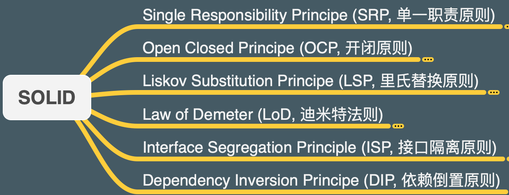

<!--
 * @description: 
 * @Author: tianzhi
 * @Date: 2020-04-26 09:11:18
 * @LastEditors: tianzhi
 * @LastEditTime: 2020-04-28 10:49:18
 -->
# Design Pattern Note
[《设计模式之禅》](https://book.douban.com/subject/25843319/)读书笔记，包含第二部分：设计模式。

## 目录

* [单例模式 *(Singleton Pattern)*](./Singleton)
* [工厂方法模式 *(Factory Method Pattern)*](./Factory%20Method)

## 阅前请看

1. 这个Repo是我复习《设计模式之禅》第二部分：23种设计模式的读书笔记，笔记中包含了核心类图和代码，还有示例代码。由于代码都是Java版本，我用Typescript又实现了一遍示例。我建议你使用[TypeScript Playground](https://www.typescriptlang.org/play)来复制代码查看效果，或者在此基础上进行进一步Coding。

2. 为什么使用Typescript？我这里主要是借助Typescript对先进特性的兼容，能够使用一些“类 Java”的面向对象编程设计。

3. 阅读Typescript代码时，你需要知道其实TS（或JS）本质是通过原型链来实现面向对象设计的，如果想了解更多关于JavaScript的面向设计精髓，可以看我的[这篇文章](https://juejin.im/post/5ea29046f265da47ea2be75d)。下面这幅图是JavaScript强大的动态原型生态链，我将基于它，来实现《设计模式之禅》的23大设计模式：

4. 在最后，我将会结合本书的第一部分：六大设计原则，给出每一种设计模式满足了这六大原则中的哪一些，并进行一定分析，来锻炼自己对六大设计原则的理解。以下是六大设计原则：

## 需要具备的一些知识

1. Java语言一些面向对象的知识，例如类、接口、继承、实现等等。

2. [*UML(Unified Modeling Language)*](https://en.wikipedia.org/wiki/Unified_Modeling_Language)基础，知道[类图 *(Class diagram)*](https://en.wikipedia.org/wiki/Class_diagram)。下面是一些常见的关系标记。

3. Typescript的语言基础。
