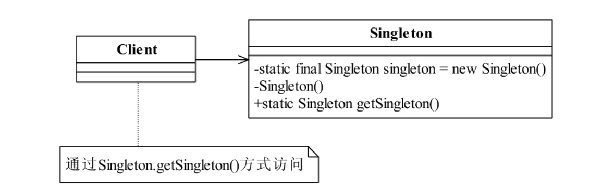
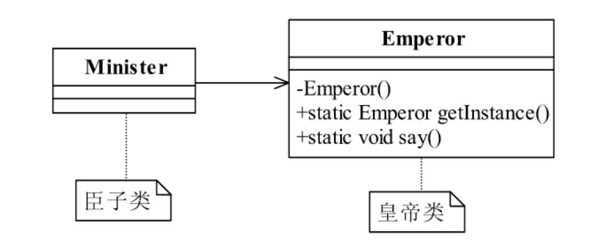

<!--
 * @description:
 * @Author: tianzhi
 * @Date: 2020-04-26 09:18:06
 * @LastEditors: Tian Zhi
 * @LastEditTime: 2020-05-14 20:19:39
 -->

## 定义

> Ensure a class has only one instance, and provide a global point of access to it.

> 确保某一个类只有一个实例，而且自行实例化并向整个系统提供这个实例

## 类图



## Java 代码

```java
public class Singleton {
    private static final Singleton singleton = new Singleton();
    // 限制产生多个对象
    private Singleton() {}
    // 通过该方法获得实例对象
    public static Singleton getSingleton() {
        return singleton;
    }
    // 类中其他方法，尽量是static
    public static void doSomething() {}
}
```

## 案例-皇帝独苗

### 类图



### Java 实现

#### 1. 皇帝类

```java
public class Emperor {
    private static final Emperor emperor = new Emperor();
    // 初始化一个皇帝
    private Emperor() {
        // 世俗和道德约束你，目的就是不希望产生第二个皇帝
    }
    public static Emperor getInstance() {
        return emperor;
    }
    // 皇帝发话了
    public static void say() {
        System.out.println("我就是皇帝某某某....");
    }
}
```

#### 2. 臣子类-臣子开始朝拜

```java
public class Minister {
    public static void main(String[] args) {
        for(int day=0; day<3; day++) {
            Emperor emperor = Emperor.getInstance();
            // 注意这里：Java的单例对象也能调用static 方法，但是JS不行！
            emperor.say();
        }
        // 三天见的皇帝都是同一个人，荣幸吧！
        // 运行结果：
        // 我就是皇帝某某某....
        // 我就是皇帝某某某....
        // 我就是皇帝某某某....
    }
}
```

### Typescript实现

JS中实现单例模式，有如下方法：

1. 使用常规的”类”语法糖
2. 声明一个对象字面量
3. 使用ES6模块-全局唯一模块

**注意ES6 'class' 语法糖暂时无法定义公有属性和私有属性，现在这一提案处于[stage3](https://github.com/tc39/proposal-class-fields)**

但是我们可以使用Typescript来玩转这些先进的特性：

#### 常规实现

```typescript
class Emperor {
    // 定义为私有成员，阻止外部new 调用
    private constructor() { };
    private static instance = new Emperor();
    public static getInstance() {
        return Emperor.instance;
    }
    public say() {
        console.log("我就是皇帝某某某....");
    }
}

class Minister {
    constructor() { };
    public worship() {
        for (let day = 0; day < 3; day++) {
            const emp = Emperor.getInstance();
            // JS无法使用实例对象调用static 方法，所以static方法去掉了static关键字
            emp.say();
        }
        // 三天见的皇帝都是同一个人，荣幸吧！
    }
}

const mi = new Minister();
mi.worship();
// 运行结果：
// 我就是皇帝某某某....
// 我就是皇帝某某某....
// 我就是皇帝某某某....
```

#### 使用namespace-本质是对象字面量

```typescript
namespace Emperor {
    export function getInstance() {
        return {
            // some state value
            say: function () {
                console.log("我就是皇帝某某某....");
            }
        }
    }
}

// 翻译成JavaScript
var Emperor;
(function (Emperor) {
    function getInstance() {
        return {
            // some state value
            say: function () {
                console.log("我就是皇帝某某某....");
            }
        };
    }
    Emperor.getInstance = getInstance;
})(Emperor || (Emperor = {}));

// ...省略臣子代码
```

#### 使用模块

##### 1. Emperor.ts

```typescript
export function getInstance() {
    return {
        // some state value
        say: function () {
            console.log("我就是皇帝某某某....");
        }
    }
}
```

#### 2. user-case.ts

```typescript
import * as Emperor from './Emperor.ts';

const emp = Emperor.getInstance();

// ...省略朝拜代码
```

### 注意事项

这里发现Java里的单例对象也能直接调用其类中的static方法，但是由于JS中的static 方法，实际上是挂在**函数对象上**而**不是函数原型(prototype)对象**上，因此类(本质是函数)创建的单例对象无法调用类中的static 方法，所以我去掉了static关键字。

## 使用场景

1. 由于单例模式在内存中只有一个实例，减少了内存开支，特别是一个对象需要频繁地创建、销毁时，而且创建或销毁时性能又无法优化，单例模式的优势就非常明显。如对象创建时需要读取配置、产生其他依赖对象、消耗过多资源时，则可以通过在应用启动时直接产生一个单例对象，然后用永久驻留内存的方式来解决。这类场景有IO和数据库访问。

2. 单例模式可以在系统设置全局的访问点，优化和共享资源访问，例如可以设计一个单例类，负责所有数据表的映射处理。

3. 单例模式可以避免对资源的多重占用，例如一个写文件动作，由于只有一个实例存在内存中，避免对同一个资源文件的同时写操作。

4. 可以用于生成唯一序列号。

5. 需要定义大量静态常量和静态方法（如工具类）的环境，可以采用单例模式。

## 最佳实践

单例模式是23个模式中比较简单的模式，应用也非常广泛，如在Spring中，每个Bean默认就是单例的，这样做的优点是Spring容器可以管理这些Bean的生命期，决定什么时候创建出来，什么时候销毁，销毁的时候要如何处理，等等。如果采用非单例模式（Prototype类型），则Bean初始化后的管理交由J2EE容器，Spring容器不再跟踪管理Bean的生命周期。

## 与六大设计原则的结合

- [ ] Single Responsibility Principle (SRP, 单一职责原则)

    单例模式关心的是“一个实例”，它并不关心是否实现了单一职责原则；反之也是这样。例如工具类就违背了单一职责原则。

- [ ] Open Closed Principle (OCP, 开闭原则)

    单例模式无法对修改关闭对扩展开放，如果想加入新功能，必须修改原来代码；如果你继承了一个单例，由于继承是“*is-a*”的关系，这样本质上[会造成该单例有“两个实例”](https://stackoverflow.com/a/36887695)。

- [ ] Liskov Substitution Principle (LSP, 里氏替换原则)

    同上，我认为单例的继承是不合理的，由于“*is-a*”关系，会打破单例限制。所以不存在里氏替换。

- [x] Law of Demeter (LoD, 迪米特法则)

    迪米特法则讲究强内聚弱耦合，我认为单例模式可以实现迪米特法则。

- [ ] Interface Segragation Principle (ISP, 接口隔离原则)

    单例模式没有涉及接口隔离原则。以下是本书的观点：

    > 单例模式一般没有接口，扩展很困难，若要扩展，除了修改代码基本上没有第二种途径可以实现。单例模式为什么不能增加接口呢？因为接口对单例模式是没有任何意义的，它要求“自行实例化”，并且提供单一实例、接口或抽象类是不可能被实例化的。

    其实对抽象的实现，都是一种"*is-a*"关系，如果有多个实现，还是会打破单例模式，因此在单例模式中使用接口和抽象类，也是不合适的。

- [ ] Dependency Inversion Principle (DIP, 依赖倒置原则)

    单例模式是实现类，依赖的都是细节，无法实现依赖倒置原则。

可以看到，单例模式基本没有满足六大设计原则，同时，其还有如下缺点：

> 单例模式对测试是不利的。在并行开发环境中，如果单例模式没有完成，是不能进行测试的，没有接口也不能使用mock的方式虚拟一个对象。

因此我们在使用之前，应该慎重考虑是否真的需要。
