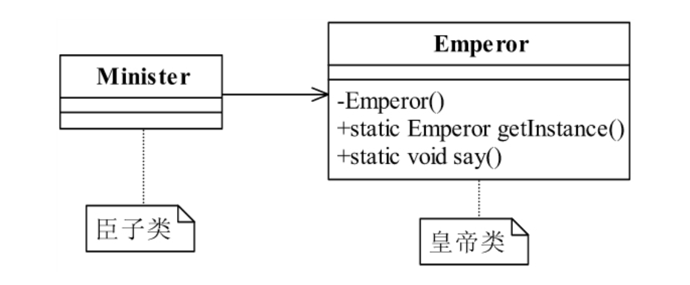

<!--
 * @description:
 * @Author: tianzhi
 * @Date: 2020-04-26 09:18:06
 * @LastEditors: tianzhi
 * @LastEditTime: 2020-04-26 11:21:15
 -->

## 定义

> Ensure a class has only one instance, and provide a global point of access to it.
> 确保某一个类只有一个实例，而且自行实例化并向整个系统提供这个实例

## 类图


## Java 代码

```java
public class Singleton {
    private static final Singleton singleton = new Singleton();
    // 限制产生多个对象
    private Singleton() {}
    // 通过该方法获得实例对象
    public static Singleton getSingleton() {
        return singleton;
    }
    // 类中其他方法，尽量是static
    public static void doSomething() {}
}
```

## 案例-皇帝独苗

### 类图



### Java 实现

#### 1. 皇帝类

```java
public class Emperor {
    private static final Emperor emperor = new Emperor();
    // 初始化一个皇帝
    private Emperor() {
        // 世俗和道德约束你，目的就是不希望产生第二个皇帝
    }
    public static Emperor getInstance() {
        return emperor;
    }
    // 皇帝发话了
    public static void say() {
        System.out.println("我就是皇帝某某某....");
    }
}
```

#### 2. 臣子类-臣子开始朝拜

```java
public class Minister {
    public static void main(String[] args) {
        for(int day=0; day<3; day++) {
            Emperor emperor = Emperor.getInstance();
            // 注意这里：Java的单例对象也能调用static 方法，但是JS不行！
            emperor.say();
        }
        // 三天见的皇帝都是同一个人，荣幸吧！
        // 运行结果：
        // 我就是皇帝某某某....
        // 我就是皇帝某某某....
        // 我就是皇帝某某某....
    }
}
```

### Typescript实现

JS中实现单例模式，有如下方法：

1. 使用常规的”类”语法糖
2. 声明一个对象字面量
3. 使用ES6模块-全局唯一模块

**注意ES6 'class' 语法糖暂时无法定义公有属性和私有属性，现在这一提案处于[stage3](https://github.com/tc39/proposal-class-fields)**

但是我们可以使用Typescript来玩转这些先进的特性：

#### 常规实现

```typescript
class Emperor {
    // 定义为私有成员，阻止外部new 调用
    private constructor() { };
    private static instance = new Emperor();
    public static getInstance() {
        return Emperor.instance;
    }
    public say() {
        console.log("我就是皇帝某某某....");
    }
}

class Minister {
    constructor() { };
    public worship() {
        for (let day = 0; day < 3; day++) {
            const emp = Emperor.getInstance();
            // JS无法使用实例对象调用static 方法，所以static方法去掉了static关键字
            emp.say();
        }
        // 三天见的皇帝都是同一个人，荣幸吧！
    }
}

const mi = new Minister();
mi.worship();
// 运行结果：
// 我就是皇帝某某某....
// 我就是皇帝某某某....
// 我就是皇帝某某某....
```

#### 使用namespace-本质是对象字面量

```typescript
namespace Emperor {
    export function getInstance() {
        return {
            // some state value
            say: function () {
                console.log("我就是皇帝某某某....");
            }
        }
    }
}

// 翻译成JavaScript
var Emperor;
(function (Emperor) {
    function getInstance() {
        return {
            // some state value
            say: function () {
                console.log("我就是皇帝某某某....");
            }
        };
    }
    Emperor.getInstance = getInstance;
})(Emperor || (Emperor = {}));

// ...省略臣子代码
```

#### 使用模块

##### 1. Emperor.ts

```typescript
export function getInstance() {
    return {
        // some state value
        say: function () {
            console.log("我就是皇帝某某某....");
        }
    }
}
```

#### 2. user-case.ts

```typescript
import * as Emperor from './Emperor.ts';

const emp = Emperor.getInstance();

// ...省略朝拜代码
```

### 注意事项

这里发现Java里的单例对象也能直接调用其类中的static方法，但是由于JS中的static 方法，实际上是挂在**函数对象上**而**不是函数原型(prototype)对象**上，因此类(本质是函数)创建的单例对象无法调用类中的static 方法，所以我去掉了static关键字。