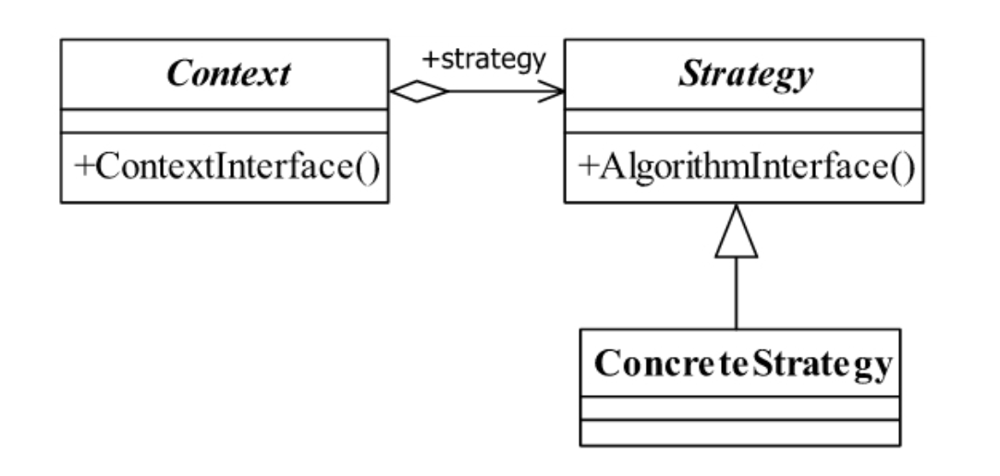
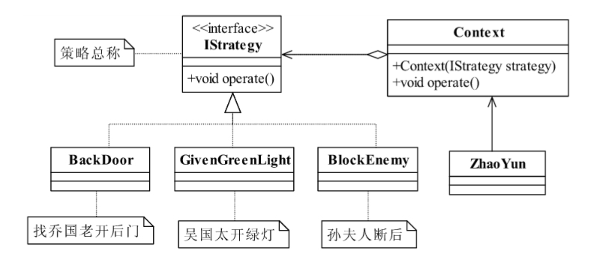

<!--
 * @description: 
 * @Author: Tian Zhi
 * @Date: 2020-05-28 12:48:01
 * @LastEditors: Tian Zhi
 * @LastEditTime: 2020-05-28 19:04:15
--> 
## 定义

策略模式 *(Strategy Pattern)* 是一种比较简单的模式，也叫做政策模式 *(Policy Pattern)* 。

> Define a family of algorithms,encapsulate each one,and make them interchangeable.

> 定义一组算法，将每个算法都封装起来，并且使它们之间可以互换。

## 类图



策略模式使用的就是面向对象的继承和多态机制，我们再来看看策略模式的三个角色：

* Context封装角色

    它也叫做上下文角色，起承上启下封装作用，屏蔽高层模块对策略、算法的直接访问，封装可能存在的变化。

* Strategy抽象策略角色

    策略、算法家族的抽象，通常为接口，定义每个策略或算法必须具有的方法和属性。

* ConcreteStrategy具体策略角色

    实现抽象策略中的操作，该类含有具体的算法。

## Java代码

### 抽象的策略角色

```java
public interface Strategy {
    // 策略模式的运算法则
    public void doSomething();
}
```

### 具体策略角色

```java
public class ConcreteStrategy1 implements Strategy {
    public void doSomething() {
        System.out.println("具体策略1的运算法则");
    }
}
```

### 封装角色

```java
public class Context {
    // 抽象策略
    private Strategy strategy = null;
    // 构造函数设置具体策略
    public Context(Strategy _strategy) {
        this.strategy = _strategy;
    }
    // 封装后的策略方法
    public void doAnythinig() {
        this.strategy.doSomething();
    }
}
```

### 场景类

```java
public class Client {
     public static void main(String[] args) {
        // 声明一个具体的策略
        Strategy strategy = new ConcreteStrategy1();
        // 声明上下文对象
        Context context = new Context(strategy);
        // 执行封装后的方法
        context.doAnythinig();
    }
}
```

## 案例-诸葛亮的三个锦囊妙计

周瑜利用孙权的妹妹向刘备招亲中，有这么一段：

> 不久，刘备忽然丧偶，周瑜计上心来，对孙权说：“您的妹妹，美丽、刚强，我们以联姻抗曹名义向刘备招亲，把他骗来南徐幽禁，逼他们拿荆州来换。”孙权大喜，郎派人到荆州说亲。
> 刘备认为这是骗局，想要拒绝，诸葛亮笑道：“送个好妻子上门何不答应？您只管去东吴，我叫赵云陪您去，自有安排，包您得了夫人又不失荆州。”
> 接着，诸葛亮暗暗关照赵云道：“我这里有三个锦囊，内藏三条妙计。到南徐时打开第一个，到年底时打开第二个，危急无路时打开第三个。”

这三个妙计分别是：找乔国老帮忙（也就是走后门了），求吴国太放行（诉苦）以及孙夫人断后。想想看，这三个计谋有什么相似之处，他们都是告诉赵云要怎么执行，也就是说这三个计谋都有一个方法是执行，具体执行什么内容，每个计谋当然不同了，分析到这里，我们来用程序实现一个类似的场景。

### 类图

在类图中增加了一个Context封装类（也就是锦囊），其作用是承装三个策略，方便赵云使用。



### Java代码

#### 妙计接口

```java
public interface IStrategy {
    // 每个锦囊妙计都是一个可执行的算法
    public void operate();
}
```

#### 乔国老开后门

```java
public class BackDoor implements IStrategy {
    public void operate() {
        System.out.println("找乔国老帮忙，让吴国太给孙权施加压力");
    }
}
```

#### 吴国太开绿灯

```java
public class GivenGreenLight implements IStrategy {
    public void operate() {
        System.out.println("求吴国太开绿灯,放行！");
    }
}
```

#### 孙夫人断后

```java
public class BlockEnemy implements IStrategy {
    public void operate() {
        System.out.println("孙夫人断后，挡住追兵");
    }
}
```

#### 锦囊

```java
public class Context {
    // 构造函数，你要使用哪个妙计
    private IStrategy straegy;
    public Context(IStrategy strategy) {
        this.straegy = strategy;
    }
    // 使用计谋了，看我出招了
    public void operate() {
        this.straegy.operate();
    }
}
```

#### 场景（赵云使用计谋）

```java
public class ZhaoYun {
    // 赵云出场了，他根据诸葛亮给他的交代，依次拆开妙计
    public static void main(String[] args) {
        Context context;
        // 刚刚到吴国的时候拆第一个
        System.out.println("---刚刚到吴国的时候拆第一个---");
        context = new Context(new BackDoor()); // 拿到妙计
        context.operate();  // 拆开执行
        System.out.println("\n\n\n\n\n\n\n\n");
        // 刘备乐不思蜀了，拆第二个了
        System.out.println("---刘备乐不思蜀了，拆第二个了---");
        context = new Context(new GivenGreenLight());
        context.operate();  // 执行了第二个锦囊
        System.out.println("\n\n\n\n\n\n\n\n");
        // 孙权的小兵追来了，咋办？拆第三个
        System.out.println("---孙权的小兵追来了，咋办？拆第三个---");
        context = new Context(new BlockEnemy());
        context.operate();  // 孙夫人退兵
        System.out.println("\n\n\n\n\n\n\n\n");
    }
}
```

### TypeScript代码

```typescript
// 妙计
interface IStrategy {
    // 每个锦囊妙计都是一个可执行的策略
    operate(): void;
}

// 乔国老开后门
class BackDoor implements IStrategy {
    operate() {
        console.log("找乔国老帮忙，让吴国太给孙权施加压力");
    }
}

// 吴国太开绿灯
class GivenGreenLight implements IStrategy {
    operate() {
        console.log("求吴国太开绿灯,放行！");
    }
}

// 孙夫人断后
class BlockEnemy implements IStrategy {
    operate() {
        console.log("孙夫人断后，挡住追兵");
    }
}

// 锦囊
class Context {
    // 构造函数，你要使用哪个妙计
    private straegy: IStrategy;
    constructor(strategy: IStrategy ) {
        this.straegy = strategy;
    }
    // 使用计谋了，看我出招了
    operate() {
        this.straegy.operate();
    }
}

// 赵云出场了，他根据诸葛亮给他的交代，依次拆开妙计
(function() {
    let context: Context;
    // 刚刚到吴国的时候拆第一个
    console.log("---刚刚到吴国的时候拆第一个---");
    context = new Context(new BackDoor()); // 拿到妙计
    context.operate();  // 拆开执行
    // 刘备乐不思蜀了，拆第二个了
    console.log("---刘备乐不思蜀了，拆第二个了---");
    context = new Context(new GivenGreenLight());
    context.operate();  // 执行了第二个锦囊
    // 孙权的小兵追来了，咋办？拆第三个
    console.log("---孙权的小兵追来了，咋办？拆第三个---");
    context = new Context(new BlockEnemy());
    context.operate();  // 孙夫人退兵
})()

```

## 使用场景

策略模式的策略（或算法）可以自由切换，策略的扩展性良好，而且可以避免使用多重条件判断（如果没有策略模式，我们可能需要对使用何种策略进行条件判断）。但是策略模式的缺点也是显而易见的，会造成策略类的膨胀以及所有策略类都要对外暴露（比如上述赵云使用时需要知道具体的锦囊妙计），因此我们单独使用策略类有时候可能还不够，需要使用其他模式来修正这个缺陷，如工厂方法模式、代理模式或享元模式。

策略模式有如下的使用场景：

* 多个类只有在算法或行为上稍有不同的场景。

* 算法需要自由切换的场景。

* 需要屏蔽算法规则的场景。

## 策略模式的扩展

现在有一个需求：输入3个参数，前后2个是数字，中间是字符'+'或'-'，来完成简单的加减法运算（暂不考虑复杂类型的校验，忽略场景类）。下面给出4种方案：

### 方案1：最直接的加减法

```java
public class Calculator {
    // 加符号
    private final static String ADD_SYMBOL = "+";
    // 减符号
    private final static String SUB_SYMBOL = "-";
    public int exec(int a, int b, String symbol) {
        int result = 0;
        if (symbol.equals(ADD_SYMBOL)) {
            result = this.add(a, b);
        } else if (symbol.equals(SUB_SYMBOL)) {
            result = this.sub(a, b);
        }
        return result;
    }   
    // 加法运算
    private int add(int a, int b) {
            return a + b;
    }
    // 减法运算
    private int sub(int a, int b) {
        return a - b;
    }
}
```

### 方案2：方案1的简化

```java
public class Calculator {
    // 加符号
    private final static String ADD_SYMBOL = "+";
    // 减符号
    private final static String SUB_SYMBOL = "-";
    public int exec(int a, int b, String symbol) {
        return symbol.equals(ADD_SYMBOL) ? a+b : a-b;
    }
}
```

对于上面两种方案，扩展性都非常不好，都需要改动原代码，增加条件判断。接下来引入策略模式：

### 方案3：引入策略模式

#### 计算器接口

```java
interface Calculator {
    public int exec(int a, int b);
}
```

#### 具体算法

```java
public class Add implements Calculator {
    // 加法运算
    public int exec(int a, int b) {
        return a + b;
    }
}
public class Sub implements Calculator {
    // 减法运算
    public int exec(int a, int b) {
        return a - b;
    }
}
```

#### 上下文

```java
public class Context {
    private Calculator cal = null;
    public Context(Calculator _cal) {
        this.cal = _cal;
    }
    public int exec(int a, int b, String symbol) {
        return this.cal.exec(a, b);
    }
}
```

引入策略模式后，具体使用哪个算法则是由高层模块判断，底层模块（算法）的扩展变得十分方便，无需更改代码。但是我们还有一种更好的方案：

### 方案4：策略枚举

策略枚举将每个策略定义成枚举成员，同时枚举类型中有一个抽象的策略函数，每一个具体的策略成员中具体实现这个函数。

```java
public enum Calculator {
    // 加法运算
    ADD("+") {
        public int exec(int a, int b) {
            return a + b;
        }
    },
    // 减法运算
    SUB("-") {
        public int exec(int a, int b) {
            return a - b;
        }
    };
    String value = "";
    // 定义成员值类型
    private Calculator(String _value) {
        this.value = _value;
    }
    // 获得枚举成员的值
    public String getValue() {
        return this.value;
    }
    // 声明一个抽象函数
    public abstract int exec(int a, int b);
}
```

下面是我用TypeScript的完整实现：

**TypeScript里的枚举无法定义方法，这里我们使用简单的Object对象即可实现。**

```typescript
type CalculatorEnum = 'ADD' | 'SUB';
type ICalculator = {
    [k in CalculatorEnum]: {
        exec(a: number, b: number): number;
    }
}

// strategy
const Calculator: ICalculator = {
    ADD:  {
        exec(a, b) {
            return a + b;
        }
    },
    SUB:  {
        exec(a, b) {
            return a - b;
        }
    }
}

// context
class Person {
    constructor(private calc: ICalculator[CalculatorEnum]) {
        this.calc = calc;
    }
    setCalculator(newCalc: ICalculator[CalculatorEnum]) {
        this.calc = newCalc;
    }
    doCalculation(a: number, b: number) {
        return this.calc.exec(a, b);
    }
}

// do some calculation
(function() {
    const person = new Person(Calculator.ADD);
    console.log(person.doCalculation(1, 2));
    person.setCalculator(Calculator.SUB);
    console.log(person.doCalculation(2, 1));
})()
```

**注意**：策略枚举是一个非常优秀和方便的模式，但是它受枚举类型的限制，每个枚举项都是public、final、static的，扩展性受到了一定的约束，因此在系统开发中，策略枚举一般担当不经常发生变化的角色。

## 最佳实践

策略模式是一个非常简单的模式。它在项目中使用得非常多，但它单独使用的地方就比较少了，因为它有致命缺陷：**所有的策略都需要暴露出去**，才方便客户端决定使用哪一个策略。这违背了迪米特法则。

例如，在例子中的赵云，实际上不知道使用哪个策略，他只知道拆第一个锦囊，而不知道是BackDoor这个妙计。虽然诸葛亮已经在规定了在适当的场景下拆开指定的锦囊，但是我们的策略模式只实现了锦囊的管理，并没有严格地定义“适当的场景”拆开“适当的锦囊”，在实际项目中，我们一般通过工厂方法模式来实现策略类的声明，作进一步的封装以实现赵云在“适当的场景”拿出来的都是一个“适当的锦囊”。

## 与六大设计原则的结合

- [x] Single Responsibility Principle (SRP, 单一职责原则)

    每个具体策略只需要实现自己的逻辑，符合SRP。

- [x] Open Closed Principle (OCP, 开闭原则)

    策略模式下，策略的扩展很方便，符合OCP。

- [x] Liskov Substitution Principle (LSP, 里氏替换原则)

    上下文类中依赖的是抽象策略，用具体策略替换也完全没问题，符合LSP。

- [ ] Law of Demeter (LoD, 迪米特法则)

    单一的策略模式不符合LoD，因为高层创建了具体的策略。可以使用扩展后的枚举策略或者结合工厂模式来解决。

- [ ] Interface Segragation Principle (ISP, 接口隔离原则)

    未提及。

- [ ] Dependency Inversion Principle (DIP, 依赖倒置原则)

    单一的策略模式高层依赖了具体策略，不符合DIP。
