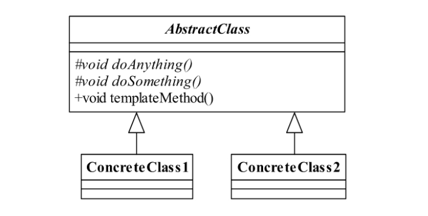
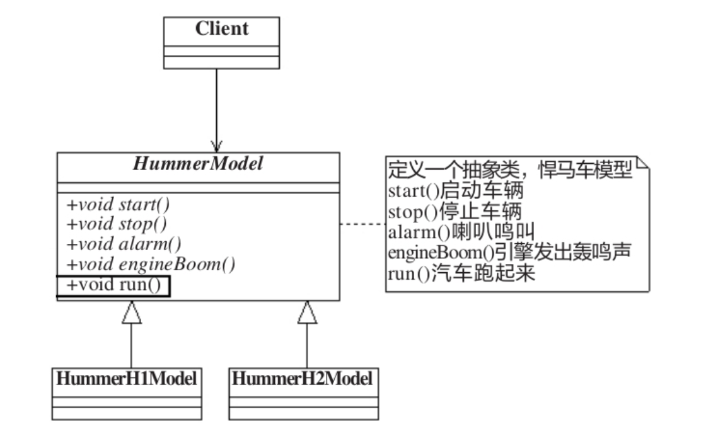
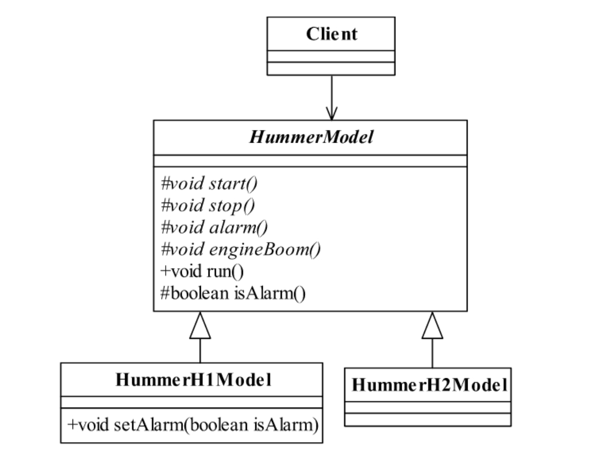

<!--
 * @description:
 * @Author: Tian Zhi
 * @Date: 2020-05-07 09:28:12
 * @LastEditors: Tian Zhi
 * @LastEditTime: 2020-05-08 09:43:30
 -->

## 定义

> Define the skeleton of an algorithm in an operation,deferring some steps tosubclasses.Template Method lets subclasses redefine certain steps of an algorithmwithout changing the algorithm's structure.

> 定义一个操作中的算法的框架，而将一些步骤延迟到子类中。使得子类可以不改变一个算法的结构即可重定义该算法的某些特定步骤。

## 使用场景

1. 多个子类有公有的方法，并且逻辑基本相同时。

2. 重要、复杂的算法，可以把核心算法设计为模板方法，周边的相关细节功能则由各个子类实现。重构时，模板方法模式是一个经常使用的模式，把相同的代码抽取到父类中，然后通过[钩子函数](#模式扩展-钩子方法)约束其行为。

## 类图



模板方法模式确实非常简单，仅仅使用了 Java 的继承机制，但它是一个应用非常广泛的模式。其中，AbstractClass 叫做抽象模板，它的方法分为两类：

- 基本方法

基本方法也叫做基本操作，是由子类实现的方法，并且在模板方法被调用。

- 模板方法

可以有一个或几个，一般是一个具体方法，也就是一个框架，实现对基本方法的调度，完成固定的逻辑。

> 注意：为了防止恶意的操作，一般模板方法都加上 final 关键字，不允许被覆写。

## Java 代码

### 抽象模板类

```java
public abstract class AbstractClass {
    // 基本方法
    protected abstract void doSomething();
    // 基本方法
    protected abstract void doAnything();
    // 模板方法
    public void templateMethod() {
        /*
        * 调用基本方法，完成相关的逻辑
        */
        this.doAnything();
        this.doSomething();
    }
}
```

### 具体模板类 1（2 类似，省略）

```java
public class ConcreteClass1 extends AbstractClass {
    // 实现基本方法
    protected void doAnything() {
        // 业务逻辑处理
    }
    protected void doSomething() {
        // 业务逻辑处理
    }
}
```

### 场景类

```java
public class Client {
    public static void main(String[] args) {
        AbstractClass class1 = new ConcreteClass1();
        AbstractClass class2 = new ConcreteClass2();
        // 调用模板方法
        class1.templateMethod();
        class2.templateMethod();
    }
}
```

## 案例-悍马车模

### 类图



### Java实现

#### 抽象悍马车模

```java
public abstract class HummerModel {
    /*
     * 首先，这个模型要能发动起来，别管是手摇发动，还是电力发动，反正
     * 是要能够发动起来，那这个实现要在实现类里了
    */
    public abstract void start();
    // 能发动，还要能停下来，那才是真本事
    public abstract void stop();
    // 喇叭会出声音，是滴滴叫，还是哔哔叫
    public abstract void alarm();
    // 引擎会轰隆隆地响，不响那是假的al
    public abstract void engineBoom();
    // 那模型应该会跑吧，别管是人推的，还是电力驱动，总之要会跑
    public void run() {
        // 先发动汽车
        this.start();
        // 引擎开始轰鸣
        this.engineBoom();
        // 然后就开始跑了，跑的过程中遇到一条狗挡路，就按喇叭
        this.alarm();
        // 到达目的地就停车
        this.stop();
    }
}
```

#### H1 型号悍马车（H2 型类似，省略）

```java
public class HummerH1Model extends HummerModel {
    // H1型号的悍马车鸣笛
    public void alarm() {
        System.out.println("悍马H1鸣笛...");
    }
    // 引擎轰鸣声
    public void engineBoom() {
        System.out.println("悍马H1引擎声音是这样的...");
    }
    // 汽车发动
    public void start() {
        System.out.println("悍马H1发动...");
    }
    // 停车
    public void stop() {
        System.out.println("悍马H1停车...");
    }
}
```

#### 场景类

```java
public class Client {
    public static void main(String[] args) {
        // XX公司要H1型号的悍马
        HummerModel h1 = new HummerH1Model();
        // H1模型演示
        h1.run();
        // H2模型演示...
    }
}
```

### TypeScript实现

```typescript
// 抽象悍马模型
abstract class HummerModel {
    /**
     * 首先，这个模型要能发动起来，别管是手摇发动，还是电力发动，反正
     * 是要能够发动起来，那这个实现要在实现类里了
     */
    abstract start(): void;
    // 能发动，还要能停下来，那才是真本事
    abstract stop(): void;
    // 喇叭会出声音，是滴滴叫，还是哔哔叫
    abstract alarm(): void;
    // 引擎会轰隆隆地响，不响那是假的
    abstract engineBoom(): void;
    // 那模型应该会跑吧，别管是人推的，还是电力驱动，总之要会跑
    run() {
        // 先发动汽车
        this.start();
        // 引擎开始轰鸣
        this.engineBoom();
        // 然后就开始跑了，跑的过程中遇到一条狗挡路，就按喇叭
        this.alarm();
        // 到达目的地就停车
        this.stop();
    }
}

// H1型号悍马车
class HummerH1Model extends HummerModel {
    // H1型号的悍马车鸣笛
    alarm() {
        console.log("悍马H1鸣笛...");
    }
    // 引擎轰鸣声
    engineBoom() {
        console.log("悍马H1引擎声音是这样的...");
    }
    // 汽车发动
    start() {
        console.log("悍马H1发动...");
    }
    // 停车
    stop() {
        console.log("悍马H1停车...");
    }
}

// 展示H1型号悍马车方法
function runHummerH1Model() {
    // XX公司要H1型号的悍马
    const h1: HummerModel = new HummerH1Model();
    // H1模型演示
    h1.run();
}

// 展示H1型号悍马车
runHummerH1Model();
```

## 模式扩展-钩子方法

假设我们对上述悍马模型进行扩展。比如我们发现每次启动时都会鸣笛太吵。对于 H1 模型默认鸣笛，但是我们可以将其关闭；而对于 H2 模型，我们需要关闭喇叭功能。这样我们如何设计呢？

我们当然需要修改模板方法，增加一个鸣笛的判断方法，这个方法默认返回`true`，也就是需要鸣笛。然后针对 H1 和 H2 模型，我们进行不同的覆写：

1. H1 模型我们默认返回`true`，也就是需要鸣笛，但是可以增加一个设置鸣笛的方法，如果需要禁用鸣笛则调用该方法，将鸣笛标志位设置为`false`。

2. H2 模型我们直接在方法中返回`false`即可。

### 类图



### 代码部分

#### 扩展后的抽象模板类

```java
public abstract class HummerModel {
    /*
    * 首先，这个模型要能够被发动起来，别管是手摇发动，还是电力发动，反正
    * 是要能够发动起来，那这个实现要在实现类里了
    */
    protected abstract void start();
    // 能发动，还要能停下来，那才是真本事
    protected abstract void stop();
    // 喇叭会出声音，是滴滴叫，还是哔哔叫
    protected abstract void alarm();
    // 引擎会轰隆隆的响，不响那是假的
    protected abstract void engineBoom();
    // 那模型应该会跑吧，别管是人推的，还是电力驱动，总之要会跑
    final public void run() {
        // 先发动汽车
        this.start();
        // 引擎开始轰鸣
        this.engineBoom();
        // 要让它叫的就是就叫，喇嘛不想让它响就不响
        if(this.isAlarm()){
            this.alarm();
        }
        // 到达目的地就停车
        this.stop();
    }
    // 钩子方法，默认喇叭是会响的
    protected  boolean isAlarm() {
        return true;
    }
}
```

#### 扩展后的 H1 悍马

```java
public class HummerH1Model extends HummerModel {
    private boolean alarmFlag = true;  // 要响喇叭
    protected void alarm() {
        System.out.println("悍马H1鸣笛...");
    }
    protected void engineBoom() {
        System.out.println("悍马H1引擎声音是这样的...");
    }
    protected void start() {
        System.out.println("悍马H1发动...");
    }
    protected void stop() {
        System.out.println("悍马H1停车...");
    }
    protected boolean isAlarm() {
        return this.alarmFlag;
    }
    // 要不要响喇叭，是由客户来决定的
    public void setAlarm(boolean isAlarm) {
        this.alarmFlag = isAlarm;
    }
}
```

#### 扩展后的 H2 悍马

```java
public class HummerH2Model extends HummerModel {
    protected void alarm() {
        System.out.println("悍马H2鸣笛...");
    }
    protected void engineBoom() {
        System.out.println("悍马H2引擎声音是这样的...");
    }
    protected void start() {
        System.out.println("悍马H2发动...");
    }
    protected void stop() {
        System.out.println("悍马H2停车...");
    }
    // 默认没有喇叭的
    protected boolean isAlarm() {
        return false;
    }
}
```

#### 扩展后的场景类

```java
public class Client {
    public static void main(String[] args) throws IOException {
        System.out.println("-------H1型号悍马--------");
        System.out.println("H1型号的悍马是否需要喇叭声响？0-不需要   1-需要");
        String type = (new BufferedReader(new InputStreamReader(System.in))).readLine();
        HummerH1Model h1 = new HummerH1Model();
        if (type.equals("0")){
            h1.setAlarm(false);
        }
        h1.run();
        System.out.println("\n-------H2型号悍马--------");
        HummerH2Model h2 = new HummerH2Model();
        h2.run();
    }
}
```

H1型号的悍马是由客户自己控制是否要响喇叭，也就是说外界条件改变，影响到模板方法的执行。在我们的抽象类中`isAlarm`的返回值就是影响了模板方法的执行结果，该方法就叫**钩子方法 *（Hook Method）***。有了钩子方法的模板方法模式才算完美，大家可以想想，由子类的一个方法返回值决定公共部分的执行结果，是不是很有吸引力呀！

## 最佳实践

### 父类怎么调用子类的方法？

初级程序员在写程序的时候经常会问高手“父类怎么调用子类的方法”。这个问题很有普遍性，那么父类是否可以调用子类的方法呢？我的回答是能，但强烈地、极度地不建议这么做，那该怎么做呢？

* :x: 父类直接调用子类

    1. 子类传递到父类的有参构造中，然后调用。
    2. 使用反射的方式调用。
    3. 父类调用子类的静态方法。

    这三种都是父类直接调用子类的方法，好用不？好用！解决问题了吗？解决了！项目中允许使用不？不允许！为什么要用父类调用子类的方法？如果一定要调用子类，那为什么要继承它呢？

* :white_check_mark: 使用模板方法模式

    父类建立框架，子类在重写了父类部分的方法后，再调用从父类继承的方法，产生不同的结果（而这正是模板方法模式）。这是不是也可以理解为父类调用了子类的方法呢？你修改了子类，影响了父类行为的结果，曲线救国的方式实现了父类依赖子类的场景，模板方法模式就是这种效果。

模板方法在一些开源框架中应用非常多，它提供了一个抽象类，然后开源框架写了一堆子类。在《××× In Action》中就说明了，如果你需要扩展功能，可以继承这个抽象类，然后覆写protected方法，再然后就是调用一个类似execute方法，就完成你的扩展开发，非常容易扩展的一种模式。

## 与六大设计原则的结合

- [ ] Single Responsibility Principle (SRP, 单一职责原则)

    没有提及

- [x] Open Closed Principle (OCP, 开闭原则)

    模板方法模式可以增加具体类而不去修改模板，符合开闭原则。

- [ ] Liskov Substitution Principle (LSP, 里氏替换原则)

    没有提及。在悍马例子当中，其实是符合LSP的；但是在钩子方法扩展中，出现了可以手动设置鸣笛的H1模型，这样的模型有了”个性“，其出现的时候无法用抽象的父类替代，不符合LSP。

- [ ] Law of Demeter (LoD, 迪米特法则)

    抽象模板中的基本方法尽量设计为protected类型，符合迪米特法则，不需要暴露的属性或方法尽量不要设置为protected类型。实现类若非必要，尽量不要扩大父类中的访问权限。

- [ ] Interface Segragation Principle (ISP, 接口隔离原则)

    没有提及

- [x] Dependency Inversion Principle (DIP, 依赖倒置原则)

    模板方法模式提供了一个”抽象模板“，实现了面向抽象编程，符合DIP。