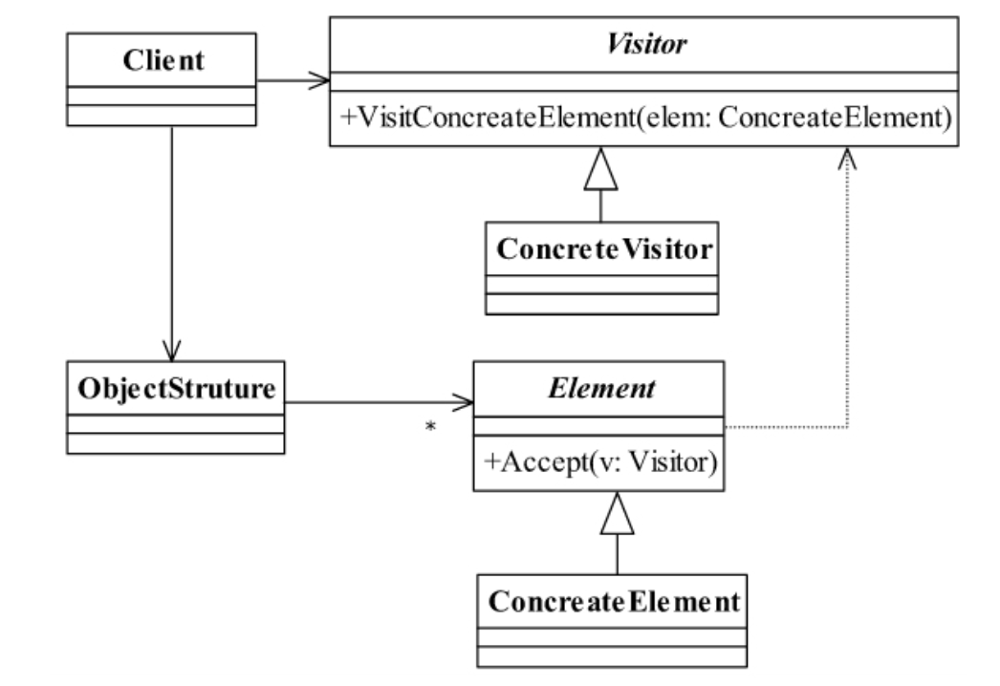
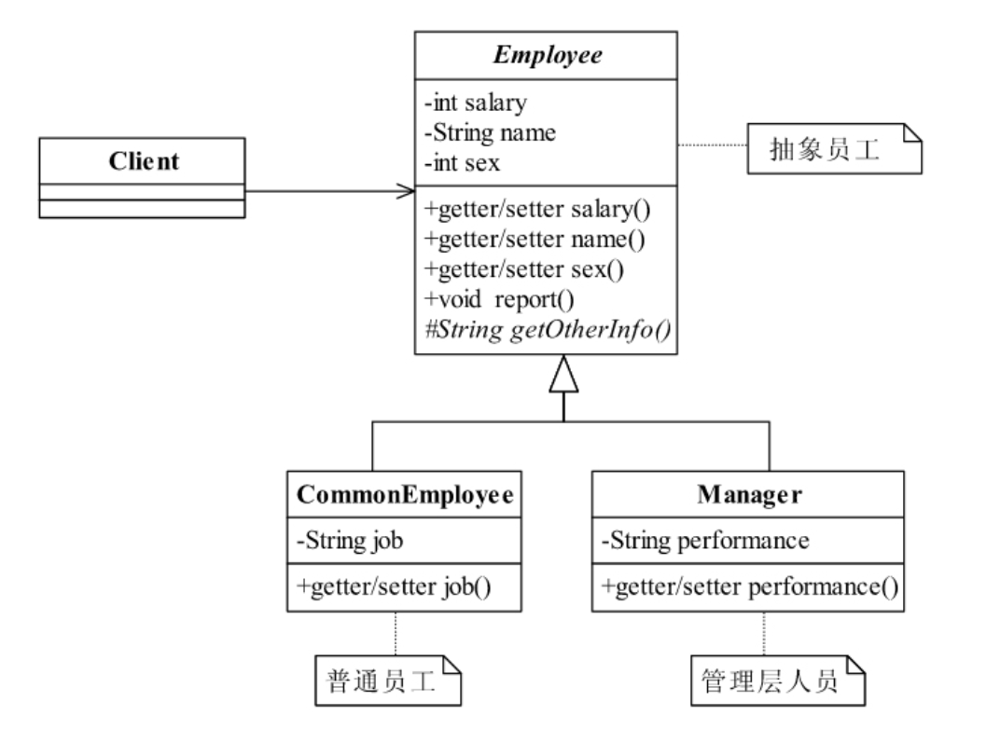
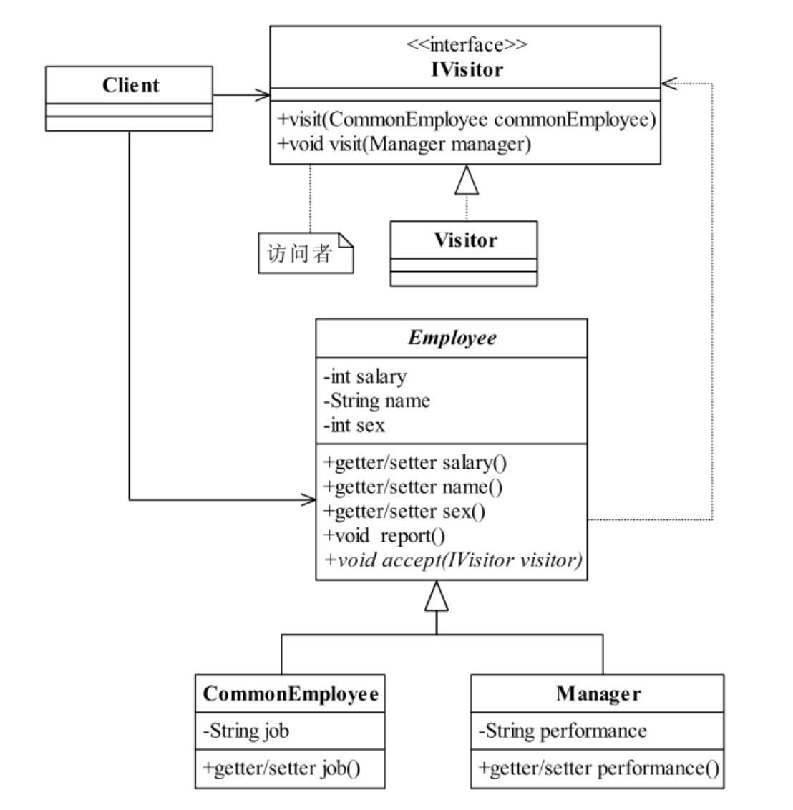
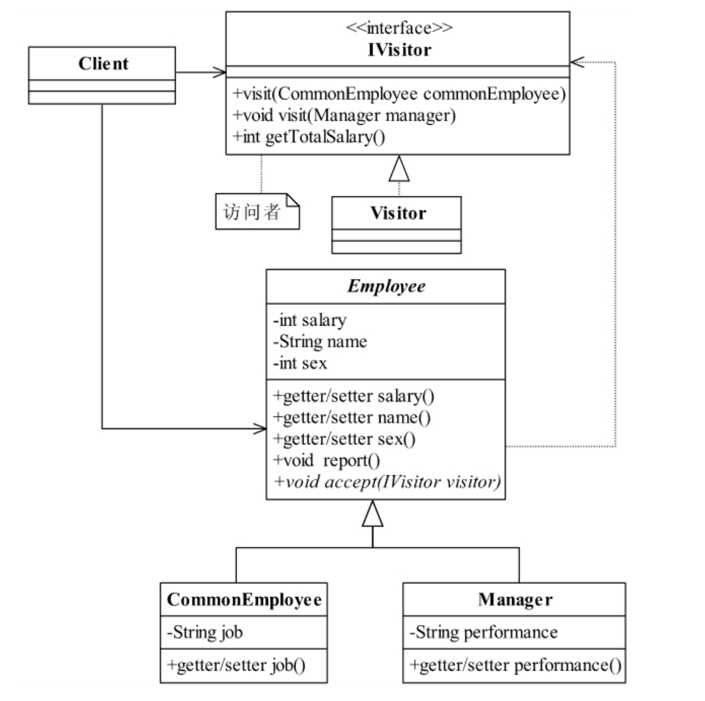
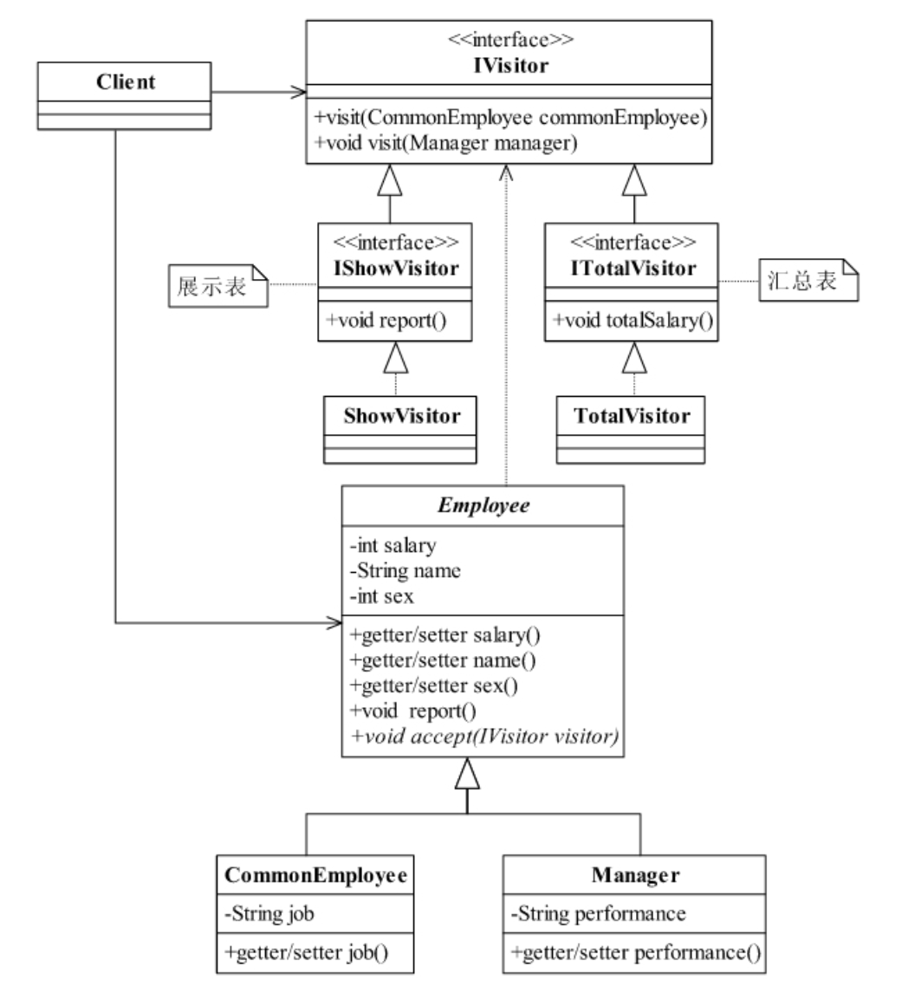

<!--
 * @description: 
 * @Author: Tian Zhi
 * @Date: 2020-07-20 10:28:23
 * @LastEditors: Tian Zhi
 * @LastEditTime: 2020-07-20 20:24:34
--> 
## 定义

访问者模式（Visitor Pattern）是一个相对简单的模式，其定义如下：

> Represent an operationto be performed on the elements of an object structure.Visitor lets you define a newoperation without changing the classes of the elements on which it operates.

> 封装一些作用于某种数据结构中的各元素的操作，它可以在不改变数据结构的前提下定义作用于这些元素的新的操作。

## 类图



来看看上述类图中的几个具体角色：

* Visitor——抽象访问者

    抽象类或者接口，声明访问者可以访问哪些元素，具体到程序中就是`visit`方法的参数定义哪些对象是可以被访问的。

* ConcreteVisitor——具体访问者

    它影响访问者访问到一个类后该怎么干，要做什么事情。

* Element——抽象元素

    接口或者抽象类，声明接受哪一类访问者访问，程序上是通过`accept`方法中的参数来定义的。

* ConcreteElement——具体元素

    实现`accept`方法，通常是`visitor.visit(this)`，基本上都形成了一种模式了。

* ObjectStruture——结构对象

    元素产生者，一般容纳在多个不同类、不同接口的容器，如`List`、`Set`、`Map`等，在项目中，一般很少抽象出这个角色。

## Java代码

我们来看看访问者模式的通用源码：

### 抽象元素

```java
public abstract class Element {
    // 定义业务逻辑
    public abstract void doSomething();
    // 允许谁来访问
    public abstract void accept(IVisitor visitor);
}
```

### 具体元素

```java
public class ConcreteElement1 extends Element {
    // 完善业务逻辑
    public void doSomething() {
        // 业务处理
    }
    // 允许那个访问者访问
    public void accept(IVisitor visitor) {
        visitor.visit(this);
    }
}
public class ConcreteElement2 extends Element {
    // 完善业务逻辑
    public void doSomething() {
        // 业务处理
    }
    // 允许那个访问者访问
    public void accept(IVisitor visitor) {
        visitor.visit(this);
    }
}
```

### 抽象访问者

```java
public interface IVisitor {
    // 可以访问哪些对象
    public void visit(ConcreteElement1 el1);
    public void visit(ConcreteElement2 el2);
}
```

### 具体访问者

```java
public class Visitor implements IVisitor {
    // 访问el1元素
    public void visit(ConcreteElement1 el1) {
        el1.doSomething();
    }
    // 访问el2元素
    public void visit(ConcreteElement2 el2) {
        el2.doSomething();
    }   
}
```

### 结构对象

```java
public class ObjectStruture {
    // 对象生成器，这里通过一个工厂方法模式模拟
    public static Element createElement() {
        Random rand = new Random();
        if (rand.nextInt(100) > 50) {
            return new ConcreteElement1();
        } else {
            return new ConcreteElement2();
        }
    }
}
```

### 场景类

```java
public class Client {
    public static void main(String[] args) {
        for (int i = 0; i < 10; i++) {
            // 获得元素对象
            Element el = ObjectStruture.createElement();
            // 接受访问者访问
            el.accept(new Visitor());
        }
    }
}
```

## 案例-员工信息报表打印

现在有一个需求，需要将公司中的所有人员信息都打印进行汇报，该如何实现？下面的类图表示了简单的员工信息：



类图比较简单，员工分为了管理职员和普通职员两类，每一类都有一些基本信息（包括一个`report`方法用来打印信息，`getOtherInfo`方法由具体类实现）。管理职员还有绩效信息，普通职员只有工作信息。

如果使用上述类图进行员工信息打印汇报，只能循环遍历所有员工，执行`report`方法，代码如下（只展示场景类代码）：

```java
public class Client {
    public static void main(String[] args) {
        for (Employee emp:mockEmployee()) {
            emp.report();
        }
    }
    // 模拟出公司的人员情况，我们可以想象这个数据是通过持久层传递过来的
    public static List<Employee> mockEmployee() {
        List<Employee> empList = new ArrayList<Employee>();
        // 产生张三这个员工
        CommonEmployee zhangSan = new CommonEmployee();
        zhangSan.setJob("编写Java程序，绝对的蓝领、苦工加搬运工");
        zhangSan.setName("张三");
        zhangSan.setSalary(1800);
        zhangSan.setSex(Employee.MALE);
        empList.add(zhangSan);
        // 产生李四这个员工
        CommonEmployee liSi = new CommonEmployee();
        liSi.setJob("页面美工，审美素质太不流行了！");
        liSi.setName("李四");
        liSi.setSalary(1900);
        liSi.setSex(Employee.FEMALE);
        empList.add(liSi);
        // 再产生一个经理
        Manager wangWu = new Manager();
        wangWu.setName("王五");
        wangWu.setPerformance("基本上是负值，但是我会拍马屁呀");
        wangWu.setSalary(18750);
        wangWu.setSex(Employee.MALE);
        empList.add(wangWu);
        return empList;
    }
}
```

上述设计有个明显的缺点，就是无法为每个子类定制不同的展示报表，或者是有多份展示报表（给不同的人看），都会直接涉及到修改子类，不好进行扩展。想象一个场景：我邀请一个人来参观我家，参观结束后进行描述，这样不同的参观者会有不同的描述，我家（子类）只需要展示初始的样子即可，如何描述交给访问者。这就是访问者模式，如果将该模式应用到这个例子，我们可以将`report`方法交给访问者实现，设计如下：



在抽象类`Employee`中增加了`accept`方法，该方法是一个抽象方法，由子类实现，用于定义自己可以被谁“接收”，接收到子类后，接收者进行相关“描述”（报表打印），代码如下：

**访问者接口**

```java
public interface IVisitor {
    // 首先，定义我可以访问普通员工
    public void visit(CommonEmployee commonEmployee);
    // 其次，定义我还可以访问部门经理
    public void visit(Manager manager);
}
```

**访问者实现**

```java
public class Visitor implements IVisitor {
    // 访问普通员工，打印出报表
    public void visit(CommonEmployee commonEmployee) {
        System.out.println(this.getCommonEmployee(commonEmployee));
    }
    // 访问部门经理，打印出报表
    public void visit(Manager manager) {
        System.out.println(this.getManagerInfo(manager));
    }
    // 组装出基本信息
    private String getBasicInfo(Employee employee) {
        String info = "姓名：" + employee.getName() + "\t";
        info = info + "性别：" + (employee.getSex() == Employee.FEMALE?"女":"男") + "\t";
        info = info + "薪水：" + employee.getSalary()  + "\t";
        return info;
    }
    // 组装出部门经理的信息
    private String getManagerInfo(Manager manager) {
        String basicInfo = this.getBasicInfo(manager);
        String otherInfo = "业绩："+manager.getPerformance() + "\t";
        return basicInfo + otherInfo;
    }
    // 组装出普通员工信息
    private String getCommonEmployee(CommonEmployee commonEmployee) {
        String basicInfo = this.getBasicInfo(commonEmployee);
        String otherInfo = "工作："+commonEmployee.getJob()+"\t";
        return basicInfo + otherInfo;
    }
}
```

**抽象员工类**

```java
public abstract class Employee {
    public final static int MALE = 0;  // 0代表是男性
    public final static int FEMALE = 1; // 1代表是女性
    // 甭管是谁，都有工资
    private String name;
    // 只要是员工那就有薪水
    private int salary;
    // 性别很重要
    private int sex;
    // 以下是简单的getter/setter
    public String getName() {
        return name;
    }
    public void setName(String name) {
        this.name = name;
    }
    public int getSalary() {
        return salary;
    }
    public void setSalary(int salary) {
        this.salary = salary;
    }
    public int getSex() {
        return sex;
    }
    public void setSex(int sex) {
        this.sex = sex;
    }
    // 我允许一个访问者访问
    public abstract void accept(IVisitor visitor);
}
```

**普通员工**

```java
public class CommonEmployee extends Employee {
    // 工作内容，这非常重要，以后的职业规划就是靠它了
    private String job;
    public String getJob() {
        return job;
    }
    public void setJob(String job) {
        this.job = job;
    }
    // 我允许访问者访问
    @Override
    public void accept(IVisitor visitor) {
        visitor.visit(this);
    }
}
```

**管理层员工**

```java
public class Manager extends Employee {
    // 这类人物的职责非常明确：业绩
    private String performance;
    public String getPerformance() {
        return performance;
    }
    public void setPerformance(String performance) {
        this.performance = performance;
    }
    // 部门经理允许访问者访问
    @Override
    public void accept(IVisitor visitor) {
        visitor.visit(this);
    }
}
```

场景类代码改动由之前的循环的`emp.report()`变为了`emp.visit(new Visitor())`。

### TypeScript实现

```typescript
interface IVisitor {
    // 首先，定义我可以访问普通员工
    visit(commonEmployee: CommonEmployee): void;
    // 其次，定义我还可以访问部门经理
    visit(manager: Manager): void;
}

class Visitor implements IVisitor {
    // 实现重载
    visit(emp: Employee) {
        if (emp instanceof CommonEmployee) {
            // 访问普通员工，打印出报表
            this.visitCommonEmployee(emp);
        } else if (emp instanceof Manager) {
            // 访问部门经理，打印出报表
            this.visitManager(emp);
        }
    }
    private visitCommonEmployee(commonEmployee: CommonEmployee) {
        console.log(this.getCommonEmployee(commonEmployee));
    }
    // 访问部门经理，打印出报表
    private visitManager(manager: Manager) {
       console.log(this.getManagerInfo(manager));
    }
    // 组装出基本信息
    private getBasicInfo(employee: Employee) {
        let info = "姓名：" + employee.getName() + "\t";
        info = info + "性别：" + (employee.getSex() == Employee.FEMALE?"女":"男") + "\t";
        info = info + "薪水：" + employee.getSalary()  + "\t";
        return info;
    }
    // 组装出部门经理的信息
    private getManagerInfo(manager: Manager) {
        let basicInfo = this.getBasicInfo(manager);
        let otherInfo = "业绩："+manager.getPerformance() + "\t";
        return basicInfo + otherInfo;
    }
    // 组装出普通员工信息
    private getCommonEmployee(commonEmployee: CommonEmployee) {
        let basicInfo = this.getBasicInfo(commonEmployee);
        let otherInfo = "工作："+commonEmployee.getJob()+"\t";
        return basicInfo + otherInfo;
    }
}

abstract class Employee {
    static MALE = 0;  // 0代表是男性
    static FEMALE = 1; // 1代表是女性
    // 甭管是谁，都有工资
    private name: string = '';
    // 只要是员工那就有薪水
    private salary = -1;
    // 性别很重要
    private sex = Employee.MALE;
    // 以下是简单的getter/setter
    getName() {
        return name;
    }
    setName(name: string) {
        this.name = name;
    }
    getSalary() {
        return this.salary;
    }
    setSalary(salary: number) {
        this.salary = salary;
    }
    getSex() {
        return this.sex;
    }
    setSex(sex: number) {
        this.sex = sex;
    }
    // 我允许一个访问者访问
    abstract accept(visitor: IVisitor): void;
}

class CommonEmployee extends Employee {
    // 工作内容，这非常重要，以后的职业规划就是靠它了
    private job: string = '';
    getJob() {
        return this.job;
    }
    setJob(job: string) {
        this.job = job;
    }
    // 我允许访问者访问
    accept(visitor: IVisitor) {
        visitor.visit(this);
    }
}

class Manager extends Employee {
    // 这类人物的职责非常明确：业绩
    private performance: string = '';
    public getPerformance() {
        return this.performance;
    }
    setPerformance(performance: string) {
        this.performance = performance;
    }
    // 部门经理允许访问者访问
    accept(visitor: IVisitor) {
        visitor.visit(this);
    }
}

function mockEmployee() {
    const empList: Employee[] = [];
    // 产生张三这个员工
    const zhangSan = new CommonEmployee();
    zhangSan.setJob("编写Java程序，绝对的蓝领、苦工加搬运工");
    zhangSan.setName("张三");
    zhangSan.setSalary(1800);
    zhangSan.setSex(Employee.MALE);
    empList.push(zhangSan);
    // 产生李四这个员工
    const liSi = new CommonEmployee();
    liSi.setJob("页面美工，审美素质太不流行了！");
    liSi.setName("李四");
    liSi.setSalary(1900);
    liSi.setSex(Employee.FEMALE);
    empList.push(liSi);
    // 再产生一个经理
    const wangWu = new Manager();
    wangWu.setName("王五");
    wangWu.setPerformance("基本上是负值，但是我会拍马屁呀");
    wangWu.setSalary(18750);
    wangWu.setSex(Employee.MALE);
    empList.push(wangWu);
    return empList;
}

(function(){
    const empList = mockEmployee();
    for (let emp of empList) {
        emp.accept(new Visitor());
    }
})()
```

## 使用场景

### 访问者模式的优点

* 符合单一职责原则

    具体元素角色也就是`Employee`抽象类的两个子类负责数据的加载，而`Visitor`类则负责报表的展现，两个不同的职责非常明确地分离开来，各自演绎变化。

* 优秀的扩展性

    由于职责分开，继续增加对数据的操作是非常快捷的，例如，现在要增加一份给大老板的报表，这份报表格式又有所不同，直接在`Visitor`中增加一个方法，传递数据后进行整理打印。

* 灵活性非常高

    由于报表统计之类的工作交给了访问者，访问者又可以根据具体不同的子类做不同的操作，例如上述例子中的管理层员工和普通员工，他们的年终奖绩效是不同的，这种逻辑就可以放在访问者中实现，灵活性高。

### 访问者模式的缺点

* 具体元素对访问者公布细节

    访问者要访问一个类就必然要求这个类公布一些方法和数据，也就是说访问者关注了其他类的内部细节，这是迪米特法则所不建议的。

* 具体元素变更比较困难

    具体元素角色的增加、删除、修改都是比较困难的，就上面那个例子，你想想，你要是想增加一个成员变量，如年龄age，Visitor就需要修改，如果Visitor是一个还好办，多个呢？业务逻辑再复杂点呢？

* 违背了依赖倒置转原则

    访问者依赖的是具体元素，而不是抽象元素，这破坏了依赖倒置原则，特别是在面向对象的编程中，抛弃了对接口的依赖，而直接依赖实现类，扩展比较难。

### 访问者模式的使用场景

一个对象结构包含很多类对象，它们有不同的接口，而你想对这些对象实施一些依赖于其具体类的操作，也就说是用迭代器模式已经不能胜任的情景。需要对一个对象结构中的对象进行很多不同并且不相关的操作，而你想避免让这些操作“污染”这些对象的类。

总结一下，在这种地方你一定要考虑使用访问者模式：业务规则要求遍历多个不同的对象。这本身也是访问者模式出发点，迭代器模式只能访问同类或同接口的数据（当然了，如果你使用instanceof，那么能访问所有的数据，这没有争论），而访问者模式是对迭代器模式的扩充，可以遍历不同的对象，然后执行不同的操作，也就是针对访问的对象不同，执行不同的操作。访问者模式还有一个用途，就是充当拦截器（Interceptor）角色。

## 访问者模式的扩展

### 统计功能

汇总和报表是金融类企业非常常用的功能，基本上都是一堆的计算公式，然后出一个报表，很多项目采用了数据库的存储过程来实现，我不是很推荐这种方式，除非海量数据处理，一个晚上要批处理上亿、几十亿条的数据，除了存储过程来处理还没有其他办法，你要是用应用服务器来处理，连接数据库的网络就是处于100%占用状态，一个晚上也未必能处理完这批数据！除了这种海量数据外，我建议数据统计和报表的批处理通过访问者模式来处理会比较简单。还是上述例子，让我们来统计一下公司人员的工资总额，类图如下：



`IVisitor`接口增加了一个`getTotalSalary`方法，在`Visitor`实现类中实现该方法：

<!-- 这里使用具体访问者（代码不完整，请补充完整） -->

```java
public class Visitor implements IVisitor {
    // 部门经理的工资系数是5
    private final static int MANAGER_COEFFICIENT = 5;
    // 员工的工资系数是2
    private final static int COMMONEMPLOYEE_COEFFICIENT = 2;
    // 普通员工的工资总和
    private int commonTotalSalary = 0;
    // 部门经理的工资总和
    private int managerTotalSalary = 0;
    // 计算部门经理的工资总和
    private void calManagerSalary(int salary) {
        this.managerTotalSalary = this.managerTotalSalary + salary * MANAGER_COEFFICIENT;
    }
    // 计算普通员工的工资总和
    private void calCommonSlary(int salary) {
        this.commonTotalSalary = this.commonTotalSalary + salary * COMMONEMPLOYEE_COEFFICIENT;
    }
    // 获得所有员工的工资总和
    public int getTotalSalary() {
        return this.commonTotalSalary + this.managerTotalSalary;
    }
    // 访问普通员工，计算工资总额
    public void visit(CommonEmployee commonEmployee) {  
        this.commonTotalSalary = this.commonTotalSalary + commonEmployee.getSalary() * COMMONEMPLOYEE_COEFFICIENT;
    }
    // 访问部门经理，计算工资总额
    public void visit(Manager manager) {
        this.managerTotalSalary = this.managerTotalSalary + manager.getSalary() * MANAGER_COEFFICIENT;
    }
}
```

场景类代码只需要在遍历完成后调用`visitor.getTotalSalary`即可获得统计好的薪资总和：

**注意上面的例子中每个`Employee`使用了各自的`Visitor`，由于薪资需要汇总，所以此处改为使用一个`Visitor`**

```java
public class Client {
    public static void main(String[] args) {
        IVisitor visitor = new Visitor();
        for (Employee emp:mockEmployee()) {
            emp.accept(visitor);
        }
        System.out.println("本公司的月工资总额是：" + visitor.getTotalSalary());
    }
}
```

### 多个访问者

在实际的项目中，一个对象，多个访问者的情况非常多。其实我们上面例子就应该是两个访问者，报表分两种：第一种是展示表，通过数据库查询，把结果展示出来，这个就类似于我们的那个列表；第二种是汇总表，这个是需要通过模型或者公式计算出来的，一般都是批处理结果，这个类似于我们计算工资总额，这两种报表格式是对同一堆数据的两种处理方式。从程序上看，一个类就有个不同的访问者了。



代码改动如下：

**展示表接口**

```java
public interface IShowVisitor extends IVisitor {
    // 展示报表
    public void report();
}
```

**具体展示表**

```java
public class ShowVisitor implements IShowVisitor {
    private String info = "";
    // 打印出报表
    public void report() {
        System.out.println(this.info);
    }
    // 访问普通员工，组装信息
    public void visit(CommonEmployee commonEmployee) {
        this.info = this.info + this.getBasicInfo(commonEmployee) + "工作：" + commonEmployee.getJob()+"\t\n";
    }
    // 访问经理，然后组装信息
    public void visit(Manager manager) {
        this.info = this.info + this.getBasicInfo(manager) +  "业绩：" + manager.getPerformance() + "\t\n";
    }
    // 组装出基本信息
    private String getBasicInfo(Employee employee) {
        String info = "姓名：" + employee.getName() + "\t";
        info = info + "性别：" + (employee.getSex() == Employee.FEMALE ? "女" : "男") + "\t";
        info = info + "薪水：" + employee.getSalary()  + "\t";
        return info;
    }
}
```

**汇总表接口**

```java
public interface ITotalVisitor extends IVisitor {
    // 统计所有员工工资总和
    public void totalSalary();
}
```

**具体汇总表**

```java
public class TotalVisitor implements ITotalVisitor {
    // ...
    
    // 部门经理的工资系数是5
    private final static int MANAGER_COEFFICIENT = 5;
    // 员工的工资系数是2
    private final static int COMMONEMPLOYEE_COEFFICIENT = 2;
    // 普通员工的工资总和
    private int commonTotalSalary = 0;
    // 部门经理的工资总和
    private int managerTotalSalary = 0;
    public void totalSalary() {
        System.out.println("本公司的月工资总额是" + (this.commonTotalSalary + this.managerTotalSalary));
    }
    // 访问普通员工，计算工资总额
    public void visit(CommonEmployee commonEmployee) {  
        // ...
        this.commonTotalSalary = this.commonTotalSalary + commonEmployee.getSalary() * COMMONEMPLOYEE_COEFFICIENT;
    }
    // 访问部门经理，计算工资总额
    public void visit(Manager manager) {
        // ...
        this.managerTotalSalary = this.managerTotalSalary + manager.getSalary() * MANAGER_COEFFICIENT;
    }
}
```

**场景类**

```java
public class Client {
    public static void main(String[] args) {
        // 展示报表访问者
        IShowVisitor showVisitor = new ShowVisitor();
        // 汇总报表的访问者
        ITotalVisitor totalVisitor = new TotalVisitor();
        for (Employee emp:mockEmployee()) {
            emp.accept(showVisitor);  // 接受展示报表访问者
            emp.accept(totalVisitor); // 接受汇总表访问者
        }
        // 展示报表
        showVisitor.report();
        // 汇总报表
        totalVisitor.totalSalary();
    }
}
```

### 访问者模式实现“伪动态双分派”

**注意：这部分作者的讲述我并不是完全理解和赞同，因此加入了自己的理解进行重新编排，感兴趣的也可以去读读原文**

#### 概念

首先，先了解如下几个概念：分派、静态分派和动态分派、单分派和多分派：

**什么是分派？**

> 变量被声明时的类型叫做变量的静态类型(Static Type) 又叫明显类型(Apparent Type)。变量所引用的对象的真实类型又叫做变量的实际类型(Actual Type)。
根据对象的类型而对方法进行的选择，就是分派(Dispatch)。

**静态分派和动态分派？**

根据分派发生的时期，可以将分派分为两种，即静态分派和动态分派。

> 静态分派(Static Dispatch) 发生在编译时期，分派根据静态类型信息发生。方法重载(Overload)就是静态分派的最典型的应用。（所谓的：编译时多态）

> 动态分派(Dynamic Dispatch) 发生在运行时期，动态分派动态地置换掉某个方法。面向对象的语言利用动态分派来实现方法置换(Override)产生的多态性。（所谓的：运行时多态）

Java中也叫做静态绑定和动态绑定。

**单分派和多分派？**

首先需要知道方法的**宗量**：

> 方法的接收者与方法的参数统称为方法的宗量，例如`visitor.visit(employee)`中，`visitor`作为方法`visit`的接收者，`employee`作为参数，两者均为`visit`的宗量。

> 根据分派基于多少宗量，可以把分派划分为单分派和多分派(双分派是多分派的一种形式)。单分派是根据一个宗量来对方法进行选择，多分派则是根据多个宗量来对方法进行选择。

#### 案例

例如，演员饰演角色，一个演员可以饰演多个角色，比如功夫主角和白痴配角，代码如下：

**角色接口及实现类**

```java
public interface Role {
    // 演员要扮演的角色
}
public class KungFuRole implements Role {
    // 武功天下第一的角色
}
public class IdiotRole implements Role {
    // 一个弱智角色
}
```

**抽象演员**

```java
public abstract class AbsActor {
    // 演员都能够演一个角色
    public void act(Role role) {
        System.out.println("演员可以扮演任何角色");
    }
    // 可以演功夫戏
    public void act(KungFuRole role) {
        System.out.println("演员都可以演功夫角色");
    }
}
```

**老年演员**

```java
public class OldActor extends AbsActor {
    // 不演功夫角色
    public void act(KungFuRole role) {
        System.out.println("年龄大了，不能演功夫角色");
    }
}
```

**场景类**

```java
public class Client {
    public static void main(String[] args) {
        // 定义一个演员
        AbsActor actor = new OldActor();
        // 定义一个角色
        Role role = new KungFuRole();
        // 开始演戏
        actor.act(role);
        actor.act(new KungFuRole());
    }
}
```

看到上面的场景结果，可以得知：

1. `act`方法的选择依赖于`actor`的实际类型。

2. `act`方法的选择也依赖于参数`role`的静态类型。

那么，有没有一种方法可以实现不同演员饰演不同角色时，依赖的都是实际类型呢？

当然上面的两条原则不可能被打破，但是可以使用访问者模式实现一个“伪动态双分派”，引入访问者模式代码如下：

**引入访问者模式**

```java
public interface Role {
    // 演员要扮演的角色
    public void accept(AbsActor actor);
}
public class KungFuRole implements Role {
    // 武功天下第一的角色
    public void accept(AbsActor actor) {
        actor.act(this);
    }
}
public class IdiotRole implements Role {
    // 一个弱智角色，由谁来扮演
    public void accept(AbsActor actor) {
        actor.act(this);
    }
}
```

**场景类**

```java
public class Client {
    public static void main(String[] args) {
        // 定义一个演员
        AbsActor actor = new OldActor();
        // 定义一个角色
        Role role = new KungFuRole();
        // 开始演戏
        role.accept(actor);
    }
}
```

上述情况下，不管演员类和角色类如何变化，我们都能够找到期望的方法运行（也就是说依赖的都是实际类型），这种做法貌似“绕开了对静态类型参数的依赖”，看起来很巧妙，我们来分析一下：

首先看对`role`的类型确认，由于`role`是方法`accept`的接收者，因此会进行一次动态单分派：

> `role.accept(actor)`

这样做就避免了之前的场景下，`role`作为参数进行静态分派而使用静态类型。

巧妙之处在于`actor`作为`accept`的参数传递到了其内部进行真实调用（让角色进行表演）：

> `actor.act(this)`

这样一来`actor`作为`act`方法的接收者，也会进行一次动态分派，而`this`则让编译器明确知道`role`的类型为`KungfuRole`。

这样的设计就保证了外层调用时，`actor`和`rule`分派的都是实际类型，实现了“伪动态双分派”。

#### 参考

1. [设计模式中的访问者模式](https://www.cnblogs.com/jiaoyiping/p/9769554.html)

2. [访问者和双分派](https://refactoringguru.cn/design-patterns/visitor-double-dispatch)

3. [如何理解java是一门静态多分派且动态单分派的语言？](https://www.zhihu.com/question/28462483)

## 最佳实践

访问者模式是一种集中规整模式，特别适用于大规模重构的项目，在这一个阶段需求已经非常清晰，原系统的功能点也已经明确，通过访问者模式可以很容易把一些功能进行梳理，达到最终目的——功能集中化，如一个统一的报表运算、UI展现等，我们还可以与其他模式混编建立一套自己的过滤器或者拦截器。

## 案例是否符合六大设计原则

- [x] Single Responsibility Principle (SRP, 单一职责原则)

    案例符合单一职责原则，`Employee`类只负责自己的数据管理，而`Visitor`负责数据的组合（报表生成），符合SRP。

- [x] Open Closed Principle (OCP, 开闭原则)

    案例新增报表（增加visitor）非常简单且不会破坏原有结构，但是具体元素角色的扩展非常麻烦，会破坏已有的观察者。因此前者扩展符合OCP，后者不符合。

- [ ] Liskov Substitution Principle (LSP, 里氏替换原则)

    未提及。

- [ ] Law of Demeter (LoD, 迪米特法则)

    案例违反了LoD，观察者可以知道具体元素`Employee`类的具体实现细节。

- [ ] Interface Segragation Principle (ISP, 接口隔离原则)

    未提及。

- [ ] Dependency Inversion Principle (DIP, 依赖倒置原则)

    案例违反了DIP。观察者接口的`visit`方法依赖了具体的元素类，例如`CommonEmployee`和`Manager`。
